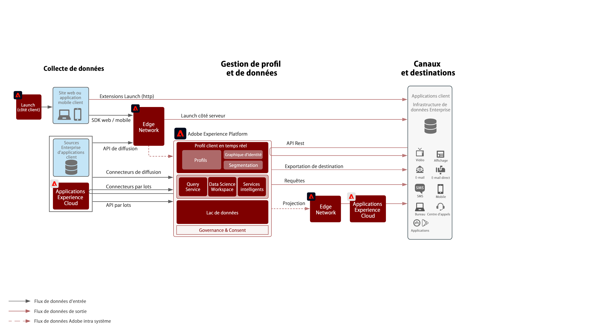
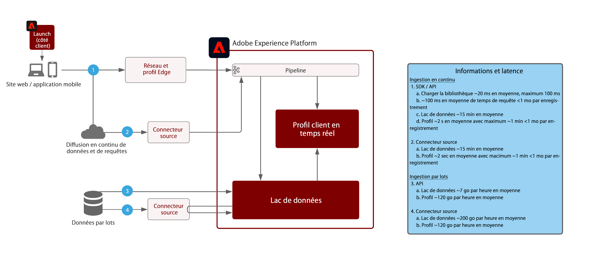

# Architecture de flux de données Adobe Experience Platform

## Diagramme de flux de données

Le schéma ci-dessous illustre les différents chemins d’accès pour l’ingestion et la sortie de données d’Adobe Experience Platform.

## Garde-fous de l’ingestion des données

Le diagramme ci-dessous illustre les principaux garde-fous de performance et la latence de l’ingestion de données dans Adobe Experience Platform.

