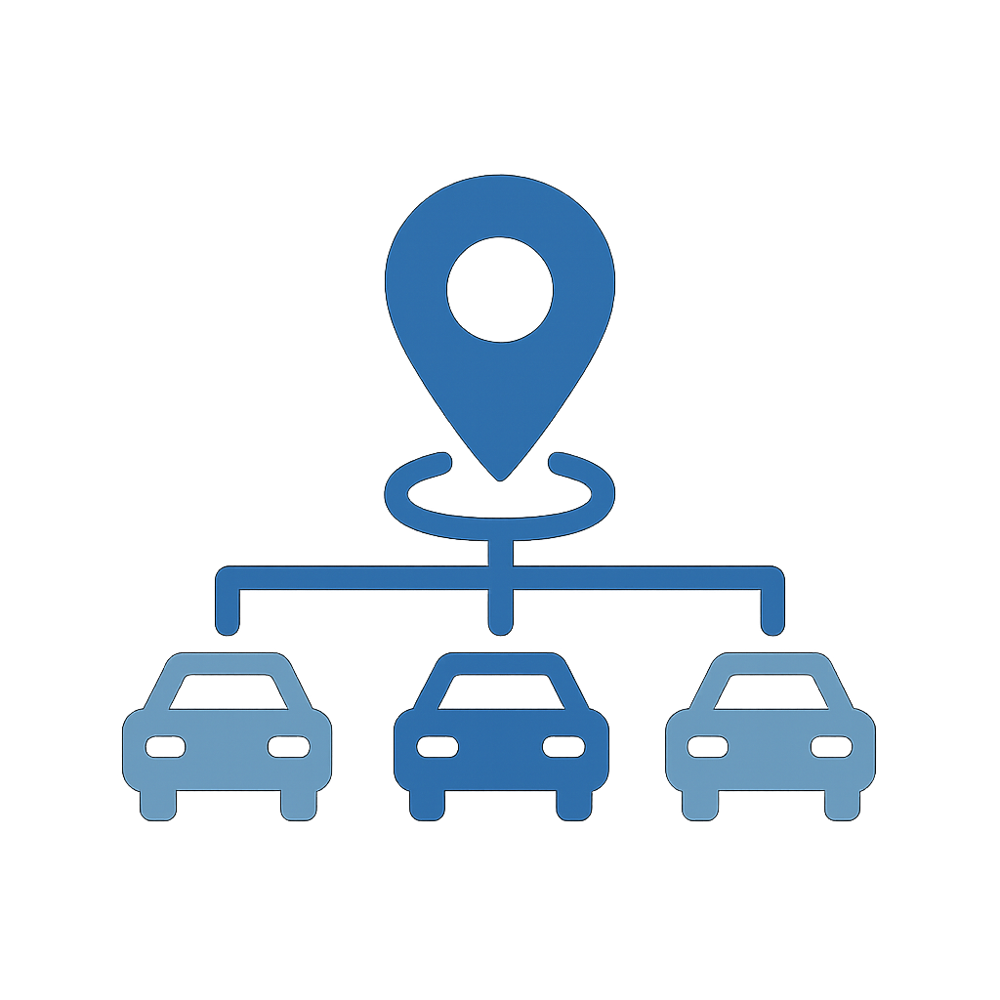

# Catalogue des cas d’utilisation

Les cas d’utilisation du secteur montrent comment les organisations de secteurs spécifiques appliquent Adobe Experience Platform et les applications pour obtenir des résultats commerciaux mesurables. Chaque cas d’utilisation décrit un scénario commercial concret, son impact attendu et fournit des liens vers le [modèle de cas d’utilisation](/help/blueprints/use-case-patterns/overview.md) qui fournit des conseils détaillés sur la mise en œuvre.

Parcourez les différents secteurs d’activité pour trouver des cas d’utilisation pertinents pour votre organisation, puis suivez les liens pour obtenir des références d’implémentation, y compris des conseils de décision, des chaînes de fonction et la documentation d’Experience League.

| Industrie | Thèmes Clés |
| --- | --- |
| [Automobile](automotive/automotive-overview.md) | Parcours d&#39;achat de véhicule, cycle de vie du service, expériences de voiture connectée, fidélité du propriétaire |
| [B2B](b2b/b2b-overview.md) | Marketing basé sur les comptes, notation des prospects, accélération des pipelines, expansion des clients |
| [Services financiers](financial-services/financial-services-overview.md) | Recommandations de produits, prévention de l’attrition, offres d’étape de vie, personnalisation de la fraude |
| [Santé](healthcare/healthcare-overview.md) | Gestion des rendez-vous, observance des médicaments, intégration des patients, coordination des soins |
| [Assurance](insurance/insurance-overview.md) | Renouvellement des politiques, expérience des réclamations, prévention des risques, optimisation des ventes croisées |
| [Médias et divertissement](media-entertainment/media-entertainment-overview.md) | Recommandations de contenu, conservation des abonnements, conversion d’essai, engagement sur plusieurs plateformes |
| [Vente au détail](retail/retail-overview.md) | Personnalisation des produits, récupération du panier, optimisation des ventes croisées, engagement de fidélité |
| [&#x200B; Télécommunications &#x200B;](telecommunications/telecommunications-overview.md) | Mises à niveau des appareils, prévention de l’attrition, optimisation des plans, engagement du réseau |
| [Voyage et hébergement](travel-hospitality/travel-hospitality-overview.md) | Personnalisation des réservations, récupération des abandons, programmes de fidélité, campagnes saisonnières |

## Comment les cas d’utilisation se connectent aux conseils d’implémentation

Chaque cas d’utilisation est associé à un **modèle de cas d’utilisation**, une approche d’implémentation répétable qui décrit la chaîne de fonctions, les points de décision et les étapes de configuration nécessaires pour donner vie au cas d’utilisation. Les modèles de cas d’utilisation se connectent à leur tour aux [objectifs commerciaux clés](/help/blueprints/business-objectives/overview.md), ce qui vous permet d’aligner le travail d’implémentation sur les résultats stratégiques.

```
Industry Use Case → Use Case Pattern → Key Business Objective
```

## Parcourir par secteur

>[!BEGINTABS]

>[!TAB Vente au détail]

| | Cas d’utilisation | Description | Maturité | Modèle |
| --- | --- | --- | --- | --- |
|  | [Récupération d’e-mails de panier abandonné](retail/retail-overview.md#abandoned-cart-email-recovery) | Envoyer des rappels personnalisés pour les paniers abandonnés | [!BADGE Fondamental]{type=Neutral} | [Messagerie déclenchée par un événement](/help/blueprints/use-case-patterns/campaign-management-orchestration/event-triggered-messaging.md) |
|  | [Campagnes d’urgence basées sur les stocks](retail/retail-overview.md#inventory-based-urgency-campaigns) | Déclencher des alertes en temps réel lorsque le stock de produits est faible | [!BADGE Fondamental]{type=Neutral} | [Messagerie déclenchée par un événement](/help/blueprints/use-case-patterns/campaign-management-orchestration/event-triggered-messaging.md) |
|  | [Alertes de chute de prix](retail/retail-overview.md#price-drop-alerts) | Informer les clients de la chute du prix des articles mis en vente ou consultés | [!BADGE Fondamental]{type=Neutral} | [Messagerie déclenchée par un événement](/help/blueprints/use-case-patterns/campaign-management-orchestration/event-triggered-messaging.md) |
| | [&#x200B; Notifications de rupture de stock &#x200B;](retail/retail-overview.md#out-of-stock-notifications) | Avertir les clients lorsque des produits en rupture de stock sont disponibles | [!BADGE Fondamental]{type=Neutral} | [Messagerie déclenchée par un événement](/help/blueprints/use-case-patterns/campaign-management-orchestration/event-triggered-messaging.md) |
|  | [Recommandations de produits personnalisées](retail/retail-overview.md#personalized-product-recommendations) | Afficher des produits personnalisés en fonction de l&#39;historique de navigation et d&#39;achat | [!BADGE Émergent]{type=Informative} | [Recommandation comportementale](/help/blueprints/use-case-patterns/personalization/behavioral-recommendation.md) |
|  | [Pages de catégorie personnalisées](retail/retail-overview.md#personalized-category-pages) | Réorganiser dynamiquement les pages de catégories en fonction des préférences du client | [!BADGE Émergent]{type=Informative} | [Recommandation comportementale](/help/blueprints/use-case-patterns/personalization/behavioral-recommendation.md) |
|  | [Nouvelle série de bienvenue clients](retail/retail-overview.md#new-customer-welcome-series) | Automatisation des séries de bienvenue comportant plusieurs e-mails avec des recommandations personnalisées | [!BADGE Émergent]{type=Informative} | [Parcours orchestré en plusieurs étapes](/help/blueprints/use-case-patterns/campaign-management-orchestration/multi-step-orchestrated-journey.md) |
|  | [Rappels de réapprovisionnement](retail/retail-overview.md#replenishment-reminders) | Envoyer des rappels automatisés pour les produits consommables achetés régulièrement | [!BADGE Émergent]{type=Informative} | [Parcours orchestré en plusieurs étapes](/help/blueprints/use-case-patterns/campaign-management-orchestration/multi-step-orchestrated-journey.md) |
|  | [Campagnes De Suivi Après Achat](retail/retail-overview.md#post-purchase-follow-up-campaigns) | Envoyer des conseils d’assistance, examiner les demandes et des suggestions de produits associées | [!BADGE Émergent]{type=Informative} | [Parcours orchestré en plusieurs étapes](/help/blueprints/use-case-patterns/campaign-management-orchestration/multi-step-orchestrated-journey.md) |
| | [Social Proof Personalization](retail/retail-overview.md#social-proof-personalization) | Afficher des évaluations et des avis personnalisés en fonction du profil client | [!BADGE Émergent]{type=Informative} | [Web/App Personalization pour visiteurs connus](/help/blueprints/use-case-patterns/personalization/known-visitor-web-app-personalization.md) |
|  | [Recommandations relatives aux ventes croisées et aux ventes incitatives](retail/retail-overview.md#cross-sell-and-upsell-recommendations) | Afficher les produits de vente croisée et de montée en gamme pertinents au passage en caisse et dans les e-mails | [!BADGE Avancé]{type=Caution} | [Offer Decisioning](/help/blueprints/use-case-patterns/personalization/offer-decisioning.md) |
| | [Offres Exclusives Client VIP](retail/retail-overview.md#vip-customer-exclusive-offers) | Proposer des offres exclusives et un accès anticipé à des clients à forte valeur ajoutée | [!BADGE Avancé]{type=Caution} | [Parcours cross-canal avec prise de décision](/help/blueprints/use-case-patterns/campaign-management-orchestration/cross-channel-journey-with-decisioning.md) |

>[!TAB Automobile]

| | Cas d’utilisation | Description | Maturité | Modèle |
| --- | --- | --- | --- | --- |
|  | [Rappels de rendez-vous de service](automotive/automotive-overview.md#service-appointment-reminders) | Envoyer des rappels de service personnalisés en fonction du kilométrage du véhicule et de l&#39;historique du service | [!BADGE Fondamental]{type=Neutral} | [Messagerie déclenchée par un événement](/help/blueprints/use-case-patterns/campaign-management-orchestration/event-triggered-messaging.md) |
|  | [Avis de rappel de véhicule](automotive/automotive-overview.md#vehicle-recall-notifications) | Envoyer des notifications de rappel personnalisées avec les options de planification du service | [!BADGE Fondamental]{type=Neutral} | [Messagerie déclenchée par un événement](/help/blueprints/use-case-patterns/campaign-management-orchestration/event-triggered-messaging.md) |
|  | [Planification du test de conduite](automotive/automotive-overview.md#test-drive-scheduling) | Activer la planification personnalisée du test routier avec les recommandations du concessionnaire | [!BADGE Fondamental]{type=Neutral} | [Messagerie déclenchée par un événement](/help/blueprints/use-case-patterns/campaign-management-orchestration/event-triggered-messaging.md) |
|  | [Nouvelles campagnes de lancement de modèles](automotive/automotive-overview.md#new-model-launch-campaigns) | Ciblez les clients intéressés par de nouveaux modèles basés sur le véhicule et les préférences actuels. | [!BADGE Fondamental]{type=Neutral} | [Activation des messages sortants par lots](/help/blueprints/use-case-patterns/campaign-management-orchestration/batch-outbound-message-activation.md) |
|  | [Campagnes de reprise](automotive/automotive-overview.md#trade-in-value-campaigns) | Proactivement proposer des évaluations de la valeur de reprise aux clients prêts pour la mise à niveau | [!BADGE Émergent]{type=Informative} | [Parcours orchestré en plusieurs étapes](/help/blueprints/use-case-patterns/campaign-management-orchestration/multi-step-orchestrated-journey.md) |
|  | [Recommandations relatives aux pièces et aux accessoires](automotive/automotive-overview.md#parts-and-accessories-recommendations) | Recommander les pièces et accessoires en fonction du modèle du véhicule et de la durée de possession | [!BADGE Émergent]{type=Informative} | [Recommandation comportementale](/help/blueprints/use-case-patterns/personalization/behavioral-recommendation.md) |
|  | [Plans de garantie et de service étendu](automotive/automotive-overview.md#warranty-and-extended-service-plans) | Recommander des plans de garantie et de service à des moments optimaux en fonction de l&#39;âge du véhicule | [!BADGE Émergent]{type=Informative} | [Parcours orchestré en plusieurs étapes](/help/blueprints/use-case-patterns/campaign-management-orchestration/multi-step-orchestrated-journey.md) |
|  | [Activation des caractéristiques de la voiture connectée](automotive/automotive-overview.md#connected-car-feature-activation) | Personnaliser les recommandations de caractéristiques des voitures connectées en fonction des caractéristiques du véhicule | [!BADGE Émergent]{type=Informative} | [Parcours orchestré en plusieurs étapes](/help/blueprints/use-case-patterns/campaign-management-orchestration/multi-step-orchestrated-journey.md) |
|  | [Coordination du réseau de concessionnaires](automotive/automotive-overview.md#dealer-network-coordination) | Activer les recommandations personnalisées des concessionnaires en fonction de l&#39;emplacement et des préférences | [!BADGE Émergent]{type=Informative} | [Web/App Personalization pour visiteurs connus](/help/blueprints/use-case-patterns/personalization/known-visitor-web-app-personalization.md) |
|  | [Parcours d’achat de véhicule Personalization](automotive/automotive-overview.md#vehicle-purchase-journey-personalization) | Personnaliser le parcours d’achat de véhicule de la recherche à l’achat | [!BADGE Avancé]{type=Caution} | [Parcours cross-canal avec prise de décision](/help/blueprints/use-case-patterns/campaign-management-orchestration/cross-channel-journey-with-decisioning.md) |
|  | [Offres de financement et d&#39;assurance](automotive/automotive-overview.md#financing-and-insurance-offers) | Présenter des offres de financement et d&#39;assurance personnalisées en fonction du profil de crédit | [!BADGE Avancé]{type=Caution} | [Offer Decisioning](/help/blueprints/use-case-patterns/personalization/offer-decisioning.md) |
|  | [Programmes de fidélité des propriétaires](automotive/automotive-overview.md#owner-loyalty-programs) | Personnalisez les communications de fidélité, les récompenses et les offres exclusives en fonction de l’historique de propriété | [!BADGE Avancé]{type=Caution} | [Parcours cross-canal avec prise de décision](/help/blueprints/use-case-patterns/campaign-management-orchestration/cross-channel-journey-with-decisioning.md) |

>[!TAB Services financiers]

| | Cas d’utilisation | Description | Maturité | Modèle |
| --- | --- | --- | --- | --- |
| | [Alertes et recommandations basées sur les transactions](financial-services/financial-services-overview.md#transaction-based-alerts-and-recommendations) | Envoi d’alertes en temps réel pour les transactions et de recommandations personnalisées | [!BADGE Fondamental]{type=Neutral} | [Messagerie déclenchée par un événement](/help/blueprints/use-case-patterns/campaign-management-orchestration/event-triggered-messaging.md) |
| | [Récupération de l’abandon de la demande de carte de crédit](financial-services/financial-services-overview.md#credit-card-application-abandonment-recovery) | Réengagez les clients qui ont commencé mais n’ont pas rempli leurs demandes de carte de crédit | [!BADGE Fondamental]{type=Neutral} | [Messagerie déclenchée par un événement](/help/blueprints/use-case-patterns/campaign-management-orchestration/event-triggered-messaging.md) |
| | [Personalization d’alerte de fraude](financial-services/financial-services-overview.md#fraud-alert-personalization) | Personnaliser les alertes de fraude et les communications de sécurité selon les préférences des clients | [!BADGE Fondamental]{type=Neutral} | [Messagerie déclenchée par un événement](/help/blueprints/use-case-patterns/campaign-management-orchestration/event-triggered-messaging.md) |
|  | [Formation de leads à haute valeur ajoutée](financial-services/financial-services-overview.md#high-value-lead-nurturing) | Identifier les prospects à forte valeur ajoutée et les nourrir avec du contenu et des offres personnalisés | [!BADGE Émergent]{type=Informative} | [Parcours orchestré en plusieurs étapes](/help/blueprints/use-case-patterns/campaign-management-orchestration/multi-step-orchestrated-journey.md) |
|  | [Tableau de bord de compte personnalisé](financial-services/financial-services-overview.md#personalized-account-dashboard) | Personnaliser le tableau de bord des services bancaires en ligne en fonction de l&#39;activité du compte et des objectifs financiers | [!BADGE Émergent]{type=Informative} | [Web/App Personalization pour visiteurs connus](/help/blueprints/use-case-patterns/personalization/known-visitor-web-app-personalization.md) |
| | [Recommandations relatives à Investment Portfolio](financial-services/financial-services-overview.md#investment-portfolio-recommendations) | Fournir des recommandations d’investissement personnalisées en fonction du profil de risque et des objectifs | [!BADGE Émergent]{type=Informative} | [Recommandation comportementale](/help/blueprints/use-case-patterns/personalization/behavioral-recommendation.md) |
| | [Campagnes de pré-approbation de prêt hypothécaire](financial-services/financial-services-overview.md#mortgage-pre-approval-campaigns) | Clients cibles probables sur le marché d’un prêt hypothécaire en fonction du profil et du stade de vie | [!BADGE Émergent]{type=Informative} | [Parcours orchestré en plusieurs étapes](/help/blueprints/use-case-patterns/campaign-management-orchestration/multi-step-orchestrated-journey.md) |
|  | [Recommandation de produit pour les clients existants](financial-services/financial-services-overview.md#product-recommendation-for-existing-customers) | Recommander des produits financiers pertinents en fonction du profil, des transactions et du stade de vie | [!BADGE Avancé]{type=Caution} | [Offer Decisioning](/help/blueprints/use-case-patterns/personalization/offer-decisioning.md) |
|  | [Campagnes de prévention de l’attrition](financial-services/financial-services-overview.md#churn-prevention-campaigns) | Identifiez les clients à risque à l’aide de prévisions basées sur l’IA et bénéficiez d’offres de fidélisation | [!BADGE Avancé]{type=Caution} | [Parcours cross-canal avec prise de décision](/help/blueprints/use-case-patterns/campaign-management-orchestration/cross-channel-journey-with-decisioning.md) |
|  | [Offres De Produits Basées Sur L’Étape De Vie](financial-services/financial-services-overview.md#life-stage-based-product-offers) | Identifier les clients qui entrent dans de nouvelles étapes de leur vie et leur proposer des produits financiers pertinents | [!BADGE Avancé]{type=Caution} | [Parcours cross-canal avec prise de décision](/help/blueprints/use-case-patterns/campaign-management-orchestration/cross-channel-journey-with-decisioning.md) |
| | [Engagement du programme de fidélité](financial-services/financial-services-overview.md#loyalty-program-engagement) | Personnalisez les communications, les récompenses et les offres de fidélité par niveau et par historique. | [!BADGE Avancé]{type=Caution} | [Parcours cross-canal avec prise de décision](/help/blueprints/use-case-patterns/campaign-management-orchestration/cross-channel-journey-with-decisioning.md) |
| | [Contenu personnalisé d’éducation financière](financial-services/financial-services-overview.md#personalized-financial-education-content) | Offrir une éducation financière personnalisée en fonction du profil et des intérêts du client | [!BADGE Avancé]{type=Caution} | [Parcours cross-canal avec prise de décision](/help/blueprints/use-case-patterns/campaign-management-orchestration/cross-channel-journey-with-decisioning.md) |

>[!TAB Santé]

| | Cas d’utilisation | Description | Maturité | Modèle |
| --- | --- | --- | --- | --- |
|  | [Automatisation des rappels de rendez-vous](healthcare/healthcare-overview.md#appointment-reminder-automation) | Envoyer des rappels de rendez-vous personnalisés par le biais des canaux de communication préférés | [!BADGE Fondamental]{type=Neutral} | [Messagerie déclenchée par un événement](/help/blueprints/use-case-patterns/campaign-management-orchestration/event-triggered-messaging.md) |
|  | [Campagnes De Suivi Post-Visite](healthcare/healthcare-overview.md#post-visit-follow-up-campaigns) | Envoyer des questionnaires après la visite, des instructions de soins et des rappels de rendez-vous de suivi | [!BADGE Fondamental]{type=Neutral} | [Messagerie déclenchée par un événement](/help/blueprints/use-case-patterns/campaign-management-orchestration/event-triggered-messaging.md) |
| | [Notification des résultats de l’atelier](healthcare/healthcare-overview.md#lab-results-notification) | Informer les patients lorsque les résultats de laboratoire sont disponibles par leur canal préféré | [!BADGE Fondamental]{type=Neutral} | [Messagerie déclenchée par un événement](/help/blueprints/use-case-patterns/campaign-management-orchestration/event-triggered-messaging.md) |
| | [Vérification de la couverture d’assurance](healthcare/healthcare-overview.md#insurance-coverage-verification) | Vérifier et communiquer de manière proactive la couverture d’assurance avant les rendez-vous | [!BADGE Fondamental]{type=Neutral} | [Messagerie déclenchée par un événement](/help/blueprints/use-case-patterns/campaign-management-orchestration/event-triggered-messaging.md) |
| | [Rappels de rendez-vous de télésanté](healthcare/healthcare-overview.md#telehealth-appointment-reminders) | Envoyer des rappels personnalisés pour les rendez-vous de télésanté avec des instructions de connexion | [!BADGE Fondamental]{type=Neutral} | [Messagerie déclenchée par un événement](/help/blueprints/use-case-patterns/campaign-management-orchestration/event-triggered-messaging.md) |
|  | [Rappels concernant les soins préventifs](healthcare/healthcare-overview.md#preventive-care-reminders) | Rappeler aux patients les soins préventifs recommandés en fonction de l&#39;âge et des antécédents médicaux | [!BADGE Fondamental]{type=Neutral} | [Activation des messages sortants par lots](/help/blueprints/use-case-patterns/campaign-management-orchestration/batch-outbound-message-activation.md) |
|  | [Campagnes d’observance des médicaments](healthcare/healthcare-overview.md#medication-adherence-campaigns) | Envoyer des rappels personnalisés pour aider les patients à rester sur la bonne voie avec les médicaments | [!BADGE Émergent]{type=Informative} | [Parcours orchestré en plusieurs étapes](/help/blueprints/use-case-patterns/campaign-management-orchestration/multi-step-orchestrated-journey.md) |
| | [Programmes de prise en charge des maladies chroniques](healthcare/healthcare-overview.md#chronic-disease-management-programs) | Personnaliser les communications de gestion des maladies chroniques et les rappels de surveillance | [!BADGE Émergent]{type=Informative} | [Parcours orchestré en plusieurs étapes](/help/blueprints/use-case-patterns/campaign-management-orchestration/multi-step-orchestrated-journey.md) |
| | [Nouveau Parcours d’intégration des patients &#x200B;](healthcare/healthcare-overview.md#new-patient-onboarding-journey) | Automatisez l’intégration en plusieurs étapes avec des informations de bienvenue, l’accès au portail et la planification. | [!BADGE Émergent]{type=Informative} | [Parcours orchestré en plusieurs étapes](/help/blueprints/use-case-patterns/campaign-management-orchestration/multi-step-orchestrated-journey.md) |
| | [Participation au programme de mieux-être](healthcare/healthcare-overview.md#wellness-program-engagement) | Personnaliser les communications, les défis et les récompenses du programme de bien-être | [!BADGE Émergent]{type=Informative} | [Parcours orchestré en plusieurs étapes](/help/blueprints/use-case-patterns/campaign-management-orchestration/multi-step-orchestrated-journey.md) |
| | [Coordination de l’équipe soignante](healthcare/healthcare-overview.md#care-team-coordination) | Permettre une communication personnalisée entre les patients et leur équipe soignante | [!BADGE Émergent]{type=Informative} | [Parcours orchestré en plusieurs étapes](/help/blueprints/use-case-patterns/campaign-management-orchestration/multi-step-orchestrated-journey.md) |
| | [Diffusion de contenu d’intégrité personnalisée](healthcare/healthcare-overview.md#personalized-health-content-delivery) | Diffuser du contenu personnalisé d’éducation sanitaire adapté aux conditions des patients | [!BADGE Avancé]{type=Caution} | [Parcours cross-canal avec prise de décision](/help/blueprints/use-case-patterns/campaign-management-orchestration/cross-channel-journey-with-decisioning.md) |

>[!TAB Assurance]

| | Cas d’utilisation | Description | Maturité | Modèle |
| --- | --- | --- | --- | --- |
|  | [Campagnes de renouvellement des politiques](insurance/insurance-overview.md#policy-renewal-campaigns) | Envoyer des rappels et des offres personnalisés pour le renouvellement des politiques | [!BADGE Fondamental]{type=Neutral} | [Messagerie déclenchée par un événement](/help/blueprints/use-case-patterns/campaign-management-orchestration/event-triggered-messaging.md) |
| | [Notifications de modification de politique](insurance/insurance-overview.md#policy-change-notifications) | Envoyer des notifications personnalisées sur les modifications de politique et les mises à jour de couverture | [!BADGE Fondamental]{type=Neutral} | [Messagerie déclenchée par un événement](/help/blueprints/use-case-patterns/campaign-management-orchestration/event-triggered-messaging.md) |
| | [Récupération de devis abandonnés](insurance/insurance-overview.md#quote-abandonment-recovery) | Réengager les clients qui ont commencé mais n&#39;ont pas terminé un devis d&#39;assurance | [!BADGE Fondamental]{type=Neutral} | [Messagerie déclenchée par un événement](/help/blueprints/use-case-patterns/campaign-management-orchestration/event-triggered-messaging.md) |
| | [Prévention de la fraude liée aux réclamations](insurance/insurance-overview.md#claims-fraud-prevention) | Utiliser la détection intelligente des fraudes pour identifier les modèles de réclamations suspectes | [!BADGE Fondamental]{type=Neutral} | [Messagerie déclenchée par un événement](/help/blueprints/use-case-patterns/campaign-management-orchestration/event-triggered-messaging.md) |
| | [Réponse à un événement catastrophique](insurance/insurance-overview.md#catastrophic-event-response) | Communiquer de manière proactive avec les clients dans les zones touchées lors de catastrophes naturelles | [!BADGE Fondamental]{type=Neutral} | [Messagerie déclenchée par un événement](/help/blueprints/use-case-patterns/campaign-management-orchestration/event-triggered-messaging.md) |
| | [Coordination des agents et des courtiers](insurance/insurance-overview.md#agent-and-broker-coordination) | Activer la communication personnalisée entre les clients et les agents affectés | [!BADGE Fondamental]{type=Neutral} | [Activation des messages sortants par lots](/help/blueprints/use-case-patterns/campaign-management-orchestration/batch-outbound-message-activation.md) |
|  | [Personalization du processus de réclamation](insurance/insurance-overview.md#claims-process-personalization) | Personnaliser les communications relatives au traitement des réclamations, les mises à jour de statut et les ressources d’assistance | [!BADGE Émergent]{type=Informative} | [Parcours orchestré en plusieurs étapes](/help/blueprints/use-case-patterns/campaign-management-orchestration/multi-step-orchestrated-journey.md) |
| | [Évaluation des risques et prévention](insurance/insurance-overview.md#risk-assessment-and-prevention) | Fournir des informations personnalisées sur l&#39;évaluation des risques et des conseils de prévention | [!BADGE Émergent]{type=Informative} | [Parcours orchestré en plusieurs étapes](/help/blueprints/use-case-patterns/campaign-management-orchestration/multi-step-orchestrated-journey.md) |
| | [Programmes de mieux-être et de prévention](insurance/insurance-overview.md#wellness-and-prevention-programs) | Personnaliser les communications et les récompenses du programme de bien-être pour les clients d’assurance | [!BADGE Émergent]{type=Informative} | [Parcours orchestré en plusieurs étapes](/help/blueprints/use-case-patterns/campaign-management-orchestration/multi-step-orchestrated-journey.md) |
|  | [Recommandations de produits de ventes croisées](insurance/insurance-overview.md#cross-sell-product-recommendations) | Recommander des produits d&#39;assurance supplémentaires en fonction des polices existantes et du stade de vie | [!BADGE Avancé]{type=Caution} | [Offer Decisioning](/help/blueprints/use-case-patterns/personalization/offer-decisioning.md) |
|  | [Offres De Produits Basées Sur L’Étape De Vie](insurance/insurance-overview.md#life-stage-based-product-offers) | Identifier les clients qui entrent dans de nouvelles étapes de la vie et proposer des produits d&#39;assurance pertinents | [!BADGE Avancé]{type=Caution} | [Parcours cross-canal avec prise de décision](/help/blueprints/use-case-patterns/campaign-management-orchestration/cross-channel-journey-with-decisioning.md) |
| | [Opportunités de remise et d’épargne](insurance/insurance-overview.md#discount-and-savings-opportunities) | Identifier et communiquer des opportunités de remise personnalisées | [!BADGE Avancé]{type=Caution} | [Offer Decisioning](/help/blueprints/use-case-patterns/personalization/offer-decisioning.md) |

>[!TAB Médias et divertissement]

| | Cas d’utilisation | Description | Maturité | Modèle |
| --- | --- | --- | --- | --- |
|  | [Nouvelles notifications de publication de contenu](media-entertainment/media-entertainment-overview.md#new-content-release-notifications) | Informer les abonnés du nouveau contenu correspondant à leurs préférences | [!BADGE Fondamental]{type=Neutral} | [Messagerie déclenchée par un événement](/help/blueprints/use-case-patterns/campaign-management-orchestration/event-triggered-messaging.md) |
| | [Liste de surveillance et rappels des favoris](media-entertainment/media-entertainment-overview.md#watchlist-and-favorites-reminders) | Envoyer des rappels sur le contenu non surveillé dans les listes de contrôle | [!BADGE Fondamental]{type=Neutral} | [Messagerie déclenchée par un événement](/help/blueprints/use-case-patterns/campaign-management-orchestration/event-triggered-messaging.md) |
| | [Rappels d’affichage d’événements en direct](media-entertainment/media-entertainment-overview.md#live-event-viewing-reminders) | Informer les utilisateurs des événements en direct à venir correspondant à leurs intérêts | [!BADGE Fondamental]{type=Neutral} | [Messagerie déclenchée par un événement](/help/blueprints/use-case-patterns/campaign-management-orchestration/event-triggered-messaging.md) |
| | [&#x200B; Campagnes d’achèvement du contenu &#x200B;](media-entertainment/media-entertainment-overview.md#content-completion-campaigns) | Rappeler aux utilisateurs de terminer le contenu qu’ils ont commencé mais n’ont pas terminé | [!BADGE Fondamental]{type=Neutral} | [Messagerie déclenchée par un événement](/help/blueprints/use-case-patterns/campaign-management-orchestration/event-triggered-messaging.md) |
|  | [Moteur de recommandation de contenu](media-entertainment/media-entertainment-overview.md#content-recommendation-engine) | Fournir des recommandations de contenu personnalisé en fonction de l’historique de visionnage | [!BADGE Émergent]{type=Informative} | [Recommandation comportementale](/help/blueprints/use-case-patterns/personalization/behavioral-recommendation.md) |
| | [Expérience de page d’accueil personnalisée](media-entertainment/media-entertainment-overview.md#personalized-homepage-experience) | Personnaliser de manière dynamique la page d’accueil pour afficher d’abord le contenu le plus pertinent | [!BADGE Émergent]{type=Informative} | [Recommandation comportementale](/help/blueprints/use-case-patterns/personalization/behavioral-recommendation.md) |
| | [Génération de listes de lecture personnalisée](media-entertainment/media-entertainment-overview.md#personalized-playlist-generation) | Générer automatiquement des listes de lecture en fonction de l’historique d’écoute et des préférences | [!BADGE Émergent]{type=Informative} | [Recommandation comportementale](/help/blueprints/use-case-patterns/personalization/behavioral-recommendation.md) |
| | [Campagnes de conversion d’évaluation gratuites](media-entertainment/media-entertainment-overview.md#free-trial-conversion-campaigns) | Faites participer des utilisateurs à l’essai gratuit avec du contenu personnalisé pour encourager la conversion | [!BADGE Émergent]{type=Informative} | [Parcours orchestré en plusieurs étapes](/help/blueprints/use-case-patterns/campaign-management-orchestration/multi-step-orchestrated-journey.md) |
| | [Synchronisation de contenu sur plusieurs plateformes](media-entertainment/media-entertainment-overview.md#cross-platform-content-sync) | Fournissez une expérience de contenu transparente sur tous les appareils avec des préférences synchronisées. | [!BADGE Émergent]{type=Informative} | [Web/App Personalization pour visiteurs connus](/help/blueprints/use-case-patterns/personalization/known-visitor-web-app-personalization.md) |
| | [Personalization de partage sur les réseaux sociaux](media-entertainment/media-entertainment-overview.md#social-sharing-personalization) | Personnaliser les invites de partage sur les réseaux sociaux en fonction des préférences de contenu | [!BADGE Émergent]{type=Informative} | [Web/App Personalization pour visiteurs connus](/help/blueprints/use-case-patterns/personalization/known-visitor-web-app-personalization.md) |
|  | [Prévention de la résiliation des abonnements](media-entertainment/media-entertainment-overview.md#subscription-churn-prevention) | Identifiez les abonnés à risque et participez aux offres de fidélisation | [!BADGE Avancé]{type=Caution} | [Parcours cross-canal avec prise de décision](/help/blueprints/use-case-patterns/campaign-management-orchestration/cross-channel-journey-with-decisioning.md) |
| | [Intensification des fonctionnalités Premium](media-entertainment/media-entertainment-overview.md#premium-feature-upsell) | Identifier les utilisateurs qui bénéficieraient de fonctionnalités premium avec des offres personnalisées | [!BADGE Avancé]{type=Caution} | [Offer Decisioning](/help/blueprints/use-case-patterns/personalization/offer-decisioning.md) |

>[!TAB  Télécommunications ]

| | Cas d’utilisation | Description | Maturité | Modèle |
| --- | --- | --- | --- | --- |
| | [Alertes et recommandations d’utilisation des données](telecommunications/telecommunications-overview.md#data-usage-alerts-and-recommendations) | Envoyer des alertes personnalisées lorsque les clients approchent des limites de données | [!BADGE Fondamental]{type=Neutral} | [Messagerie déclenchée par un événement](/help/blueprints/use-case-patterns/campaign-management-orchestration/event-triggered-messaging.md) |
| | [Notifications de panne du service](telecommunications/telecommunications-overview.md#service-outage-notifications) | Informer de manière proactive les clients des pannes de service dans leur zone | [!BADGE Fondamental]{type=Neutral} | [Messagerie déclenchée par un événement](/help/blueprints/use-case-patterns/campaign-management-orchestration/event-triggered-messaging.md) |
| | [Rappels de paiement de la facture](telecommunications/telecommunications-overview.md#bill-payment-reminders) | Envoyer des rappels de paiement de factures personnalisés avec des options de paiement | [!BADGE Fondamental]{type=Neutral} | [Messagerie déclenchée par un événement](/help/blueprints/use-case-patterns/campaign-management-orchestration/event-triggered-messaging.md) |
| | Campagnes de mise à niveau [5G](telecommunications/telecommunications-overview.md#5g-upgrade-campaigns) | Clients Target éligibles aux mises à niveau 5G avec des offres personnalisées | [!BADGE Fondamental]{type=Neutral} | [Activation des messages sortants par lots](/help/blueprints/use-case-patterns/campaign-management-orchestration/batch-outbound-message-activation.md) |
|  | [Planifier des campagnes d’optimisation](telecommunications/telecommunications-overview.md#plan-optimization-campaigns) | Analyser les schémas d’utilisation et recommander des modifications de plan optimales | [!BADGE Émergent]{type=Informative} | [Parcours orchestré en plusieurs étapes](/help/blueprints/use-case-patterns/campaign-management-orchestration/multi-step-orchestrated-journey.md) |
| | [Nouveau Parcours d’intégration des clients](telecommunications/telecommunications-overview.md#new-customer-onboarding-journey) | Automatisez l’intégration personnalisée avec des informations de bienvenue et des tutoriels sur les fonctionnalités | [!BADGE Émergent]{type=Informative} | [Parcours orchestré en plusieurs étapes](/help/blueprints/use-case-patterns/campaign-management-orchestration/multi-step-orchestrated-journey.md) |
| | [Network Performance Personalization](telecommunications/telecommunications-overview.md#network-performance-personalization) | Personnaliser les informations de performances réseau en fonction de l’emplacement et de l’appareil | [!BADGE Émergent]{type=Informative} | [Web/App Personalization pour visiteurs connus](/help/blueprints/use-case-patterns/personalization/known-visitor-web-app-personalization.md) |
|  | [Recommandations de mise à niveau des appareils](telecommunications/telecommunications-overview.md#device-upgrade-recommendations) | Identifier les clients éligibles et présenter des recommandations personnalisées sur les appareils | [!BADGE Avancé]{type=Caution} | [Parcours cross-canal avec prise de décision](/help/blueprints/use-case-patterns/campaign-management-orchestration/cross-channel-journey-with-decisioning.md) |
|  | [Prévention de l’attrition pour les clients à forte valeur ajoutée](telecommunications/telecommunications-overview.md#churn-prevention-for-high-value-customers) | Identifiez les clients à risque à forte valeur ajoutée et participez aux offres de fidélisation | [!BADGE Avancé]{type=Caution} | [Parcours cross-canal avec prise de décision](/help/blueprints/use-case-patterns/campaign-management-orchestration/cross-channel-journey-with-decisioning.md) |
| | [Gestion du plan familial](telecommunications/telecommunications-overview.md#family-plan-management) | Personnaliser les communications pour les administrateurs de plans familiaux en fonction de l&#39;utilisation familiale | [!BADGE Avancé]{type=Caution} | [Parcours cross-canal avec prise de décision](/help/blueprints/use-case-patterns/campaign-management-orchestration/cross-channel-journey-with-decisioning.md) |
| | [Recommandations relatives aux services de module complémentaire](telecommunications/telecommunications-overview.md#add-on-service-recommendations) | Recommander des services complémentaires pertinents en fonction du plan, de l’utilisation et des préférences | [!BADGE Avancé]{type=Caution} | [Offer Decisioning](/help/blueprints/use-case-patterns/personalization/offer-decisioning.md) |
| | [Engagement du programme de fidélité](telecommunications/telecommunications-overview.md#loyalty-program-engagement) | Personnalisez les communications, les récompenses et les offres de fidélité par niveau et par historique. | [!BADGE Avancé]{type=Caution} | [Parcours cross-canal avec prise de décision](/help/blueprints/use-case-patterns/campaign-management-orchestration/cross-channel-journey-with-decisioning.md) |

>[!TAB Voyage et hébergement]

| | Cas d’utilisation | Description | Maturité | Modèle |
| --- | --- | --- | --- | --- |
|  | [Parcours de récupération après abandon de panier](travel-hospitality/travel-hospitality-overview.md#cart-abandonment-recovery-journey) | Détecter les paniers de réservation abandonnés et déclencher un parcours d’e-mail personnalisé | [!BADGE Fondamental]{type=Neutral} | [Messagerie déclenchée par un événement](/help/blueprints/use-case-patterns/campaign-management-orchestration/event-triggered-messaging.md) |
|  | [Rappels de réservation multicanaux](travel-hospitality/travel-hospitality-overview.md#multi-channel-booking-reminders) | Envoyer des rappels de réservation personnalisés par e-mail, SMS et notification push | [!BADGE Fondamental]{type=Neutral} | [Messagerie déclenchée par un événement](/help/blueprints/use-case-patterns/campaign-management-orchestration/event-triggered-messaging.md) |
|  | [Personalization de campagne saisonnière](travel-hospitality/travel-hospitality-overview.md#seasonal-campaign-personalization) | Personnaliser les campagnes en fonction des préférences saisonnières et des réservations antérieures | [!BADGE Fondamental]{type=Neutral} | [Activation des messages sortants par lots](/help/blueprints/use-case-patterns/campaign-management-orchestration/batch-outbound-message-activation.md) |
|  | [&#x200B; Page d’accueil personnalisée pour les nouveaux visiteurs &#x200B;](travel-hospitality/travel-hospitality-overview.md#personalized-homepage-for-new-visitors) | Afficher des recommandations personnalisées en fonction de l’emplacement et du comportement de navigation | [!BADGE Émergent]{type=Informative} | [Personalization Web de visiteur anonyme](/help/blueprints/use-case-patterns/personalization/anonymous-visitor-web-personalization.md) |
|  | [Ciblage des visiteurs à forte intention](travel-hospitality/travel-hospitality-overview.md#high-intent-visitor-targeting) | Identifiez les visiteurs à forte intention avec le score IA et ciblez avec des offres personnalisées | [!BADGE Émergent]{type=Informative} | [Web/App Personalization pour visiteurs connus](/help/blueprints/use-case-patterns/personalization/known-visitor-web-app-personalization.md) |
|  | [Campagnes de montée en gamme après réservation](travel-hospitality/travel-hospitality-overview.md#post-booking-upsell-campaigns) | Déclenchez des campagnes de montée en gamme pour les mises à niveau, les excursions et les packages après la réservation. | [!BADGE Émergent]{type=Informative} | [Parcours orchestré en plusieurs étapes](/help/blueprints/use-case-patterns/campaign-management-orchestration/multi-step-orchestrated-journey.md) |
|  | [Campagnes de reconquête pour les clients obsolètes](travel-hospitality/travel-hospitality-overview.md#win-back-campaigns-for-lapsed-customers) | Contactez les clients obsolètes avec des offres de reconquête personnalisées | [!BADGE Émergent]{type=Informative} | [Parcours orchestré en plusieurs étapes](/help/blueprints/use-case-patterns/campaign-management-orchestration/multi-step-orchestrated-journey.md) |
|  | [Recommandations d’itinéraires dynamiques](travel-hospitality/travel-hospitality-overview.md#dynamic-itinerary-recommendations) | Afficher des itinéraires personnalisés en fonction des réservations et des préférences passées | [!BADGE Émergent]{type=Informative} | [Web/App Personalization pour visiteurs connus](/help/blueprints/use-case-patterns/personalization/known-visitor-web-app-personalization.md) |
|  | [Produits récemment consultés sur la page d&#39;accueil](travel-hospitality/travel-hospitality-overview.md#recently-browsed-products-on-homepage) | Afficher les destinations récemment consultées pour encourager les visites récurrentes | [!BADGE Émergent]{type=Informative} | [Web/App Personalization pour visiteurs connus](/help/blueprints/use-case-patterns/personalization/known-visitor-web-app-personalization.md) |
|  | [Recommandations de réservation de groupe](travel-hospitality/travel-hospitality-overview.md#group-booking-recommendations) | Recommander des forfaits de groupe et des options pour les familles aux réservateurs fréquents | [!BADGE Émergent]{type=Informative} | [Recommandation comportementale](/help/blueprints/use-case-patterns/personalization/behavioral-recommendation.md) |
|  | [&#x200B; Boîte de dialogue modale d’intention de sortie avec des offres ciblées](travel-hospitality/travel-hospitality-overview.md#exit-intent-modal-with-targeted-offers) | Afficher une boîte de dialogue modale personnalisée avec les offres pertinentes lorsque le visiteur affiche son intention de sortie | [!BADGE Avancé]{type=Caution} | [Offer Decisioning](/help/blueprints/use-case-patterns/personalization/offer-decisioning.md) |
|  | [Personalization du programme de fidélité](travel-hospitality/travel-hospitality-overview.md#loyalty-program-personalization) | Personnalisez le site web, les offres et les communications par niveau de fidélité et par solde de points | [!BADGE Avancé]{type=Caution} | [Parcours cross-canal avec prise de décision](/help/blueprints/use-case-patterns/campaign-management-orchestration/cross-channel-journey-with-decisioning.md) |

>[!TAB B2B]

| | Cas d’utilisation | Description | Maturité | Modèle |
| --- | --- | --- | --- | --- |
|  | [Planification de webinaires et de démonstrations](b2b/b2b-overview.md#webinar-and-demo-scheduling) | Personnalisez les invitations aux webinaires et la planification des démonstrations en fonction des centres d’intérêt des prospects | [!BADGE Fondamental]{type=Neutral} | [Messagerie déclenchée par un événement](/help/blueprints/use-case-patterns/campaign-management-orchestration/event-triggered-messaging.md) |
|  | [Account-Based Marketing Personalization](b2b/b2b-overview.md#account-based-marketing-personalization) | Personnaliser les communications marketing pour les comptes cibles en fonction des signaux d’achat | [!BADGE Émergent]{type=Informative} | [Activation d’audience B2B](/help/blueprints/use-case-patterns/audience-building-activation/b2b-audience-activation.md) |
|  | [Évaluation et fidélisation des leads](b2b/b2b-overview.md#lead-scoring-and-nurturing) | Noter automatiquement les leads et acheminer les leads qui ont des scores élevés vers les ventes avec des campagnes de soutien | [!BADGE Émergent]{type=Informative} | [Parcours orchestré en plusieurs étapes](/help/blueprints/use-case-patterns/campaign-management-orchestration/multi-step-orchestrated-journey.md) |
|  | [Personalization de contenu pour les prospects](b2b/b2b-overview.md#content-personalization-for-prospects) | Personnalisez le contenu et les ressources du site web en fonction du secteur, du rôle et de l’engagement des prospects | [!BADGE Émergent]{type=Informative} | [Web/App Personalization pour visiteurs connus](/help/blueprints/use-case-patterns/personalization/known-visitor-web-app-personalization.md) |
|  | [Inscription à un événement et suivi](b2b/b2b-overview.md#event-registration-and-follow-up) | Automatisez les confirmations, les rappels et le suivi personnalisés de l’enregistrement des événements | [!BADGE Émergent]{type=Informative} | [Parcours orchestré en plusieurs étapes](/help/blueprints/use-case-patterns/campaign-management-orchestration/multi-step-orchestrated-journey.md) |
|  | [Campagnes de conversion d’évaluation de produit](b2b/b2b-overview.md#product-trial-conversion-campaigns) | Faites participer les utilisateurs en évaluation avec des recommandations personnalisées pour encourager la conversion payante | [!BADGE Émergent]{type=Informative} | [Parcours orchestré en plusieurs étapes](/help/blueprints/use-case-patterns/campaign-management-orchestration/multi-step-orchestrated-journey.md) |
|  | [Succès client et intégration](b2b/b2b-overview.md#customer-success-and-onboarding) | Personnaliser les parcours d’intégration avec des formations et des ressources appropriées | [!BADGE Émergent]{type=Informative} | [Parcours orchestré en plusieurs étapes](/help/blueprints/use-case-patterns/campaign-management-orchestration/multi-step-orchestrated-journey.md) |
|  | [Campagnes de remplacement compétitives](b2b/b2b-overview.md#competitive-replacement-campaigns) | Ciblez les prospects à l’aide des produits concurrents avec des offres de migration personnalisées | [!BADGE Émergent]{type=Informative} | [Parcours orchestré en plusieurs étapes](/help/blueprints/use-case-patterns/campaign-management-orchestration/multi-step-orchestrated-journey.md) |
|  | [Étude de cas et Personalization du RSI](b2b/b2b-overview.md#case-study-and-roi-personalization) | Proposer des études de cas et des calculateurs de retour sur investissement personnalisés basés sur le secteur des prospects | [!BADGE Émergent]{type=Informative} | [Web/App Personalization pour visiteurs connus](/help/blueprints/use-case-patterns/personalization/known-visitor-web-app-personalization.md) |
| | [Programmes de sensibilisation des clients](b2b/b2b-overview.md#customer-advocacy-programs) | Identifier et engager des clients satisfaits pour des références et des témoignages | [!BADGE Émergent]{type=Informative} | [Parcours orchestré en plusieurs étapes](/help/blueprints/use-case-patterns/campaign-management-orchestration/multi-step-orchestrated-journey.md) |
|  | [Campagnes de renouvellement de contrat](b2b/b2b-overview.md#contract-renewal-campaigns) | Interagissez de manière proactive avec les clients qui approchent du renouvellement avec des offres personnalisées | [!BADGE Avancé]{type=Caution} | [Parcours cross-canal avec prise de décision](/help/blueprints/use-case-patterns/campaign-management-orchestration/cross-channel-journey-with-decisioning.md) |
|  | [Opportunités de montée en gamme et d’expansion](b2b/b2b-overview.md#upsell-and-expansion-opportunities) | Identifier les clients prêts pour les mises à niveau en fonction des schémas d’utilisation et des indicateurs de croissance | [!BADGE Avancé]{type=Caution} | [Parcours cross-canal avec prise de décision](/help/blueprints/use-case-patterns/campaign-management-orchestration/cross-channel-journey-with-decisioning.md) |

>[!ENDTABS]
