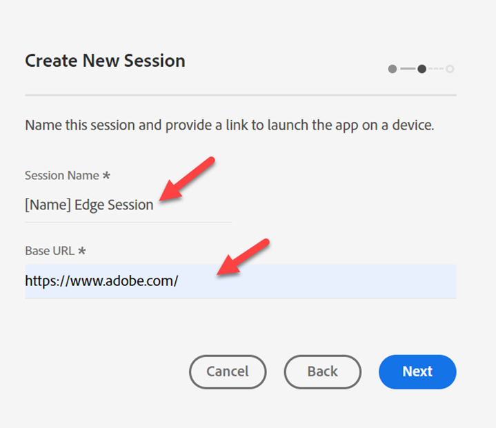
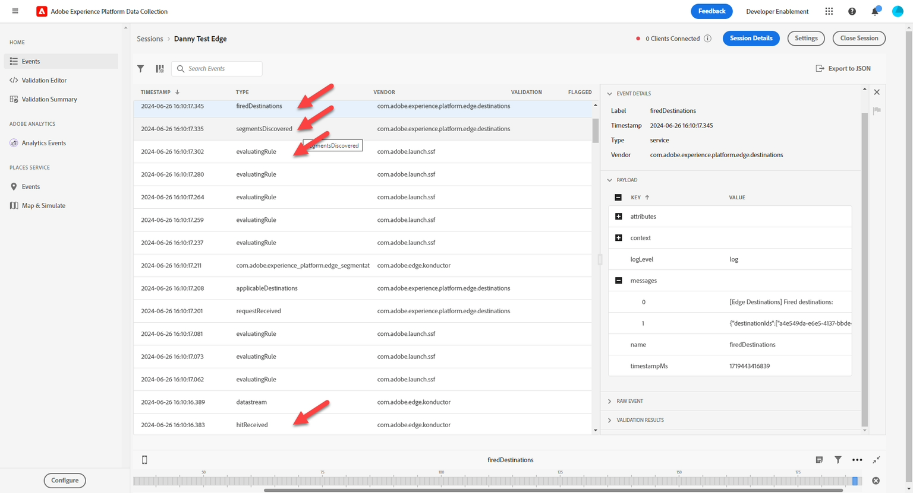

# Surveiller votre événement

## Accès à Assurance

[&#128279;](https://experienceleague.adobe.com/fr/docs/experience-platform/assurance/home) est un produit d’Adobe Experience Cloud qui vous permet d’inspecter, de tester, de simuler et de valider la manière dont vous collectez les données dans Adobe Experience Platform Edge.

1. Accédez à Adobe Experience Platform -> Assurance -> Créer une session

   

2. Cliquez sur le bouton **Démarrer**

## Configuration d’une session

1. Nom —> \[Sandbox] Session Edge
1. URL —> https\://www\.adobe.com
   - Notez que cette URL sera remplacée par le site réel de votre client
1. Cliquez sur le bouton Suivant .

   

&#x200B;4. Copiez le lien à un endroit auquel vous pourrez faire référence ultérieurement

&#x200B;5. Cliquez sur le bouton **Terminé**

   

&#x200B;6. Accédez à **Paramètres**

   

&#x200B;7. Activez **Transactions d’événement** et **Edge Delivery** en cliquant sur le bouton **+**, puis sur **Terminé**

## Ouvrir Postman

Accédez à Postman -> Créer une Edge d’événement web (aucune authentification) -> En-têtes .

1. Ajoutez le **x-adobe-aep-validation-token** aux en-têtes avec le lien copié ci-dessus à partir d’Assurance. Saisissez **uniquement la valeur ID** après l’opérateur = dans le lien que vous avez copié à partir d’Assurance. par ex. [https://www.adobe.com/?adb\_validation\_sessionid=](https://www.adobe.com/?adb_validation_sessionid=efa4a9ed-02d8-4647-80fa-f01a5be273d0) [`efa4a9ed-02d8-4647-80fa-f01a5be273d0`](https://www.adobe.com/?adb_validation_sessionid=efa4a9ed-02d8-4647-80fa-f01a5be273d0)
1. Nous utiliserions simplement la valeur [`efa4a9ed-02d8-4647-80fa-f01a5be273d0`](https://www.adobe.com/?adb_validation_sessionid=efa4a9ed-02d8-4647-80fa-f01a5be273d0), et non l’URL complète

   

&#x200B;3. Dans Postman, enregistrez et exécutez la requête **Création d’un événement web Edge (aucune authentification)**

## Affichage des journaux Assurance

Revenez à Assurance et vous devriez voir s’afficher un grand nombre d’événements. Filtrez vers le bas pour obtenir uniquement les types d’événements pertinents en indiquant votre identifiant de flux de données dans la recherche.

Sélectionnez un événement et ouvrez tous les messages si nécessaire sur le rail de droite.

Types d’événements à rechercher :

- hitReceived (affiche la payload reçue par l’Edge)
- assessmentRule (si vous configurez SSF, affiche les règles en cours d&#39;évaluation)
- fireDestinations (vers quelles destinations a-t-il été envoyé)
- segmentsDiscover (était-il éligible pour les segments Edge)
- com.adobe.experience\_platform.edge\_segmentation/response (avec quels segments a-t-il répondu)

Explorez-les et découvrez comment chaque étape est interprétée par Assurance.
