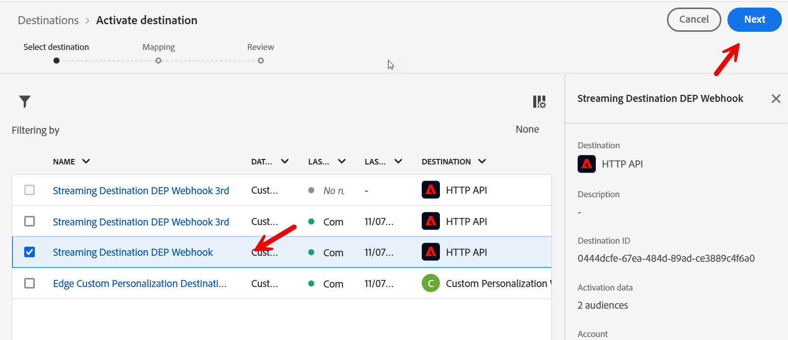

# Envoyer l’événement de commande au hub

## Diffusion en continu vers Hub ou Edge

Dans le cas d’utilisation #1, nous avons envoyé un événement à Edge.  Il existe certains cas d’utilisation où nous pouvons avoir un système back-end qui souhaite diffuser un événement, mais qui n’a pas besoin de l’envoyer à Edge.  Cet atelier explique comment procéder en diffusant en continu un événement de commande vers le Hub.

## Créer un segment de commande (si ce n’est pas le cas)

Cliquez sur Audience sur le rail de gauche, puis sur le bouton Créer une audience en haut à droite.


Recherchez la carte de type d’événement Commande passée et faites-la glisser sur la zone de travail.


## Mettre à jour les règles d’événement

Apportez les modifications suivantes aux règles d’événement (vous devrez peut-être développer l’événement pour l’afficher)

1. En dernier
1. 15
1. Minutes
1. Passer à l’évaluation par flux

Enregistrer sous **diffusion en continu d’événements de commande (dans les 15 minutes)**


## Activer vers la destination

Ouvrez l’audience que vous venez de créer si elle est fermée.

Cliquer sur Activer vers la destination


### Destination

Sélectionnez la destination de diffusion en continu que vous avez créée précédemment (Diffusion en continu DEP Webhook)




### Mappage

Laissez Mapping seul et cliquez sur Suivant


Cliquez sur Terminer

## Ouvrir Postman

Lancez Postman sur votre ordinateur et accédez à l’appel API suivant :

1. Barre Latérale Gauche De **Postman** —> `Collections`
1. **Collection** —> `AEP Foundations Bootcamps (labs)`
1. **Dossier** —> Laboratoire de profils
1. **Requête API** —> `Create Order Event`


## Modifier la requête API

Pour créer l’exemple de requête API, vous devez renseigner les éléments suivants dans le corps de la requête API.

Collectez d&#39;abord les valeurs suivantes :

## Rechercher le point d’entrée de diffusion en continu du compte

1. Accédez à **Sources** dans le rail de gauche, puis cliquez sur **Comptes** dans le volet de navigation supérieur
1. Recherchez **dep : API HTTP \[raw]**, mettez la ligne en surbrillance, copiez et enregistrez la valeur du point d’entrée **de diffusion en continu** à un endroit auquel vous pourrez vous référer ultérieurement

 le compte et copiez son point d’entrée de diffusion en continu](assets/send-order-event-to-hub-http-api-raw-streaming-endpoint.png « dep: HTTP API \[raw] »)

## Rechercher un ID de flux de données

1. Recherchez l’enregistrement de **dep: Orders (flux)** puis cliquez sur le lien flux de données .
1. Dans le rail de droite, copiez et enregistrez les valeurs **ID de flux de données** à un emplacement auquel vous pourrez faire référence ultérieurement

>[!NOTE]
>
>Cliquez dans un espace vide sur la ligne.  NE CLIQUEZ PAS sur les liens bleus !


## Créer une requête API finale

Copiez les valeurs enregistrées lors des étapes précédentes dans les emplacements mis en surbrillance ci-dessous.

- **Rouge** —> `Streaming Endpoint URL`
- **Vert** —> `Dataflow ID`

Votre requête d’API finale doit ressembler à ceci une fois terminée

>[!CAUTION]
>
>NE PAS EXÉCUTER POUR LE MOMENT


## Exécution de l’API

1. Enregistrez votre appel API en cliquant sur le bouton **Enregistrer**
1. Exécutez votre demande en cliquant sur le bouton **Envoyer**

Un appel réussi doit entraîner la réponse suivante...


## Valider

1. Accédez à votre profil et recherchez votre profil pour voir que l’événement a été ingéré dans Profile.  Il devrait apparaître en secondes.
   1. Recherche du profil à l’aide de l’e-mail dans la commande
1. Vérifiez que le profil est qualifié pour les segments (cela peut prendre quelques minutes). Il devrait apparaître en quelques secondes ou minutes.
   1. Commander la diffusion en continu des événements (dans les 15 minutes)
1. Vérifiez votre webhook pour voir si la destination a notifié le webhook d’un segment « réalisé ».  Il devrait apparaître dans 5-10 minutes.
1. Au bout de 15 à 30 minutes, vous pouvez même vérifier votre jeu de données avec les éléments suivants :
   1. Remplacez le nom du tableau ci-dessous par celui de votre sandbox.  Pour le trouver, accédez à la liste de vos jeux de données et filtrez sur « `dest` », ouvrez le jeu de données et copiez le nom du tableau sur le rail de droite.

```sql
SELECT * FROM profile_export_for_destination_merge_policy_xxx
WHERE extSourceSystemAudit.LASTREFERENCEDDATE >= CURRENT_DATE
AND identitymap['email'][0].ID in ('depche.mode@dep.com')
ORDER BY extSourceSystemAudit.LASTREFERENCEDDATE DESC
LIMIT 10
```
