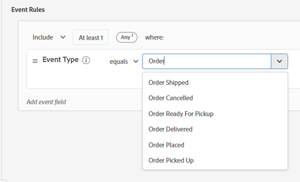
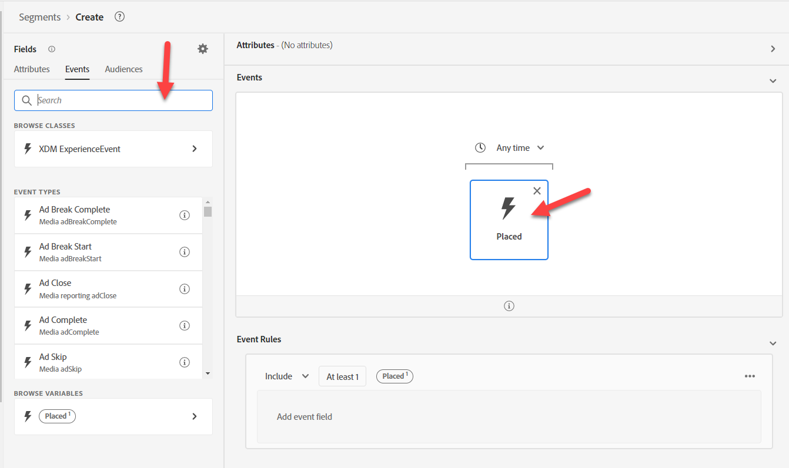
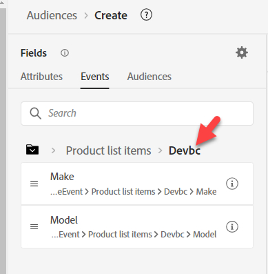
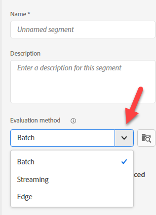

# Créer un #1 d’audience

## Objectif du Lab

Créer une audience qui ne trouve que les profils ayant passé une commande pour un iPhone 14

## Décomposition de l’audience

Commencez par créer votre première audience. Il est composé de nombreux éléments que nous devons incorporer. Cliquez sur Audience sur le rail de gauche, puis sur le bouton Créer une audience en haut à droite.

Nous allons diviser ce cas d’utilisation en plusieurs parties et les résoudre avec plusieurs audiences. La raison en est que nous essayons de faire de cette diffusion une diffusion en continu et que deux choses l’empêchent :

1. La clause d’exclusion « aucune commande n’existe pour iPhone 14/Pixel 7 »
1. La clause d’exclusion « no active iPhone 14/Pixel 7 ». Nous en examinerons les ramifications à la fin.

## Partie 1 - Découverte

La première partie de notre audience consiste à rechercher « aucune commande n’existe pour un iPhone 14 ». Imaginons que nous soyons un nouveau spécialiste marketing d’AEP et que nous n’ayons pas conçu le schéma. Recherchez « Ordre » dans l’onglet Événements du rail de gauche

Vous obtenez de nombreux objets liés à une commande

- Attributs : par exemple, ID de commande, Date de commande
- Dossiers : par exemple, Order, Plan Order Details
- Types d’événement : par exemple Commande passée, Commande envoyée, etc.

>[!NOTE]
>
>&#x200B;* Il n’y a pas de « i » pour l’ordre « dossier ». Même si notre description a été renseignée, elle ne l’a pas et cela peut être une source de confusion pour votre spécialiste marketing, car il peut essayer de l’utiliser ou vouloir en connaître la nature.
>&#x200B;* Le « i » des cartes d’événement répète simplement le type, car le type d’événement est un champ et non plusieurs.
>&#x200B;* Les données récapitulatives s’affichent uniquement si la valeur est présente dans plus de 2 % des profils fusionnés. Cela génère également une saisie semi-automatique lors du filtrage sur une chaîne.

Utilisez la carte Type d’événement de commande passée et faites-la glisser sur la zone de travail.

&#x200B;> [!TIP]
>
>**Facultatif:**
>
>Chaque événement possède un type d’événement.  Nous pouvons filtrer selon le type d’événement au lieu d’utiliser une carte de type d’événement .
>
>Revenez à l’époque où nous avons étendu le type d’événement de schéma d’ordre. Nous avons ajouté les valeurs que nous voyons désormais dans la liste déroulante.  Ces mêmes valeurs apparaissent sous la forme de cartes Type d’événement .
>
>Si vous le souhaitez, vous pouvez utiliser l’une ou l’autre des approches.
>
>Dans une nouvelle audience, accédez à Événement d’expérience XDM et faites glisser sur Type d’événement.
>
>
>
>Le filtrage à l’aide de cartes Type d’événement est identique au filtrage à l’aide du champ Type d’événement
>
>
>
>Avantages de l’utilisation des cartes de type événement :
>
>- Il affiche le nom du type d’événement dans l’audience, ce qui facilite et accélère sa compréhension
>- Il est rapide et nécessite moins d’étapes
>
>Avantage de l’utilisation du champ Type d’événement :
>
>- Il permet de sélectionner plusieurs types d’événements (par exemple, « Commande prélevée » ou « Commande remise ») si nous voulons inclure plusieurs types dans un seul critère
>- Elle prend en charge le respect de la casse

>[!NOTE]
>
>Il existe quelques options à prendre en compte pour l’option « Aucune commande n’existe ».  Nous choisissons une approche simple, mais voici quelques éléments à prendre en compte dans le monde réel :
>
>- Commande passée mais ramassée ou expédiée
>- Commande passée mais annulée
>- Plusieurs commandes ont été passées, mais une a été annulée

Notre spécialiste marketing sait grâce à sa formation que plusieurs sources de données ont été chargées :

- Commandes (capturées par le système de commandes sur tous les canaux)
- Web (suivi côté client de ce sur quoi les personnes cliquent, y compris les commandes passées sur le site)
- eCommerce (capturé par le système eCommerce sur le site)

Quelle source devrions-nous utiliser ? Ils représentent tous logiquement le même événement « Commande passée ». Mais ils sont physiquement stockés dans différents systèmes. Comment savons-nous lequel utiliser ? La meilleure méthode consiste à consulter les descriptions de chaque objet de schéma et de chaque champ à connaître.

>[!NOTE]
>
>Les descriptions doivent comporter des informations pertinentes pour aider à prendre ces décisions, telles que :
>
>1. D’où proviennent les données ?
>2. Que contient-il ou ne contient pas ?
>3. Quelle est la latence ?
>4. Un système a-t-il été désigné comme « source de vérité »?
>5. Y a-t-il des nuances dont nous devons tenir compte?

Pour nous, nous voulons utiliser Commande passée, mais gardez à l’esprit que, selon notre cas d’utilisation, nous aurions pu avoir les exigences suivantes, qui peuvent influencer la source à partir de laquelle nous extrayons :

- Achats sur site au cours des 30 dernières minutes
- Commandes passées et non annulées
- Les commandes sont récupérées dans un délai d&#39;un jour après leur préparation

>[!TIP]
>
>Exercice de réflexion optionnel, imaginez que nous ayons placé une seule Commande sur notre site aujourd’hui (rappelez-vous que la Commande est enregistrée par les trois systèmes) :
>
>1. Combien d’événements seraient comptabilisés pour les commandes passées aujourd’hui ?
>2. Combien de commandes ont été passées du point de vue des clients ?
>3. Combien d’événements seraient comptabilisés si nous appliquions un filtre sur Méthode d’expédition = pendant la nuit (en supposant qu’ils aient choisi cette option) ?
>4. Comment devons-nous résoudre ce problème (audience ou modèle de données) ?

Après avoir fait une analyse, nous allons passer à la `Orders Event of Event Type=”order. placed”`. Nous voulons nous assurer que notre audience utilise la source de vérité au compromis de la vitesse (les données web arrivent avec chaque clic pendant que la commande passe par un certain traitement avant d&#39;être envoyée). De plus, à l&#39;avenir, nous voudrons peut-être exclure ceux qui ont annulé et cela pourrait se faire par n&#39;importe quel canal.

## Partie 2 - Création de l’audience

Activer Afficher le schéma complet

Appuyez-vous sur ce que vous avez commencé.  Cliquez sur la carte Placé , puis **effacez « placé » de la zone de recherche** sur le rail de gauche et effectuez une analyse en profondeur pour obtenir les informations suivantes :

Événement d’expérience XDM -> Dossier d’éléments de la liste de produits

>[!WARNING]
>
>Une confusion courante pour votre professionnel du marketing serait d’utiliser Appareil plutôt que Produit ici (puisque nous appliquerons un filtre sur iPhone). Encore une fois, une autre raison pour de bonnes descriptions.

Nous recherchons un élément sur lequel nous pouvons appliquer un filtre et qui pourrait être associé à iPhone. Remarquez que nous avons trois options

- Nom
- Produit
- SKU

Ils pourraient tous être de bons candidats, mais nous ne le savons pas.  Cliquez sur le « i » pour plus de détails sur chacun d’eux.

>[!NOTE]
>
>Vous pouvez modifier les descriptions de n’importe quel champ prêt à l’emploi. Mettez à jour ou même masquez les champs qui ne sont pas utilisés pour réduire la confusion pour vos utilisateurs. Ces descriptions prêtes à l’emploi peuvent ne pas avoir de sens dans votre secteur/entreprise.
>
>Une bonne description peut même contenir des exemples
>
>- Nom Description = nom d’affichage du produit tel qu’il est présenté à l’utilisateur pour cette vue de produit. Par exemple : iPhone 14, pixel 7
>- Description du SKU = Unité de gestion des stocks (SKU), identifiant unique d’un produit défini par le fournisseur. Par exemple : iP14, Pix7
>- Description du produit = Identifiant XDM du produit lui-même. Par exemple : 123, 456

Activer « Afficher uniquement les champs contenant des données »

>[!NOTE]
>
>**Schéma observable**
>
>Ce n’est que dans ce cas que les champs contiennent des données.  Il s’agit d’une méthode permettant aux applications reposant sur AEP d’exclure de l’utilisation de champs qui s’avèrent inutiles.
>
>**Schéma XDM complet**
>
>Il s’agit de tous les champs du schéma d’union, même si des données y ont été chargées.

Une fois que vous avez activé « Afficher uniquement les champs contenant des données », vous remarquez les champs que vous pensiez utiliser disparaître.

Accédez à XDM ExperienceEvent > Éléments de la liste de produits > Dép > Modèle .

Le modèle lui ressemble, mais ne comporte aucune description.

Faites-la glisser sur la carte Événement placé.

Ajouter iPhone 14

Au-dessus de l’événement placé, remplacez « À tout moment » par « Aujourd’hui ».

>[!NOTE]
>
>Nous filtrons sur aujourd&#39;hui parce que nous ne nous soucions pas des commandes passées il y a une semaine, un mois ou un an.  En outre, une recherche en amont plus longue sera traitée dans la section suivante.  À un moment donné, l’ordre devient « *détenu »* et nous allons créer un segment pour cela.

Fournir une description

Remplacez la méthode d’évaluation par **Streaming**.

**Enregistrer l’audience** comme « *Commande passée iPhone 14* »

Cliquez sur le bouton bleu **Activer l’audience** vers la destination

Sélectionnez la destination **Webhook de streaming DEP** et cliquez sur Suivant

Ne modifiez pas le mappage, cliquez sur Suivant puis sur Terminer

>[!NOTE]
>
>**Conteneurs**
>
>Remarquez que lorsque nous filtrons sur Nom dans la liste Produit , certains conteneurs sont automatiquement ajoutés. La raison en est que les éléments de la liste de produits sont d’un type de données Tableau . Lors du filtrage sur un tableau, un conteneur est créé (appelé éléments de liste de produits dans notre exemple).
>
>
>
>
>
>Les conteneurs sont un moyen de référencer une variable d’événement ou un élément de tableau. Vous pouvez en savoir plus sur les ramifications de cette opération dans ce blog, mais pour plus de simplicité, cela vous permet de spécifier si un seul élément du tableau répond aux deux conditions ou si la condition peut être répartie sur deux éléments.
>
>[&#128279;](https://experienceleaguecommunities.adobe.com/t5/adobe-experience-platform-blogs/how-exactly-do-containers-work-in-aep-segmentation-a-deeper-look/ba-p/458780?profile.language=fr)

>[!WARNING]
>
>**Filtres temporels**
>
>Bien que rien ne soit spécifié dans les exigences, cette audience présente un problème que nous devrions vérifier et clarifier avec l’entreprise.
>
>Les exigences n’avaient pas de filtre temporel. Cela veut dire que si quelqu&#39;un passait une commande il y a un an ou cinq ans, il serait admissible. Essayez toujours d’incorporer une méthode pour vous assurer de ne pas tomber dans ce piège ou de toujours devoir mettre à jour vos audiences au fur et à mesure que la nouvelle version est publiée.
>
>Si nous modifions le filtre temporel que nous avons ajouté, jusqu’à combien de temps en arrière pouvons-nous remonter avant qu’un segment Edge ne devienne Diffusion en continu ou même Lot ?

>[!CAUTION]
>
>**Le produit est-il stocké à deux endroits ?**
>
>Notez les différentes conventions de dénomination des chemins d’accès et descriptions. Le comparer à l’audience précédente
>
>- XDM Individual Profile > Dep > Produits actifs > Propriétés de l’ID de produit > Nom du produit
>  - Description : nom du produit.
>- XDM ExperienceEvent > Éléments de la liste de produits > Dép > Modèle
>  - Description : nom d’affichage du produit tel qu’il est présenté à l’utilisateur pour cette vue de produit.
>
>Lorsque nous commençons à stocker la même valeur à différents endroits pour différentes raisons et à différentes fins, nous devons réfléchir aux ramifications pour nos utilisateurs et à la manière dont le profil les fusionnera (et comment une politique de fusion résoudra ce conflit si nécessaire).
>
>Nos descriptions actuelles rendent difficile pour le professionnel du marketing de savoir lequel utiliser
