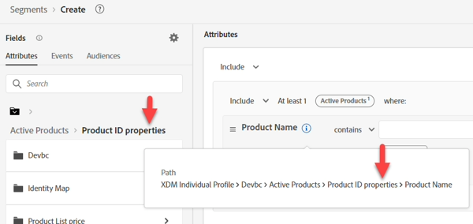
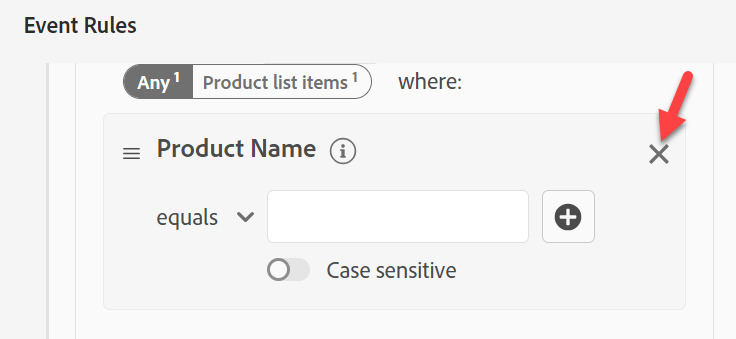

# Créer un #2 d’audience

## Objectif du Lab

Créez une audience qui trouve tous les profils dont la ligne active n’est pas une iPhone 14

## Tâches d&#39;analyse

Cette audience est constituée de « ceux qui n’ont pas d’iPhone 14 actif ».

- Comment savoir si une personne « n’a pas d’iPhone 14 actif » ?  Idées :
  - Inclure ceux qui ont acheté un iPhone 14
  - Inclure ceux qui disposent de données de facturation pour un iPhone 14
  - Incluez ceux qui disposent de données web provenant d’un iPhone 14
  - D&#39;autres ?

En fin de compte, il s&#39;agit d&#39;un choix d&#39;affaires quant à la personne à qui ils veulent vendre. Dans notre cas, la société a jugé cela si important que nous avons créé un schéma qui définit les lignes actives, alors utilisez-le.

>[!NOTE]
>
>Étant donné que Lignes actives est un tableau stocké sur un profil, cela va sélectionner le propriétaire du compte par rapport à chaque propriétaire individuel de l&#39;appareil. Assurez-vous que l’équipe marketing en est consciente et le souhaite. Sinon, il se peut que vous souhaitiez une approche différente.

## Créer une audience (possède iPhone 14)

1. Dans l’onglet Attributs du rail de gauche, accédez à Nom du produit (ou recherchez-le).
   - Profil individuel XDM —> \&lt;nom du client> —> Produits actifs —> Propriétés de l’ID de produit —> Nom du produit
1. Faites glisser Nom du produit sur la zone de travail

## Enregistrer l’audience

1. Saisir iPhone 14 (conserver en tant qu’évaluation par lots)
1. Fournir une description
1. Enregistrer l’audience en tant que « *possède iPhone 14* »
   - Suivez les mêmes étapes pour le Pixel 7 (si vous avez le temps).

>[!TIP]
>
>**Side a pensé : « ne pourrions-nous pas simplement filtrer les événements, plutôt que d’avoir un autre champ sur Profile qui stocke la même chose ?**
>
>Oui, nous le pourrions, mais nous devons aborder certaines nuances commerciales et techniques qui rendent les audiences complexes et introduisent certains défis :
>
>1. Si nous utilisons l’événement d’achat :
>   1. Et s’ils n’achetaient pas chez nous, mais avaient une ligne active ?
>   1. Et s&#39;ils ont acheté il y a 2 ans, ma règle doit remonter à N années en arrière et nous n&#39;avons conservé qu&#39;un an d&#39;Événements sur Profile ?
>1. L’événement de facturation semble mieux convenir :
>   1. Mais les données datent maintenant d&#39;un mois.
>   1. Et si le dernier événement de facturation remonte à 2 ans, il peut inclure des personnes qui ne sont pas des clients ?
>   1. Que se passe-t-il si le chargement de mes données échoue ? Mon décompte peut tomber à zéro si je ne regarde qu’un mois en arrière pour exclure les anciennes données ?
>   1. Capturons-nous même l’appareil pour un événement de facturation ? Non, nous devrions donc modifier notre flux de données
>
>En fin de compte, nous devrons faire des compromis pour ce public. Si vous êtes toujours d’accord pour utiliser des événements pour cette règle, lisez ce blog à ce sujet : https\://experienceleaguecommunities.adobe.com/t5/adobe-experience-platform-blogs/how-to-capture-latest-experience-event-in-adobe-experience/ba-p/430941

>[!NOTE]
>
>**Activation d’une politique de fusion pour Edge**
>
>Assurez-vous que votre politique de fusion est configurée pour les audiences Edge. Accédez à vos politiques de fusion et modifiez la politique de fusion par défaut pour \_xdm.context.profile.  Activez la politique de fusion Active-On-Edge et enregistrez-la.
>
>
>
>
>
>

## Recréer l’audience

Le marketing est arrivé aujourd’hui et nous a donné l’exigence d’avoir ce Streaming et malheureusement, la façon dont nous l’avons construit est le Batch. Corrigez les éléments suivants :

1. Ouvrez l’audience « *possède iPhone 14* » et remplacez le nom par « *possède le lot iPhone 14 »*.

   >[!WARNING]
   >
   >Aujourd’hui, nous ne pouvons pas modifier la méthode d’évaluation dans l’interface utilisateur. Toutes les audiences qui font référence à cette audience doivent également être supprimées. Gardez cela en tête lorsque vous décidez de votre stratégie de création d’utiliser des segments dans des segments.

2. Créez une audience. Ajoutez l’audience « Possède un lot d’audiences iPhone 14 » à la zone de travail et cliquez sur Convertir en règles.

   

   

3. Mettez à jour Description, Nom et Méthode d’évaluation sur Diffusion en continu dans le coin inférieur droit, puis cliquez sur l’icône de dossier à côté de la Méthode d’évaluation. Vous devriez voir ceci :

   

   Bien que cela ne soit pas évident, la raison en est que nous utilisons le nom du produit sur un schéma de recherche

   >[!NOTE]
   >
   >Chaque fois que nous utilisons une recherche, notre méthode d’évaluation est forcée à Batch.
   >
   >Vous pouvez le voir si vous regardez le chemin qui contient des « propriétés » n’importe où
   >
   >

4. Remplacez la valeur existante pour que le nom du produit provienne désormais du schéma XDM Individual Profile .

   Remplacez le chemin suivant : .

   - XDM Individual Profile > Dep > Produits actifs > Propriétés de l’ID de produit > Nom du produit

   Ajoutez le nouveau chemin :

   - XDM Individual Profile > Dep > Active Products > Model

   

   

5. Remplacez la Méthode d’évaluation par Diffusion en continu et cliquez sur l’icône de dossier

   

6. Fournissez une description pour la nouvelle audience éligible à la diffusion en continu.

   - Enregistrez l’audience en tant qu’audience « *possède iPhone 14* ».
   - Cliquez sur le bouton bleu **Activer l’audience** vers la destination

   

7. Sélectionnez la destination **Webhook de streaming DEP** et cliquez sur **Suivant**

8. Cliquez sur **Suivant** puis **Terminer**

>[!NOTE]
>
>Considérations sur les raisons de sélectionner Lot par rapport à Diffusion en continu ou Edge :
>
>Derniers mécanismes de sécurisation : [&#128279;](https://experienceleague.adobe.com/docs/experience-platform/profile/guardrails.html?lang=fr)

>[!TIP]
>
>**Laboratoire de défis facultatif**
>
>Fini tôt ?
>
>Créez une audience de type « Fidélité des appareils Apple » dans une famille.  Toutes les personnes du plan ont le même type d’appareil (Apple).
