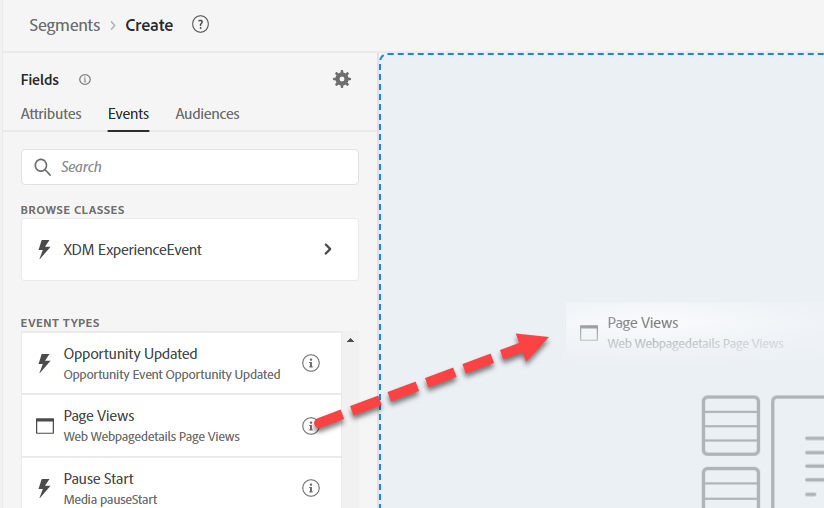

# Créer un #3 d’audience

## Objectif du Lab

Créer une audience qui a visité une page produit iPhone 14

## Tâches d&#39;analyse

Cette audience doit être directe.  Nous avons peut-être plusieurs pages de produits, mais rien de difficile ici.

## Création d’une audience (n’importe quelle page visitée)

1. Recherchez un événement Page vue dans l’onglet Événement sous Types d’événement dans le rail de gauche et ajoutez-le à l’audience

   

   >[!NOTE]
   >
   >**Utilisation des types d’événements**
   >
   >En utilisant l’événement Page vue , nous nous assurons que l’audience évalue uniquement le nom de page dans le contexte d’une page vue. Il doit être redondant, car un Nom de page n’existe que sur une Page vue, mais offre deux avantages :
   >
   >- Fournit une documentation visuelle de haut niveau à l’utilisateur ou à l’utilisatrice qui consulte l’interface utilisateur
   >- Fournit un filtrage pour s’assurer que les nouveaux événements ne sont pas inclus lorsque ce n’était pas l’intention
   >
   >C’est pourquoi il est recommandé de réfléchir attentivement aux types d’événements que vous utilisez pour chaque schéma d’événement que vous créez. Ils sont essentiels pour le filtrage et les guides visuels.

2. Fournissez une description et rendez-la Diffusion en continu.

3. Au-dessus de l’événement placé, remplacez « À tout moment » par « Aujourd’hui ».

   

4. Enregistrez cette audience en tant que « *n’importe quelle page visitée »*

5. Cliquez sur le bouton bleu **Activer l’audience** vers la destination

6. Sélectionnez la destination **Webhook de streaming DEP** et cliquez sur Suivant

7. Cliquez sur Suivant et Terminer

## Création d’une audience (page iPhone 14 visitée mais non possédée/commandée)

1. Créer une nouvelle audience et ajouter l’événement Pages vues

   

2. Naviguez jusqu’à l’emplacement Nom de page et ajoutez le champ Nom de page à l’événement afin de pouvoir le filtrer.

   - XDM ExperienceEvent —> Web —> Détails de la page web —> Nom

   

3. Ajouter contient « iPhone 14 »

   

   >[!TIP]
   >
   >**Recherche de « Page »**
   >
   >Plutôt que d’accéder au champ, essayez de rechercher « Page »
   >
   >Le nom de la page ne s’affiche pas. En raison de son nom :
   >
   >- XDM ExperienceEvent > Web > Détails de la page web > Nom
   >
   >Votre dossier apparaît, mais pas le champ lui-même. Lorsque vous rassemblez vos conventions de nommage, tenez compte de ceci et d’autres termes courants que les gens peuvent rechercher et incorporez-les dans votre nommage.
   >
   >La recherche ne recherche pas les descriptions
   >
   >

4. Au-dessus de l’événement placé, remplacez « À tout moment » par « Aujourd’hui ».

   

   >[!NOTE]
   >
   >Puisque nous activons en fonction des événements qui se sont produits aujourd’hui, nous nous concentrons uniquement sur les pages vues pour aujourd’hui.

5. Vérifiez que l’action est en flux continu et fournissez une description.

6. Enregistrer l’audience en tant que « *page iPhone 14 visitée* »

   

7. Cliquez sur le bouton bleu **Activer l’audience** vers la destination

8. Sélectionnez la destination **Webhook de streaming DEP** et cliquez sur Suivant

9. Cliquez sur Suivant et Terminer

## Création d’une audience d’audiences

1. Accédez à l’onglet Audiences dans le volet de navigation supérieur gauche
1. Accéder à Experience Platform
1. Extrayez les trois autres audiences que nous avons précédemment créées.
1. Modifiez la valeur Inclure en N’inclut pas pour possède iPhone 14 et a passé commande iPhone 14.

   

&#x200B;5. Fournissez une description.

&#x200B;6. Passer à la diffusion en continu

&#x200B;7. Enregistrer en tant que « *Page iPhone 14 visitée mais non possédée/commandée* »

&#x200B;8. Cliquez sur le bouton bleu **Activer l’audience** vers la destination

&#x200B;9. Sélectionnez la destination **Webhook de streaming DEP** et cliquez sur Suivant

&#x200B;10. Cliquez sur Suivant et Terminer

>[!NOTE]
>
>**Filtre temps**
>
>Les exigences n&#39;étaient pas assorties de délais, alors si quelqu&#39;un visitait le pays il y a trois ans, il serait admissible. Selon notre cas d’utilisation, cela peut fonctionner ou non. Cela vaut la peine de le demander. Nous en avons ajouté un, car nous l’activons en fonction des personnes qui ont visité notre site web aujourd’hui.  Cela peut ne pas fonctionner dans tous les cas d’utilisation.  Si nous ajoutons un filtre temporel, jusqu’à combien de temps pouvons-nous remonter avant qu’une audience Edge ne devienne en flux continu ou même par lots ?

>[!NOTE]
>
>**Ramifications de la séparation**
>
>Nous avons divisé ce qui est une exigence simple en de nombreuses audiences pour quelques raisons. L’exigence concerne la diffusion en continu, mais ces deux exigences transforment notre audience en lot. Plus de détails ici sur les règles d’éligibilité de diffusion en continu ici :
>
>[&#128279;](https://experienceleague.adobe.com/docs/experience-platform/segmentation/ui/streaming-segmentation.html?lang=fr)

>[!NOTE]
>
>**Que sont les audiences des audiences diffusées en continu**
>
>Notre blog *Peeking Under the Hood of Audience* (lien ci-dessous) en parle un peu. Il indique comment le résultat d’une audience est stocké sur le profil. Cela est important, car comme les flux de données dans celui-ci examinent les résultats d’une audience stockée sur le profil, l’audience n’est pas exécutée à nouveau à ce moment-là. Une simple nuance mais qui mérite d&#39;être comprise. La plupart des attributs de profil sont mis à jour régulièrement. Cette approche est donc logique.
>
>Nous devons comprendre que lors de l’utilisation d’une audience dans une audience , AEP tentera de séquencer le moment venu. Dans certains cas particuliers, cela n’est pas possible, par exemple. Si une Audience d’audiences est utilisée, la disqualification du profil se produit toutes les 24 heures.
>
>[&#128279;](https://experienceleaguecommunities.adobe.com/t5/adobe-experience-platform-blogs/peeking-underneath-the-hood-of-segments-in-aep-adobe-experience/ba-p/453535?profile.language=fr)

## Pourquoi Créer Plusieurs Audiences ?

Si nous avions créé toutes ces audiences dans une seule audience au lieu de quatre, nous aurions une méthode d’évaluation par lots, même si chaque audience est en flux continu.

En divisant ces audiences et en utilisant une audience d’audiences, nous obtenons ce comportement.  Qualification en temps réel de ces audiences en tant que flux de données dans

- IPhone 14 ordonné
- possède iPhone 14 ;
- Page iPhone 14 visitée

>[!WARNING]
>
>Aujourd’hui, il y a une disqualification de latence quotidienne/24 heures pour les audiences

Conclusion : nous avons troqué une entrée plus rapide dans l’audience en la divisant en morceaux avec une latence de 24 heures, dont certains sont sortis de l’audience.

>[!TIP]
>
>**Laboratoire de défis facultatif**
>
>Fini tôt ?
>
>Je souhaite cibler les personnes qui ont un ancien téléphone avec un e-mail.  Créez une audience de type « A un ancien téléphone ».  Comment pourrions-nous les cibler ?
