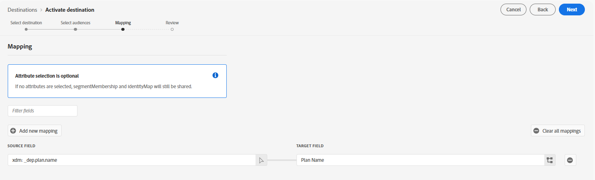

# Configurer une destination Personalization personnalisée

L’utilisation d’une [Destination Personalization personnalisée](https://experienceleague.adobe.com/en/docs/experience-platform/destinations/catalog/personalization/custom-personalization) permet de rendre les audiences disponibles sur Edge pour une utilisation par un tiers, généralement à l’aide de l’API du serveur réseau, à des fins de personnalisation.

Cet atelier configure la destination Personalization personnalisée afin que nous puissions envoyer des attributs de profil à Edge.

## Parcourir le catalogue de destinations

>[!NOTE]
>
>Pour la personnalisation à l’aide d’Adobe Target, nous utilisons la [Destination Adobe Target.](https://experienceleague.adobe.com/en/docs/experience-platform/destinations/catalog/personalization/adobe-target-v2) Le comportement est identique à celui de Custom Personalization.

1. Dans le rail de gauche, cliquez sur **Destinations**
1. Dans le rail supérieur, cliquez sur **Catalogue**
1. Sélectionnez ensuite la catégorie de **&#x200B;**
1. Au milieu de l’écran, vous devriez voir la destination intitulée **Custom Personalization with Attributes.** Cliquez sur le bouton **Configurer** sur cette carte.

## Configurer la destination

### Configuration du compte

Nommez votre compte `DEP Labs Custom PZN` puis cliquez sur le bouton **Se connecter à la destination**

### Ajouter les détails de la destination

Renseignez les détails de destination suivants :

1. Nom -> **Destination**
1. Alias d’intégration -> **edgeAlias**
1. Identifiant du flux de données -> *sélectionnez le nom du flux de données que vous avez créé précédemment*
1. Lorsque vous avez terminé, cliquez sur le bouton **Suivant**

>[!CAUTION]
>
>Une fois que vous avez cliqué sur Suivant, vous ne pouvez plus modifier le **Nom** ou le **Alias d’intégration**.  Ces éléments apparaîtront ultérieurement dans les réponses d’Edge Network

### Sélectionner la politique de gouvernance

Sélectionnez Personalization sur site **puis cliquez sur le bouton** Créer **&#x200B;**

>[!NOTE]
>
>Bien que cette étape soit facultative, il est vivement recommandé d’attribuer une politique de gouvernance à toute destination que vous créez afin d’éviter d’activer des profils par erreur

Une fois cette opération terminée, vous devriez voir cet écran vous signaler votre réussite.

## Activer la destination

### Sélectionner des audiences

Sélectionnez la destination que vous venez de créer en cliquant sur la ligne pour la mettre en surbrillance, puis cliquez sur le bouton **Suivant**

Sélectionnez **Toutes les audiences** puis cliquez sur **Suivant**

### Mappage

Ajoutez un **nouveau mappage** comme suit :

| Champ Source | Champ cible |
| ---------------------- | ------------ |
| \_tenantName.plan.name | Nom du plan |

&#x200B;> [!NOTE]
>
>N’oubliez pas de remplacer **\_tenantName** par votre nom de client

>[!NOTE]
>
>Le champ cible permet de fournir un nom convivial qui peut être différent du nom XDM

Lorsque vous avez terminé, l’écran doit ressembler à l’image ci-dessous.  Vous pouvez ensuite cliquer sur le bouton Suivant **&#x200B;**

>[!NOTE]
>
>Comme les attributs de profil peuvent contenir des données sensibles, tous les [appels &#x200B;](https://experienceleague.adobe.com/en/docs/experience-platform/edge-network-server-api/overview) l’API du serveur Edge Network doivent être effectués dans un contexte authentifié afin de récupérer l’attribut une fois qu’il se trouve sur Edge.

### Révision

Sur le dernier écran, vous pouvez consulter les détails de votre configuration, puis cliquer sur le bouton Terminer .

>[!NOTE]
>
>C’est à ce moment que [Application automatique](https://experienceleague.adobe.com/en/docs/experience-platform/data-governance/enforcement/auto-enforcement) vérifie vos [politiques d’utilisation des données](https://experienceleague.adobe.com/en/docs/experience-platform/data-governance/policies/overview). Il vérifie vos actions marketing avec les règles que vous avez créées et génère d’éventuelles erreurs.
