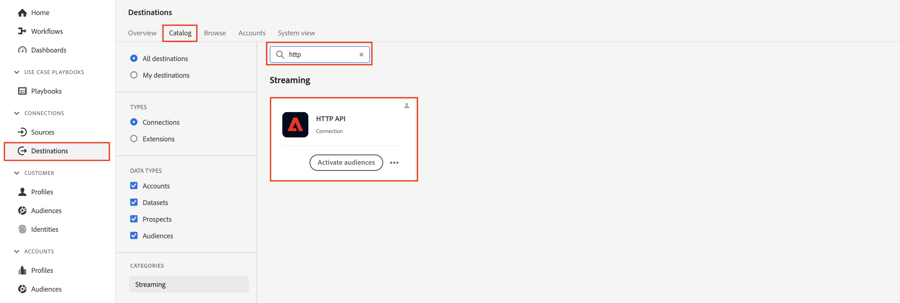
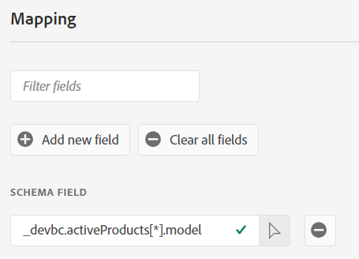

# Configurer une destination de diffusion en continu

>[!NOTE]
>
>Passez à l’étape suivante si vous avez déjà configuré votre destination de diffusion en streaming !

## Obtenir l’URL du webhook

>[!NOTE]
>
>Nous allons utiliser un webhook ici afin de voir si les données sont arrivées à la destination vers laquelle nous envoyons. Dans un scénario réel, nous nous connecterions à cette destination et utiliserions ses outils pour voir ce qui est arrivé.

1. Ouvrez le lien suivant dans un nouvel onglet de votre navigateur -> [&#128279;](https://webhook.site/)
1. Copiez l’URL unique qui s’affiche et enregistrez-la en lieu sûr.

## Configurer la destination de l’API HTTP

>[!NOTE]
>
>Nous utilisons une destination de diffusion en continu comme proxy pour envoyer ces données à un tiers (par exemple, Facebook). Dans un scénario réel, vous utiliseriez une destination Facebook au lieu d’une destination d’API HTTP pour envoyer des données à Facebook.

Dans l’interface utilisateur d’Experience Platform, accédez au catalogue de destinations en procédant comme suit :

1. Cliquez sur **Destinations** dans le rail de gauche
1. Cliquez sur **Catalogue** dans le rail supérieur
1. Dans la zone de recherche, saisissez **http**
1. Cliquez sur le bouton **Configurer** pour configurer la destination de l’API HTTP

>[!NOTE]
>
>Vous utilisez la destination de diffusion en continu de l’API HTTP pour le ou les laboratoires afin de démontrer le fonctionnement d’un connecteur de diffusion en continu réel.

## Configuration

1. Type de connexion **Aucune**
1. Cliquez sur **Se connecter à la destination**

>[!NOTE]
>
>En règle générale, nous ajoutons des informations d’authentification à ce stade, mais aucune n’est requise pour ce webhook.

&#x200B;3. Renseignez les détails de configuration de la destination comme suit :

- **Nom** -> `Streaming DEP Webhook - [Your Initials]`
- **Description** -> `[your webhook endpoint you copied above]`
- **Point d’entrée** -> ` [your webhook endpoint you copied above]`
- **Paramètres de requête** -> `leave blank`
- **En-têtes** -> `leave blank`
- Inclure les noms de segment -> bascule
- Inclure la date et l’heure du segment -> Activer

Lorsque vous avez terminé, assurez-vous que votre configuration correspond à ce que vous voyez ci-dessous.  Si tout semble correct, cliquez sur le bouton **Suivant** en haut à droite pour passer à l’étape suivante

>[!CAUTION]
>
>Les paramètres de point d’entrée, d’en-tête et de requête ne peuvent pas être modifiés dans l’interface utilisateur une fois enregistrés

## Définition de la gouvernance

1. Sélectionnez **Ciblage intersite** dans Actions marketing
1. Lorsque vous avez terminé, cliquez sur le bouton **Suivant** pour passer à l’étape suivante

>[!NOTE]
>
>Vous pouvez en savoir plus sur les politiques de gouvernance dans Experience League
>
>[&#128279;](https://experienceleague.adobe.com/docs/experience-platform/data-governance/policies/overview.html?lang=en#core-actions)

## Sélectionner des audiences

1. Sélectionner toutes les audiences
1. Lorsque vous avez terminé, cliquez sur le bouton **Suivant** pour passer à l’étape suivante

## Ajouter des mappages

>[!NOTE]
>
>Nous ajoutons ici un champ à partir du profil. Si ce champ ne contient aucune donnée, il se peut que rien ne soit transmis à la destination. Plusieurs mises à jour au fil du temps sur le profil et les événements peuvent parfois entraîner le déclenchement multiple de la destination et l’envoi de plusieurs payloads.

1. Cliquez sur **Ajouter un nouveau champ** pour ajouter un champ au schéma
1. Saisissez **model** dans la zone d’entrée du champ de schéma, puis sélectionnez le champ **\_dep.activeProducts\[0].model** dans la liste des champs qui s’affiche
1. Remplacez **\[0]** par **\[\*]** dans le nom du champ.  Votre dernier champ doit maintenant s’afficher comme **\_dep.activeProducts\[\*].model**
1. Lorsque vous avez terminé, cliquez sur le bouton **Suivant** pour passer à l’étape suivante

>[!NOTE]
>
>Il s’agit du mappage d’un champ sur le profil, et non d’un événement d’expérience. Même si nous envoyons des profils vers une destination en fonction de la qualification de l’audience, nous devons garder à l’esprit ce qui se passe.
>
>1. Un événement arrive
>2. L’audience qualifie le profil en fonction de règles
>3. La qualification est stockée sur le profil
>4. La destination est avertie que le profil est qualifié
>5. La Destination envoie le Profil. Cela signifie que lorsque la destination envoie le profil, elle n’a plus conscience de l’événement qui a déclenché l’évaluation de l’audience.

## Étape de révision

Validez la destination finale et cliquez sur le bouton **Terminer**

>[!NOTE]
>
>La destination est maintenant configurée et attend les qualifications de segment de tous les segments ajoutés en fonction de leurs vitesses d’évaluation :
>
>- Edge
>- Stream
>- Lot

>[!NOTE]
>
>Lors de la configuration initiale d’une destination, il est important de se rappeler des points suivants :
>
>- L’activation d’un renvoi (profil qualifié existant) prend jusqu’à 2 heures
>- L’activation d’une audience nouvellement ajoutée prend jusqu’à 20 minutes
