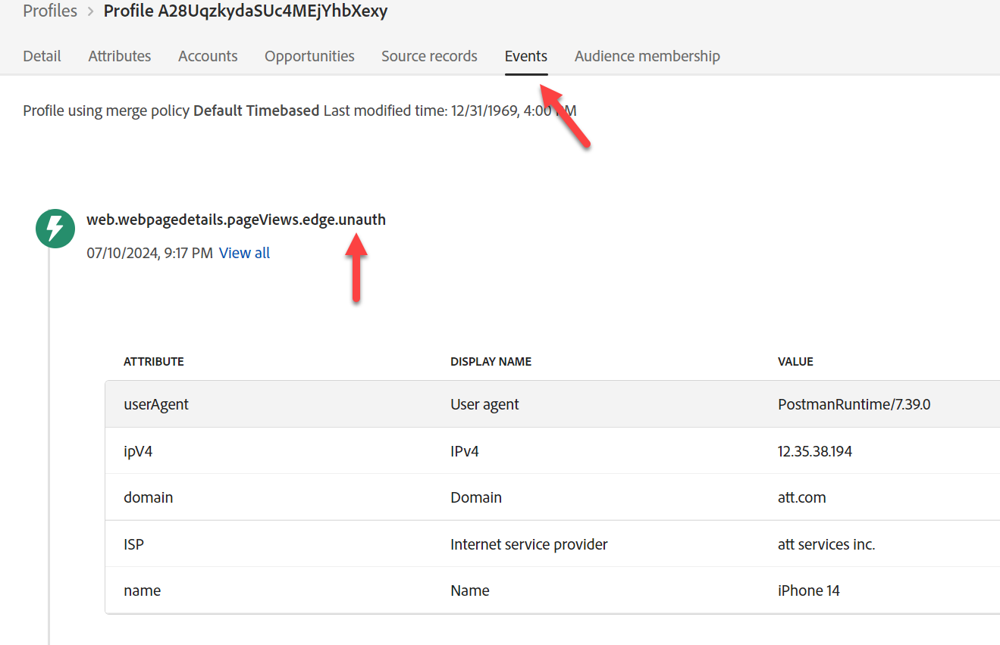
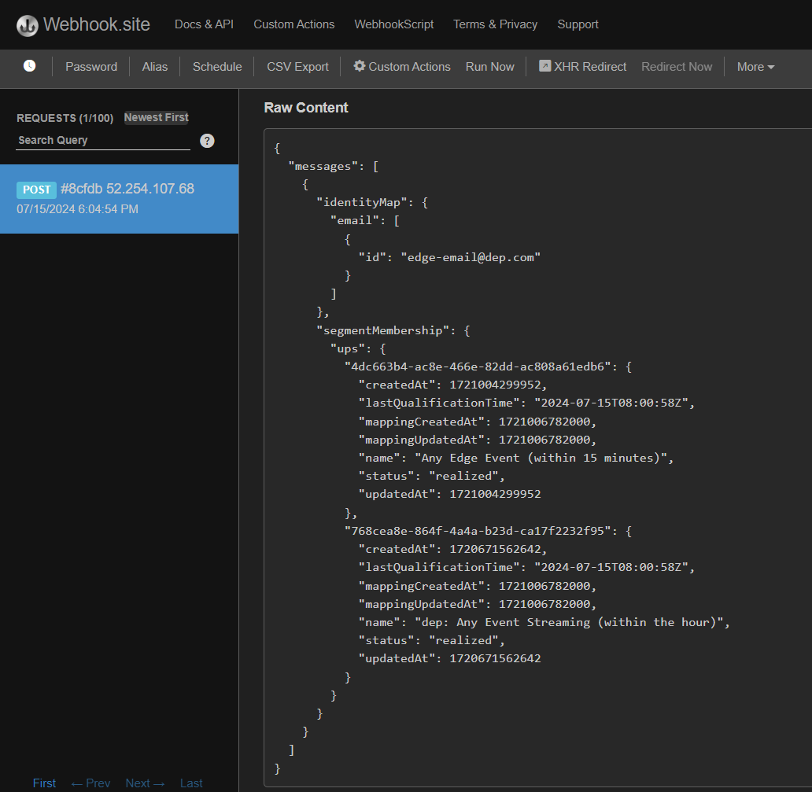

# Envoi d’un événement Edge

Maintenant que tout est configuré, envoyez un événement à Edge pour voir si tout fonctionne. Pour ce faire, utilisez Postman pour envoyer un événement web au flux de données que vous avez créé. Cette opération envoie un événement **sans jeton OAuth** pour simuler une page vue entrant du web vers Edge.  Vérifiez que Postman est ouvert sur votre ordinateur pour effectuer cet exercice pratique.

>[!NOTE]
>
>Comme vous ne transmettez pas de jeton authentifié, vous ne récupérez aucun attribut.

## Attentes du Lab

1. Événement d’expérience sur Edge
1. Configuration du flux de données pour utiliser le service de transfert d’événement
1. Transfert d’événement pour envoyer l’événement au webhook
1. Configuration du flux de données pour utiliser le service AEP
   1. Audience Edge à exécuter
   2. Envoyer l’événement au hub
1. Réponse de Postman pour inclure l’audience Edge (mais pas d’attributs)
1. Magasin de profils pour recevoir l’événement et ajouter un fragment de profil d’événement
1. Magasin d’identités pour ajouter une relation
1. Jeu de données pour recevoir des données et les stocker dans le lac de données
1. Audiences en flux continu pour évaluer et stocker les résultats sur le profil sur le hub
1. Destinations Personalization personnalisées pour renvoyer les « entrées » des audiences de streaming à Edge
1. Destinations de l’API HTTP pour envoyer les « entrées » des audiences en flux continu au webhook
1. À la fin, les Destinations d’API HTTP pour envoyer les audiences de diffusion en continu « quittent » le webhook
1. Finalement, les destinations Personalization personnalisées pour envoyer les audiences de diffusion en continu « quittent » vers Edge


## Accéder à l’appel

1. Barre Latérale Gauche De **Postman** -> Collections
1. **Collection** -> AEP Foundations Bootcamps (Labs)
1. **Dossier** -> Laboratoire de profils
1. **Requête API** -> Créer une Edge d’événement web (aucune authentification)


## Modifier la requête API

Si vous l’avez déjà fait, vous pouvez passer à Exécuter l’API .

Avant de pouvoir exécuter la requête API, vous devez ajouter des informations supplémentaires à la requête. Collectez d&#39;abord les valeurs suivantes :

## Collecter l’identifiant du flux de données

1. Dans le rail de gauche, cliquez sur **Flux de données** (sous l’en-tête Collecte de données)
1. Sélectionnez votre flux de données et copiez la valeur **Identifiant du flux de données**


## Mettre à jour le paramètre de requête Postman

1. Dans la requête elle-même, cliquez sur **Params**
1. Mettez à jour la **Valeur** avec l’identifiant du flux de données de l’étape précédente
1. Cliquez sur le bouton **Enregistrer** pour enregistrer votre mise à jour
1. Remplacer l’e-mail par votre e-mail


## Exécution de l’API

Exécutez votre demande en cliquant sur le bouton **Envoyer**.


Voici ce que vous devriez voir dans la réponse :

- Une réponse 200 OK signifie que les données ont été envoyées et acceptées par Edge Network
- Dans la réponse de la payload, vous devriez également voir les éléments suivants :
  - destinationId de la destination Personalization personnalisée que vous configurez
  - le nom d’alias de cette destination (le vôtre s’appelait customPersonalization)
  - l’un des segments pour lesquels le profil s’est qualifié et qui existent sur edge

>[!NOTE]
>
>Les segments en flux continu et par lots ne s’affichent pas tant qu’ils n’ont pas été évalués au niveau du hub en premier

>[!NOTE]
>
>Si vous effectuez un envoi à server.adobedc.net à l’aide d’un jeton porteur, l’attribut que vous avez configuré est également affiché dans la Destination Personalization personnalisée

## Erreurs que vous pouvez rencontrer

Voici un exemple d’erreur que vous pouvez rencontrer. Cela signifie que l’évaluation de la segmentation Edge n’est pas encore disponible pour évaluer les données envoyées dans Edge Network.

```none
"errors": [
        {
            "type": "https://ns.adobe.com/aep/errors/EXEG-0203-502",
            "status": 502,
            "title": "The service call has failed.",
            "detail": "An error occurred while calling the 'com.adobe.experience_platform.edge_segmentation' service for this request. Try again.",
            "report": {
                "eventIndex": 0
            }
        }
    ]
```

## Validation du transfert d’événement

Sur webhook.site, le corps de la payload que vous avez envoyé via votre requête Postman doit immédiatement apparaître.


>[!NOTE]
>
>Notez que la payload a ajouté les informations de recherche géographique que vous avez demandées lors de la configuration du flux de données utilisé dans votre configuration Edge

## Recherche du profil

Dans Adobe Experience Platform, recherchez le profil que vous venez d’envoyer à partir de l’événement que vous venez d’envoyer dans Edge Network.  Accédez à Profils -> Parcourir pour effectuer la recherche à l’aide des informations suivantes :

- Politique de fusion -> Basée sur l’heure par défaut
- Espace de noms d’identité -> E-mail
- Valeur d’identité -> edge-email\@dep.com


1. Cliquez sur **Afficher** pour rechercher le profil
1. Cliquez sur le **Identifiant du profil** pour ouvrir le profil


&#x200B;3. Cliquez sur **Événements** dans le volet de navigation supérieur pour afficher l’événement que vous venez d’envoyer




&#x200B;4. Vérifiez que le profil est qualifié pour les audiences en consultant l’onglet Appartenance à l’audience dans le volet de navigation supérieur.  Vous devriez voir les éléments suivants :

- Tout événement Edge (au cours des 15 dernières minutes)
- N’importe quel flux d’événements (au cours de la dernière heure)
- Dans les cas d’utilisation #1 vous devriez également voir les audiences de :
  - Page iPhone 14 visitée mais non possédée/commandée
  - Page iPhone 14 visitée


## Validation de l’activation de la destination de diffusion en continu

Vérifiez votre webhook pour voir si la destination de diffusion en streaming que vous avez configurée a activé des segments.  Ils devraient apparaître dans \~5 minutes.



>[!NOTE]
>
>Les destinations de diffusion en continu peuvent envoyer une autre payload de qualification de segment si les deux identités ne se sont pas encore liées.

Si l’ECID et l’e-mail ne sont pas encore liés, quelques minutes plus tard, une autre payload peut apparaître avec les mêmes valeurs, mais identityMap aura désormais deux identités (e-mail et ecid)

Avec le temps, vous devriez commencer à recevoir plus de payloads vers le webhook pour le statut « exited ».


## Comment interpréter tous les contrôles

1. Vérifier la réponse 200 dans Postman (payload correctement formatée)
1. Vérifiez si le webhook contient l’événement (transfert d’événement correctement configuré)
1. Vérifiez si le profil contient les événements (service AEP correctement configuré, événement reçu et traité sur le Hub)
1. Vérifier si le profil possède deux identités (le graphique d’identités est lié sur le Hub)
1. Vérifiez si le profil est qualifié pour les audiences (audience correctement définie)
1. Vérifiez si le webhook a reçu les audiences en flux continu (destination d’API HTTP correctement configurée)
1. Vérifiez si la réponse Postman inclut des segments (destination Personalization personnalisée correctement configurée)
1. Vérifiez si le lac de données possède un journal d’envoi (une destination de qualification d’audience et de diffusion en continu correctement configurée et envoyée). Voir ci-dessous.

## Journal des destinations du lac de données

Après au moins 60 minutes, vous pouvez même vérifier que votre jeu de données contient l’événement que vous avez envoyé. Pour ce faire, effectuez la requête suivante à l’aide de Query Service.

Remplacez le nom du tableau ci-dessous par celui de votre sandbox. Pour le trouver, accédez à la liste de vos jeux de données et filtrez sur « `dest` », ouvrez le jeu de données et copiez le nom du tableau sur le rail de droite.

```sql
SELECT * FROM profile_export_for_destination_merge_policy_xxx
WHERE extSourceSystemAudit.LASTREFERENCEDDATE >= CURRENT_DATE
AND identitymap['email'][0].ID in ('edge-email@dep.com')
ORDER BY extSourceSystemAudit.LASTREFERENCEDDATE DESC
LIMIT 10
```
