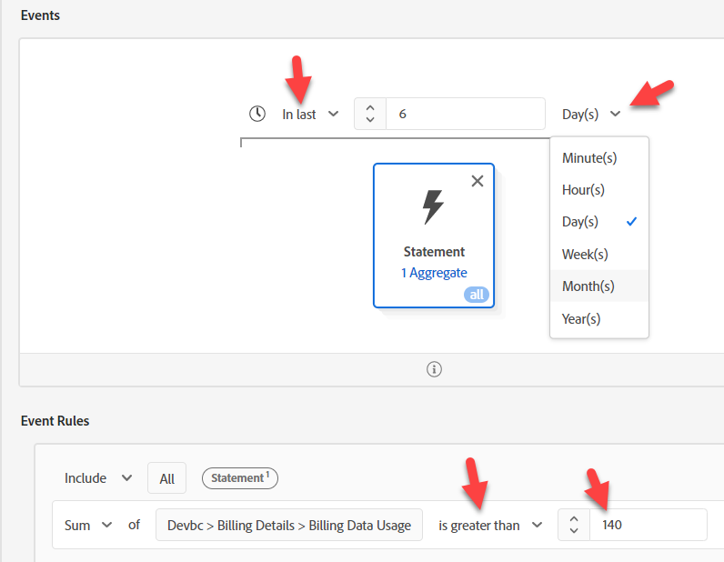

# #1 d’options - utilisation des audiences pour l’agrégation

Les agrégats dans les audiences nous permettent d’agréger les événements dans la règle Audience . Mais comme nous ne pouvons effectuer qu’un seul agrégat à la fois, nous devons séparer les deux de notre cas d’utilisation.

## Audience #1 - utilisation des données de facturation au cours des 6 derniers mois > 140GB

Dans ce build d’audience, vous déterminez l’utilisation totale des données de facturation au cours des 6 derniers mois > 140 Go. Pour ce faire, effectuez les opérations suivantes :

1. Créez une audience.  Utilisez la carte Événement de relevé de facturation.

   

   >[!NOTE]
   >
   >Une bonne structure de type d’événement facilite l’utilisation et la compréhension de vos utilisateurs et utilisatrices.  Prenez le temps de développer une approche normalisée pour tous vos schémas.
   >
   >Cela aide à corriger les fautes d’orthographe.
   >
   >Vous pouvez toujours revenir au champ Type d’événement et saisir manuellement des informations.

2. Cliquez sur l’ellipse dans les règles en bas à droite et choisissez Agréger. Cliquez sur Sélectionner un attribut et saisissez Utilisation. Sélectionnez le champ Utilisation des données de facturation .

   

   

3. Remplacez la valeur Est égal à par Supérieur à et la valeur par 140.

4. Remplacez l’heure située au-dessus de la carte Événement par À toute heure par En dernier et la valeur par 6 et les jours par mois

   

5. Fournissez une description et enregistrez.

6. Attribuez au public le nom « *somme d’utilisation de la facturation > 140 Go (6 derniers mois)* »

>[!NOTE]
>
>Les audiences agrégées ne peuvent être enregistrées que par lots

>[!NOTE]
>
>Il existe deux manières d’utiliser les agrégats dans les audiences.
>
>- Somme/Nombre/Min/Max/Moyenne (comme nous l&#39;avons fait ci-dessus)
>- Comptabilise uniquement (chaque événement est comptabilisé comme 1).
>
>
>
>Les deux peuvent être utilisés ensemble, si nécessaire
>
>

## Audience #2 - moyenne mobile de 6 mois utilisation mensuelle des données >= 20 Go

1. Ne cliquez pas sur l’hyperlien, mais sélectionnez la ligne dans l’interface utilisateur Liste d’audiences afin qu’elle mette en surbrillance celle que nous venons de créer. Une fois qu’il est mis en surbrillance, cliquez sur copier.

   

2. Cliquez sur la copie et modifiez-la.  Cliquez sur la carte Événement et définissez la Somme sur Moyenne. Remplacez supérieur à par supérieur ou égal à et la valeur par 20. Copiez le pseudo code dans la description.

   

3. Attribuez au public le nom « *Moyenne de l’utilisation de la facturation > 20 Go (6 derniers mois)* »

## Audience #3 : ne dispose pas d’un forfait téléphonique ultime

1. Création d’une audience
1. Dans Attributs, recherchez Nom du plan
1. Ajouter un nom de plan (nom du plan)
1. Sélectionnez « Ultimate ».  Modification en Non égal à

   >[!NOTE]
   >
   >Vous vous souvenez de notre travail préalable ? Elle utilise un champ sur notre dimension de recherche :
   >
   >XDM Individual Profile > Devbc > Détails du plan > Propriétés de l’ID de plan > **Nom du plan (Nom du plan)**

   

&#x200B;5. Cliquez sur Audiences —> Experience Platform. Faites glisser Somme de l’utilisation de facturation > 140 Go et Moyenne de l’utilisation de facturation >= 20 Go en regard de Nom du plan.

   

&#x200B;6. Copiez le pseudo code dans la description

&#x200B;7. Vérifiez que ceci peut être en flux continu. **Il ne peut pas s’agir de diffusion en continu**. Apportez les modifications suivantes :

   >[!NOTE]
   >
   >Toute utilisation d’un jeu de données de recherche crée une audience à entités multiples qui est évaluée par lots.  Nous avons utilisé un champ dans notre audience :
   >
   >XDM Individual Profile > Devbc > Détails du plan > Propriétés de l’ID de plan > Nom du plan (Nom du plan)

&#x200B;8. Remplacez **Nom du plan (Nom du plan)** par : XDM Individual Profile > Devbc > Détails du plan > **Nom du plan**

   

   >[!NOTE]
   >
   >Rappelez-vous que l’étape de dénormalisation du LID ajoute le nom du plan au profil. Cela vous permet d’y faire référence dans une audience. Par conséquent, cela supprime une jointure de la recherche et vous permet de rendre la méthode d’évaluation Diffusion en continu.
   >
   >Le compromis ici est que nous avons déplacé cette logique en amont vers l’ingestion de pré-données plutôt que pendant l’évaluation de l’audience.
   >
   >Nous devons également mettre à jour tout profil si le nom de ce plan change.
   >
   >L&#39;avantage est que nous pouvons maintenant réagir en temps réel.

&#x200B;9. Vérifiez que vous pouvez désormais enregistrer ceci en tant que Diffusion en continu. Enregistrez l’audience en tant que « *Utilisation élevée des données de facturation, mais pas de plan Ultimate »*

>[!NOTE]
>
>Bien que cette méthode d’évaluation soit en flux continu, elle base la qualification des audiences sur deux audiences par lot.

>[!NOTE]
>
>Cette approche fonctionnera, mais nous disposons désormais d’une audience en flux continu (temps réel), qui utilise des audiences par lots (qui s’exécuteront une fois toutes les 24 heures). Si cela fonctionne pour nos cas d’utilisation et nos chargements de données, c’est un bon choix (par exemple, peut-être que nos données de facturation sont chargées tous les jours ou tous les mois, ce qui est très probable, mais tous les cas d’utilisation ne seront pas comme ceci). Dans le cas contraire, une approche courante consiste à agréger les données avant de les envoyer à AEP. Envisagez une autre option si vous avez besoin d’une approche plus en temps réel.
