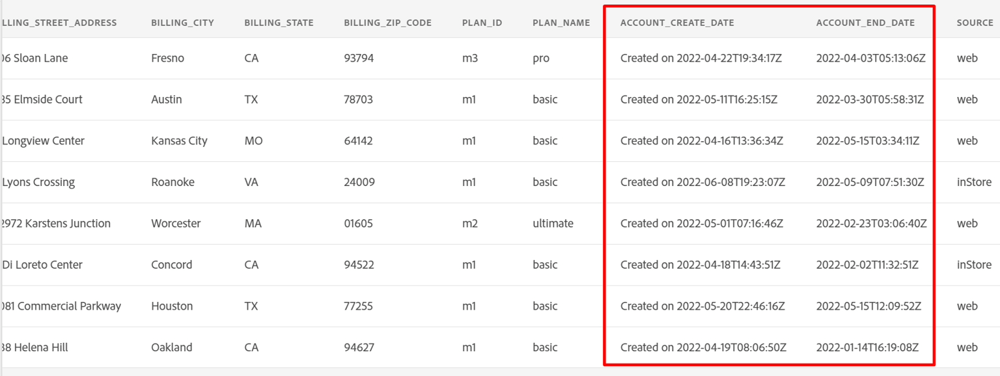

# Créer un flux de données

## Accéder aux sources

1. Dans l’interface utilisateur de Adobe Experience Platform, accédez à l’emplacement suivant :\
   **Sources** -> **Catalogue** -> **Système local**
1. Cliquez ensuite sur le bouton **Ajouter des données** pour la carte **Chargement de fichier local**

## Configurer le flux de données

1. Dans l’écran Détails du flux de données , choisissez **Nouveau jeu de données**.
1. Nommez le jeu de données de sortie **Compte client - \&lt;Vos initiales>**
1. Sélectionnez le schéma **dep: Customer Account** dans la liste déroulante.
1. Activez la case à cocher **Jeu de données de profil**.
(Si vous ne l’activez pas, la banque de profils ne pourra pas surveiller les nouvelles données qui entrent dans ce jeu de données et, par conséquent, n’ingérera pas ces données dans le profil)
1. Activez l’option **Activer l’ingestion partielle**.
(Si vous ne l’activez pas, l’ingestion entière peut échouer si un seul des enregistrements comporte une erreur)
1. Définissez le nom du flux de données sur **Lot de comptes client - \&lt;Vos initiales>**
1. Activer toutes les alertes **Début/Succès/Échec du flux de données des sources**

   

   >[!NOTE]
   >
   >**Activer l’ingestion partielle** indique le nombre d’erreurs (**INGEST** et **DCVS**) en pourcentage du nombre total d’enregistrements pouvant échouer avant que l’ensemble du flux de données ne soit déclaré en échec.

   >[!CAUTION]
   >
   >Assurez-vous d’avoir **activé le jeu de données** pour l’ingestion de profil et partielle avant de continuer.

1. Si tout semble correct, cliquez sur le bouton **Suivant** dans le coin supérieur droit de l’écran pour passer à l’étape suivante.

## Charger l’exemple de fichier

1. Téléchargez les fichiers d’exemple à partir de la [Fichiers d’exemple](../sample-files.md) à utiliser avec cet atelier.
1. Faites glisser et déposez le fichier **Lab\_Customer\_Account.csv** et/ou chargez-le dans l’interface utilisateur.  Lorsque vous avez terminé, l’écran doit ressembler à ce qui suit.

   

1. Dans le volet d’aperçu, regardez les attributs suivants et notez les choses suivantes :

   - **sms\_optIn** est un champ de consentement dont plusieurs valeurs sont manquantes (affichées dans l’aperçu sous la forme - )
   - **account\_create\_date** n’a pas le format de date approprié. Il contient des valeurs de chaîne ainsi que des valeurs de date et d’heure dans une seule chaîne.
   - **account\_end\_date** a le format de date approprié.

   

   

   >[!NOTE]
   >
   >Vous devrez vous occuper des valeurs manquantes, des dates et des champs mal formatés dans les étapes de mappage plus loin dans cet atelier

1. Cliquez sur le bouton **Suivant** dans le coin supérieur droit de l’écran pour passer à l’étape suivante
