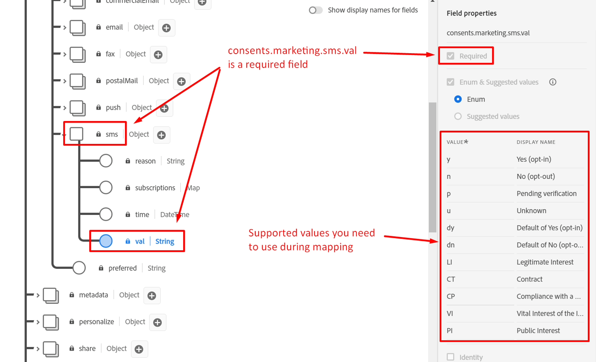
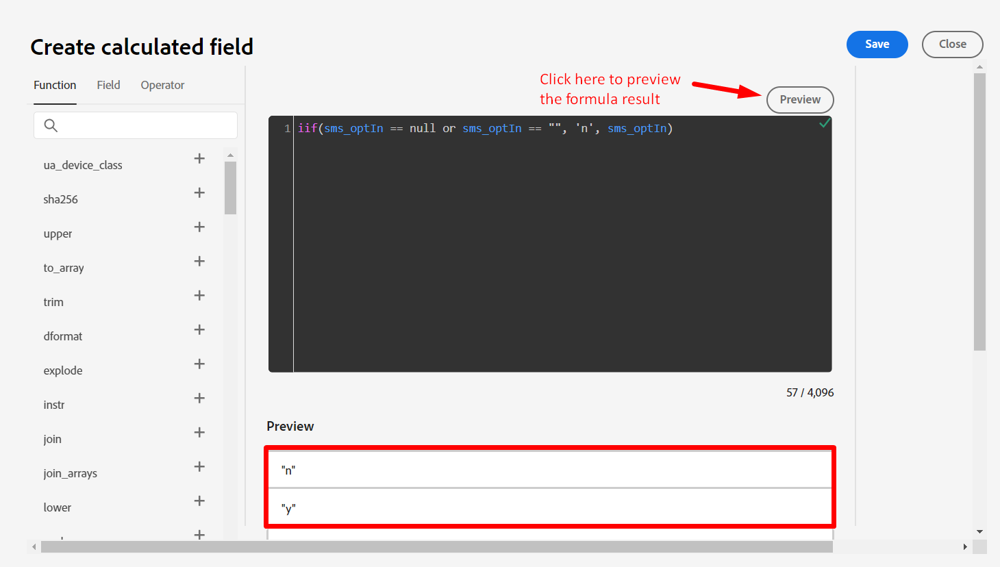
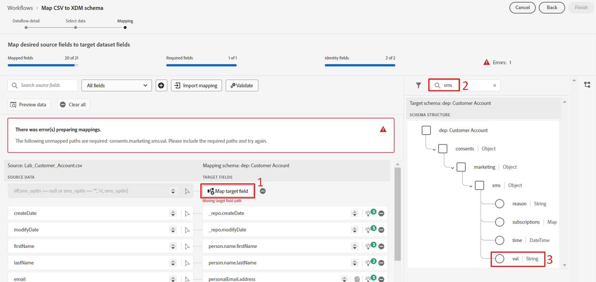
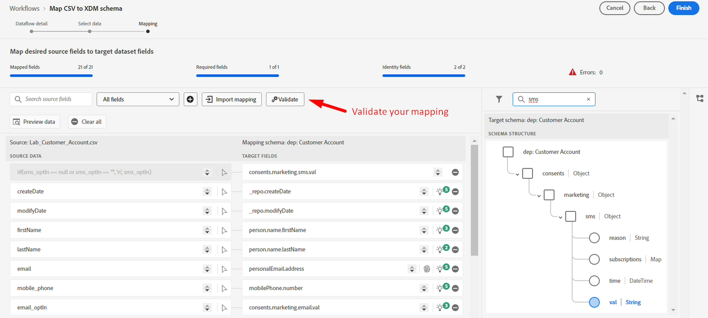

# Champs calculés

## Présentation

Le champ sms\_optIn est obligatoire dans le schéma Compte client . Le problème est que le champ sms\_optIn de notre source de diffusion en continu peut envoyer des valeurs *null*, de sorte qu’un champ calculé est nécessaire pour y remédier. Sinon, ces enregistrements sont ignorés de l’ingestion, ce qui représente une perte.




## Créer un champ calculé

1. Créez un champ calculé en cliquant sur l’icône **Nouveau type de champ** puis sélectionnez **Ajouter un champ calculé**. Pour toutes les valeurs manquantes, le consentement est supposé ne pas avoir été donné et est marqué comme **« n »**. Notez que les champs calculés apparaissent dans la colonne de gauche, car la transformation via le champ calculé est l’entrée de ce nouveau mappage.

   


1. Dans la boîte de dialogue Créer un champ calculé , ajoutez l’expression suivante, puis cliquez sur **Aperçu**

   ```none
   iif(sms_optIn == null or sms_optIn == "", 'n', sms_optIn)
   ```

   


1. Une coche verte devrait s’afficher dans le coin supérieur droit de la case noire pour indiquer la validité de l’expression et l’aperçu des données ne devrait afficher que **« n »** ou **« y »** comme valeurs. Si tout semble correct, cliquez sur **Enregistrer**.


## Mapper à la cible

Un nouveau champ est ajouté à l’écran de mappage, mais avec un chemin d’accès au champ cible non mappé.


1. Cliquez sur le **Mapper le champ cible** pour le nouveau champ calculé que vous avez créé
1. Dans le volet de droite, le panneau du schéma cible s’ouvre. Saisissez **sms** dans la zone de recherche
1. Sélectionnez le champ **val**

   


   Votre mappage final doit se présenter comme suit :

   


1. Validez le mappage pour vous assurer qu’il s’affiche correctement



>[!NOTE]
>
>Toutes les lignes sans valeur SMS valide sont rejetées lors de l’ingestion. Si l’ingestion partielle n’est pas activée, l’échec de l’ingestion avec cette ligne échoue à l’ingestion de l’ensemble du lot ou du fichier dans notre cas. Lorsque l’ingestion partielle est activée, les lignes contenant des champs obligatoires avec des valeurs manquantes sont rejetées, mais les autres lignes sont ingérées.


## Gérer les anniversaires

Il est nécessaire de séparer le jour, le mois et l&#39;année de naissance dans des champs distincts afin que certains d&#39;entre eux ne puissent pas être utilisés dans des activités en aval. Pour résoudre ce problème, vous devez créer deux champs calculés.

### Créer un mappage pour le jour et le mois de naissance

1. Ajoutez un nouveau champ calculé pour capturer le jour et le mois de naissance des profils
1. Utilisez le code suivant pour le champ calculé :

   >[!NOTE]
   >
   >Au lieu de simplement copier le code ci-dessus, essayez de comprendre ce qui se passe en exécutant les éléments de code séparément pour voir comment il a été composé afin de créer des champs calculés plus complexes sur une seule ligne, car la multiligne n’est pas autorisée. Essayez ce qui suit :
   >
   >1. `date(birth_Date,"M/d/yyyy")`
   >2. `date_part("day", date(birth_Date,"M/d/yyyy")).toString()`
   >3. `date_part("month", date(birth_Date,"M/d/yyyy")).toString()`
   >4. `concat(date_part("month", date(birth_Date,"M/d/yyyy")).toString(),`
   >   `"-", date_part("day", date(birth_Date,"M/d/yyyy")).toString())`


1. Cliquez sur Aperçu et vous devriez voir le résultat suivant. Si tout semble correct, cliquez sur **Enregistrer**

   


1. Mappez le champ calculé sur **person.bornDayAndMonth**.

1. Validation du mappage


### Créer un mappage pour l’année de naissance

1. Créez un champ calculé pour capturer l’année de naissance du profil à l’aide du code ci-dessous

   ```none
   date_part("yyyy",date(birth_Date,"M/d/yyyy"))
   ```

1. Mappez le champ calculé à l’emplacement cible de **person.bornYear**.

1. Validation du mappage

>[!NOTE]
>
>Notez que les dates sont au format **MM/JJ/AAAA**, mais les données **naissance\_Date** de l’échantillon se présentent sous la forme d’un ou de deux chiffres pour le jour et le mois. Pour que la fonction **date** fonctionne, vous devez spécifier le format d’entrée des données, tel que **M/j/aaaa** afin de pouvoir tenir compte de 1 à 2 chiffres pour le mois et le jour. Sans cette spécification du format d’entrée de date, la validation de ces mappages échoue.
