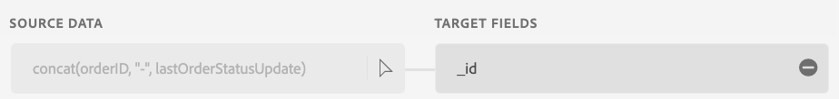

# Mappages initiaux

Comme dans l’exercice précédent, vous devrez vérifier le mappage et, dans certains cas, le modifier.

## Vérifier les recommandations ML

1. À l’étape Mappage , les recommandations ML mappent automatiquement la plupart des attributs. Cependant, plusieurs erreurs s’affichent également. L’écran initial peut ressembler à ce qui suit.


>[!NOTE]
>
>Puisque nous mappons un jeu de données d’événement d’expérience pour la première fois, notez que **\_id** et **timestamp** ne sont jamais recommandés ou mappés par défaut pour les événements d’expérience. Vous devez vous assurer manuellement que ces éléments sont correctement mappés.

## Mapper les champs \_id, timestamp et order.\_devbc.acqSource

1. Pour mapper **\_id,** écrivez l’expression de champ calculé suivante, puis cliquez sur Aperçu

```none
concat(orderID, "-", lastOrderStatusUpdate)
```




1. Assurez-vous que le champ **horodatage** du schéma cible est mappé au champ calculé suivant :

```none
lastOrderStatusUpdate
```


1. Mappez l’expression de champ calculée **« inStore »** sur **order.\_devbc.acqSource**


## Gestion des mappages en double

Si l’écran de mappage se plaint désormais qu’il existe un mappage en double, tel que **orderStatus** mappé à **order.\_devbc.acqSource,** cliquez sur l’icône « - » pour supprimer le mappage.

> [!NOTE]
>
>N’oubliez pas que plusieurs champs d’entrée ne peuvent pas être mappés au même champ de sortie, car cela rend le mappage ambigu. Cependant, un seul champ d’entrée peut être mappé à plusieurs champs de sortie dans le schéma XDM.


