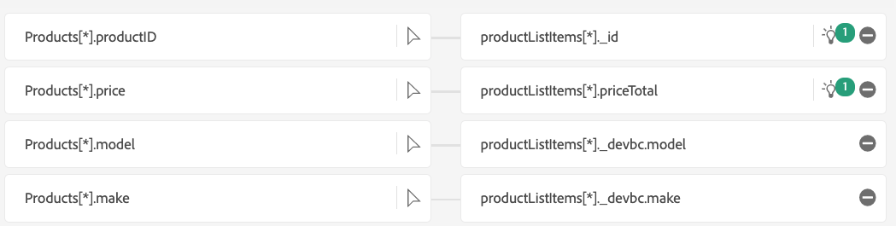

# Mappages de copie d’objet

Dans cette section, vous allez ajouter les mappages de copie d’objet et créer des remplacements.

## Mappages passthrough

Ajoutez les mappages passthrough suivants avec **products\[\*]** et **products\[\*].productID** en cliquant sur Nouveau type de champ et ajoutez ici un nouveau champ pour chaque ligne. Certains peuvent déjà être présents en raison de recommandations de ML.

| Colonne Source | Colonne XDM |
| ----------------------- | ------------------------- |
| orderStatus | eventType |
| lastOrderStatusUpdate | date et heure |
| products\[\*] | productListItems\[\*] |
| products\[\*].productID | productListItems\[\*].SKU |

>[!NOTE]
>
>Notez que **products\[\*]** effectue un mappage de champs 1-1 entre les champs d’objet et le mappage de champs explicite **products\[\*].productID** remplace la copie par défaut.

>[!NOTE]
>
>**products\[\*].productID** est également mappé à **productListItems\[\*].SKU** en plus de **productListItems\[\*].\_id**. Il s’agit d’un exemple de mappage d’un champ d’entrée unique à plusieurs champs de sortie dans le schéma XDM. Conservez le mappage tel quel.

1. Conservez le mappage **products\[\*].price** à **productListItems\[\*].priceTotal**

## Ajouter des remplacements sur certains champs

1. Remplacer les mappages de copie d’objet par
   1. Mappage **products\[\*].make** à **productListItems\[\*].\_devbc.make**
   2. Mappage **products\[\*].model** à **productListItems\[\*].\_devbc.model**

## Supprimer les remplacements de certains champs

1. Notez que les champs **productListItems.currencyCode** et **productListItems.quantity** sont automatiquement renseignés.
1. Supprimez les mappages **productListItems\[\*].quantity** et **productListItems\[\*].currencyCode**.
1. Les remplacements ne se produisent pas et la copie d’objet prend le relais avec les champs passthrough.

## Résumé des mappages, remplacements et suppressions de copies d’objet

| Colonne Source | Colonne XDM | Action |
| -------------------------- | ----------------------------------- | -------------------------------------- |
| products\[\*] | productListItems\[\*] | `Add` |
| products\[\*].productID | productListItems\[\*].SKU | `Add` |
| products\[\*].productID | productListItems\[\*].\_id | `No change` |
| products\[\*].make | productListItems\[\*].\_devbc.make | `Change` |
| products\[\*].model | productListItems\[\*].\_devbc.model | `Change` |
| products\[\*].price | productListItems\[\*].priceTotal | `No change` |
| products\[\*].quantity | productListItems\[\*].quantity | `Remove` |
| products\[\*].currencyCode | productListItems\[\*].currencyCode | `Remove` |

## Vérification des mappages

Il existe deux ensembles de mappages que vous devez vérifier. Au total, vous devriez avoir 6 mappages après la suppression de 2.

