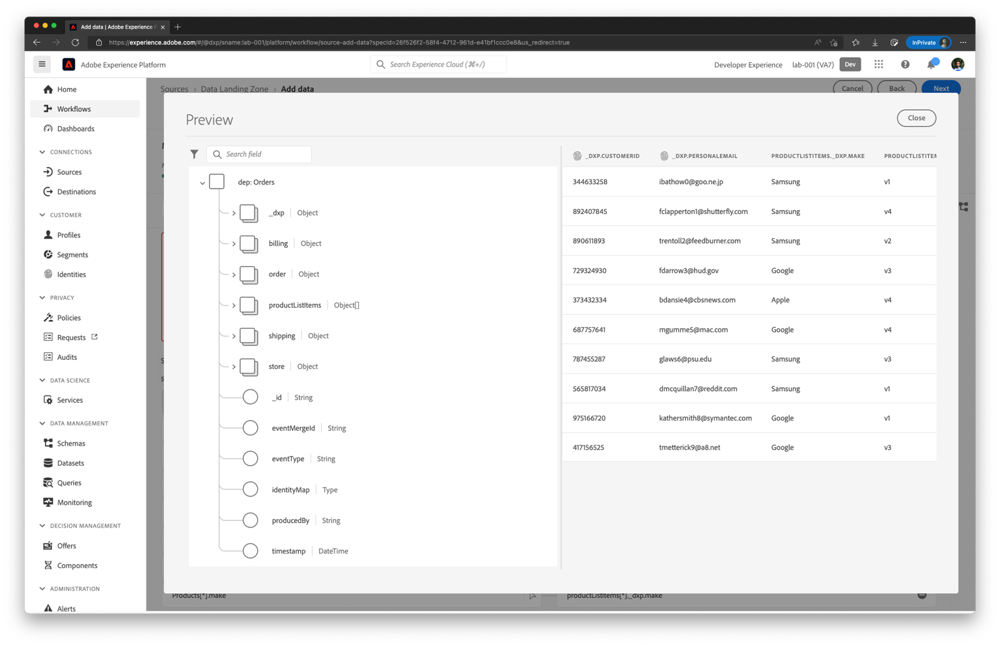

# Vérifier et planifier le flux de données

## Vérifier deux fois le jeu de mappages

| # | Colonne Source | Colonne XDM |
| -- | ------------------------------------------- | -------------------------------------------------------- |
| 1 | orderStatus | eventType |
| 2 | lastOrderStatusUpdate | date et heure |
| 3 | orderID | order.orderID |
| 4 | orderDate | order.orderDate |
| 5 | orderTotal | order.priceTotal |
| 6 | PaymentType | order.pay.payType |
| 7 | PaymentAmount | order.paiement.payAmount |
| 8 | PaymentCurrencyCode | order.pay.currencyCode |
| 9 | PaymentTransactionID | order.pay.transactionID |
| 10 | plan.ID | order.\_devbc.plan.planID |
| 11 | customerID | \_devbc.customerID |
| 12 | PersonalEmail | \_devbc.personalEmail |
| 13 | storeID | store.storeID |
| 14 | shippingStreetAddress | shipping.address.street1 |
| 15 | shippingCity | shipping.address.city |
| 16 | shippingState | shipping.address.state |
| 17 | shippingZip | shipping.address.postalCode |
| 18 | shippingMethod | shipping.shippingMethod |
| 19 | shippingAmount | shipping.shippingAmount |
| 20 | shippingDestination | shipping.shippingDestination |
| 21 | billingStreetAddress | billing.address.street1 |
| 22 | billingCity | billing.address.city |
| 23 | billingState | billing.address.state |
| 24 | billingZip | billing.address.postalCode |
| 25 | products\[\*] | productListItems\[\*] |
| 26 | products\[\*].productID | - productListItems\[\*].\_id - productListItems\[\*].SKU |
| 27 | products\[\*].make | productListItems\[\*].\_devbc.make |
| 28 | products\[\*].model | productListItems\[\*].\_devbc.model |
| 29 | products\[\*].price | productListItems\[\*].priceTotal |
| 30 | concat(orderID, « - », lastOrderStatusUpdate) | \_id |
| 31 | « inStore » | order.\_devbc.acqSource |

## Prévisualiser la sortie du mappage

1. Prévisualisez la sortie du mappage. Faites défiler tous les attributs pour vous assurer qu’il n’y a pas d’exclamation rouge en regard de l’un des attributs du côté droit.

   

1. Dans le volet de navigation de gauche de l’aperçu, sélectionnez le tableau d’objets **productListItems**. Le côté droit se met à jour pour afficher uniquement les attributs de ce tableau d’objets.

>[!NOTE]
>
>Notez que les valeurs **productListItems.currencyCode** et **productListItems.quantity** sont automatiquement renseignées (même après la suppression des mappages). Cela se produit, car **productListItems** en tant qu’objet parent est mappé.

## Planifier l’exécution

1. Définissez la planification pour qu’elle s’exécute **toutes les 15 minutes** en définissant la Fréquence sur Minute et l’Intervalle sur 15. Vérifiez le flux et cliquez sur Terminer.

   >[!CAUTION]
   >
   >Assurez-vous que la planification est définie sur 15 minutes. Si vous planifiez l’exécution en tant que **Exécuter une fois**, vous ne pouvez pas l’exécuter à nouveau, même si vous apportez des modifications au mappage ultérieurement.

1. L’exécution du flux de données ne démarre pas immédiatement et prend quelques minutes. Ainsi, le dernier statut d’exécution du flux de données est défini sur « *Aucune exécution* ».

1. Après quelques minutes, le flux de données réussit. Notez les valeurs **Statut de la dernière exécution du flux de données** et **Date de la dernière exécution du flux de données**.

1. Cliquez sur le nom du flux de données pour obtenir une liste des exécutions de flux de données. 10 Enregistrements doivent être ingérés.

1. Cliquez sur l’heure de début d’exécution du flux de données pour afficher les détails de diagnostic d’erreur.

1. Dans la barre de navigation de gauche, accédez à Jeux de données dans Platform et cliquez sur **Commandes - VotreNomIci**

1. Cliquez sur le **Prévisualiser le jeu de données.**.
