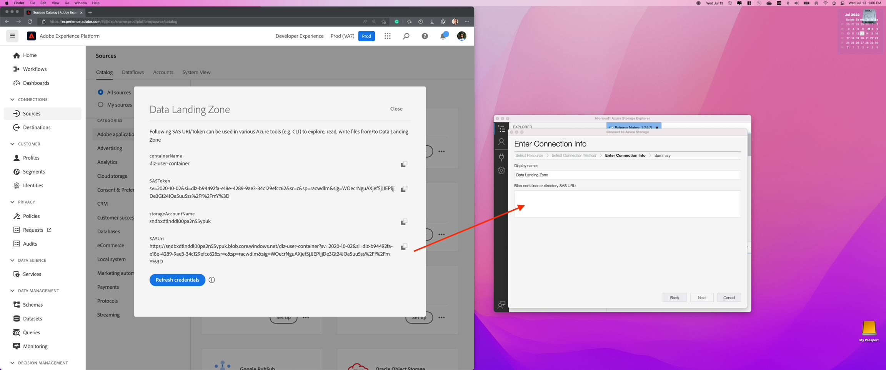

# Utilisation de Data Landing Zone

## Conditions préalables

Si vous n’avez pas téléchargé l’explorateur de stockage Azure, faites-le maintenant, car c’est une exigence de cet atelier.  Vous trouverez le téléchargement sur le lien ci-dessous :

[Télécharger l’explorateur de stockage Azure](https://azure.microsoft.com/en-us/blog/microsoft-azure-data-lake-storage-adls-in-storage-explorer-public-preview/)

1. Installation de l’application
1. Lors du premier lancement, acceptez le contrat de licence de l’utilisateur final.

## Configuration de l’explorateur de stockage Azure avec Experience Platform

1. Ouvrez l’Explorateur de stockage Azure et cliquez sur l’icône **Sélectionner la ressource** puis sélectionnez **Conteneur ou répertoire ADLS Gen 2**

   

1. Sélectionnez **URL de signature d’accès partagé (SAS)** puis cliquez sur **Suivant**

   

1. Saisissez le nom d’affichage **Zone d’atterrissage des données**

   >[!NOTE]
   >
   >Vous ne pouvez pas continuer à cette étape tant que vous n’avez pas fourni l’URL SAS.  Vous obtenez cela à partir d’Experience Platform, que vous pouvez voir à l’étape suivante.

   

1. Accédez à Adobe Experience Platform et effectuez les opérations suivantes pour accéder à la zone d’atterrissage des données :

   - Accédez à **Sources -> Catalogue**
   - Sélectionnez **Cloud Storage** sous les sources
   - Recherchez ensuite la carte **Data Landing Zone**
   - Cliquez sur la carte Data Landing Zone, puis sur **Afficher les informations d’identification** dans le rail de droite

   

1. Copiez le **SASUri** à partir de la boîte de dialogue modale qui s’affiche.

   Revenez à l’Explorateur de stockage Azure et collez la valeur **SASUri** dans le **Conteneur Blob ou URL du répertoire SAS** que vous avez laissé vide à l’étape précédente

   

1. Cliquez sur **Suivant** pour continuer

   

1. Dans l’écran Résumé, cliquez sur **Connexion**

Vous devriez maintenant voir un écran qui ressemble à ce qui suit

>[!TIP]
>
>Félicitations !  Vous avez correctement configuré l’explorateur de stockage Azure
