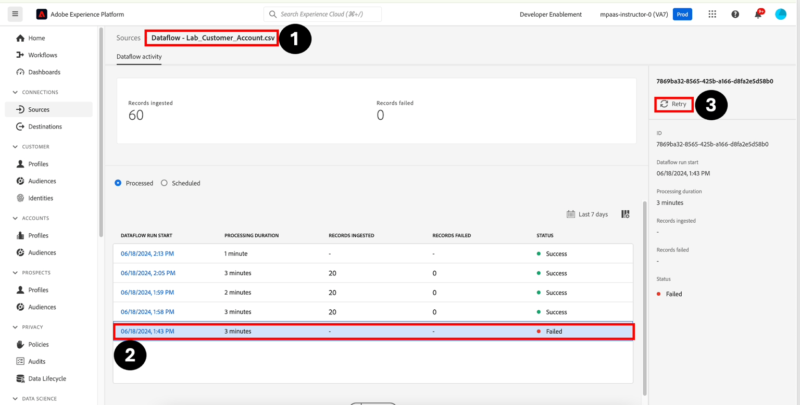

# Réessayer un flux de données ayant échoué

Pour réessayer un workflow, procédez comme suit :

1. Accédez à **Sources -> Flux de données -> \[Nom du flux de données] -> \[Échec de l’exécution]**
1. Mettez en surbrillance l’exécution du flux de données qui n’a pas réussi à afficher le rail de droite.
1. Cliquez sur **Réessayer**. La nouvelle tentative prend la copie des données associées à l’exécution ayant échoué et lui applique désormais les nouvelles règles de mappage

>[!NOTE]
>
>Notez que lorsque vous réessayez un flux de données en échec, un nouveau flux de données est créé et exécuté. Il s’affiche en haut de la liste des flux de données
