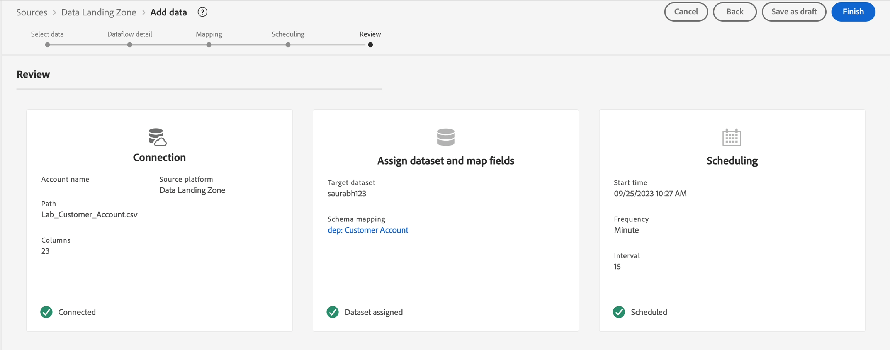

# Planifier le flux de données

À l’étape **Planification** :

1. Définissez la variable **Fréquence** sur Minute.
1. Définissez l’**Intervalle** sur 15, c’est-à-dire 15 minutes.
1. Activez l’option **Renvoyer**.

>[!NOTE]
>
>Notez que la **Heure de début** est indiquée en UTC.
>
>Le temps universel coordonné (UTC) est une norme horaire mondiale qui sert de point de référence pour la mesure du temps dans le monde entier. Pour une équipe distribuée à l’échelle mondiale, elle fournit une référence commune pour différentes régions et pays, ce qui facilite la coordination des activités et la planification d’événements entre différents fuseaux horaires.
>
>Dans différentes parties de l’interface utilisateur d’AEP, l’heure UTC apparaît comme la base de la planification de l’heure. L&#39;heure UTC est 1 heure en retard sur l&#39;heure de Londres. Si vous n’êtes pas sûr de l’heure UTC, il vous suffit de rechercher « Heure UTC maintenant » sur Google.

>[!NOTE]
>
>En pratique, l’option **Renvoi** renvoie une fois tous les fichiers et les exécutions suivantes prennent de nouveaux fichiers.

Vérifiez le flux de données et cliquez sur **Terminer.**

>[!CAUTION]
>
>Si vous choisissez l’option **Exécuter une fois** pour votre flux de données, vous ne pouvez pas modifier ce planning ni mettre à jour le flux de données ultérieurement. Cependant, vous pouvez exécuter le flux de données à la demande, c’est-à-dire l’exécuter à nouveau si vous devez ingérer de nouvelles données.

Après avoir cliqué sur **Terminer**, vous revenez à l’écran **Flux de données**. La création du flux de données doit prendre quelques minutes. Notez que le statut de la dernière exécution du flux de données indique **Aucune exécution**. La première course devrait commencer dans quelques minutes.

&#x200B;> [!NOTE]
>
>Vous devez actualiser la page en continu pour afficher la mise à jour de l’état, car le serveur principal ne transmet pas les mises à jour à l’interface utilisateur.

>[!NOTE]
>
>Si vous avez activé toutes les alertes, vous recevez une alerte dans votre navigateur dans le coin supérieur droit de votre navigateur lorsque le flux commence à s’exécuter et se termine correctement ou échoue
