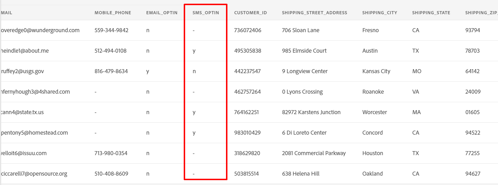

# Configurer la source

## Charger l’exemple de fichier

Vous devez charger un exemple de fichier de données dans votre zone d’atterrissage de données via l’explorateur de stockage Azure afin de pouvoir l’utiliser pendant le Lab.  Pour ce faire, procédez comme suit :

1. Téléchargez l’[exemple de fichiers](../../sample-files.md)
1. Faites glisser et déposez le fichier **Lab\_Customer\_Account.csv** et/ou chargez-le dans la zone d’atterrissage de données que vous avez enregistrée à l’étape précédente.

Une fois votre écran chargé, il doit ressembler à la capture d’écran ci-dessous.

>[!WARNING]
>
>Veillez à ne pas charger le fichier dans le dossier *project*. Il contient des données préchargées que vous n’utilisez pas dans nos laboratoires.

## Accéder aux sources

1. Accédez à Adobe Experience Platform et à : **Sources** -> **Catalogue** -> **Espace de stockage**
1. Cliquez sur **Configuration** / **Ajouter des données** pour la zone d’atterrissage de données

>[!NOTE]
>
>S’il existe au moins une connexion pour cette source, l’action **Ajouter des données** s’affiche par défaut. S’il n’existe aucune connexion pour cette source, l’action par défaut est **Configuration**

## Prévisualiser le fichier

1. Sélectionnez le fichier **Lab\_Customer\_Account.csv**

   

1. Dans le volet d’aperçu, observez les attributs suivants :

   - **sms\_optIn** est un champ de consentement qui comporte plusieurs valeurs manquantes (affichées dans l’aperçu sous la forme - )
   - **account\_create\_date** n’a pas le format de date approprié. Il contient des valeurs de chaîne ainsi que des valeurs de date et d’heure dans une seule chaîne.
   - **account\_end\_date** a le format de date approprié.

   Champ 

   les champs 

   >[!NOTE]
   >
   >Vous devrez vous occuper des valeurs manquantes, des dates et des champs mal formatés dans les étapes de mappage plus loin dans cet atelier

1. Cliquez sur **Suivant** dans le coin supérieur droit de l’écran pour passer à l’étape suivante

## Configurer le flux de données

1. Dans l’écran Détails du flux de données , choisissez **Nouveau jeu de données**.
1. Nommez le jeu de données de sortie **Compte client - \&lt;Vos initiales>**
1. Sélectionnez le schéma **dep: Customer Account** dans la liste déroulante.
1. Activez la case à cocher **Jeu de données de profil**.
(Si vous ne l’activez pas, la banque de profils ne pourra pas surveiller les nouvelles données qui entrent dans ce jeu de données et, par conséquent, n’ingérera pas ces données dans le profil)
1. Activez la **Activer l’ingestion partielle**.
(Si vous ne l’activez pas, l’ingestion peut échouer si l’un des enregistrements comporte des erreurs)
1. Définissez le nom du flux de données sur **Ingestion par lots du compte client - \&lt;Vos initiales>**
1. Activer toutes les alertes **Début/Succès/Échec du flux de données des sources**

>[!CAUTION]
>
> Assurez-vous d’avoir **activé le jeu de données** pour l’ingestion de profil et partielle.

Cliquez sur **Suivant** dans le coin supérieur droit de l’écran pour passer à l’étape suivante.

>[!NOTE]
>
>**Activer l’ingestion partielle** indique le nombre d’erreurs (**INGEST** et **DCVS**) en pourcentage du nombre total d’enregistrements qui peuvent échouer avant que l’ensemble du flux de données ne soit déclaré en échec.
