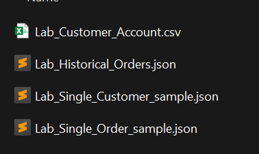

# Exemples de fichiers

Téléchargez le fichier zip ci-dessous et décompressez-le sur votre espace de stockage local.

Télécharger le fichier — [bootcamp-sample-files.zip](assets/bootcamp-sample-files.zip)

Lorsque vous avez terminé, vous devriez voir un dossier comme celui-ci avec le contenu suivant.  Vous référencerez ce dossier dans les ateliers suivants.

