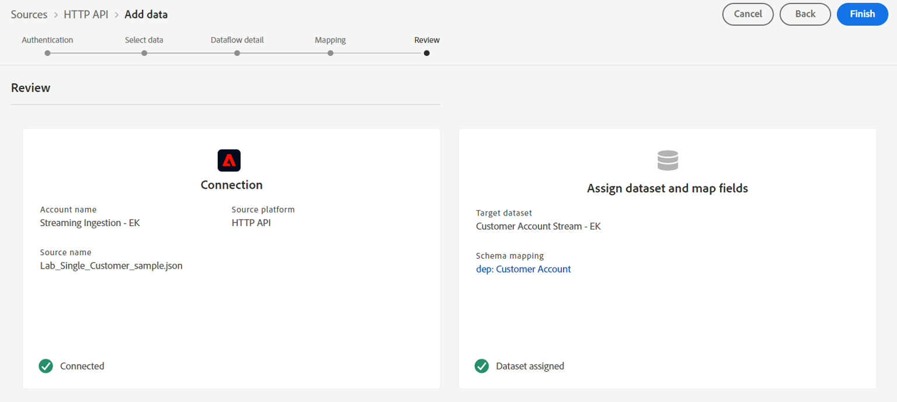

# Vérifier le jeu de mappages final

## Mappages passthrough

&#x200B;> [!NOTE]
>
>Assurez-vous que votre mappage final correspond à ce qui est indiqué ci-dessous avant de continuer.

>[!NOTE]
>
>Remplacez \&lt;nom-client> par la valeur de votre sandbox

| Champ Source | Champ cible |
| ------------------------- | --------------------------------- |
| account\_create\_date | \&lt;nom-client>.account.createDate |
| account\_end\_date | \&lt;nom-client>.account.endDate |
| customer\_id | \&lt;nom-client>.customerID |
| plan\_name | \&lt;nom-client>.plan.name |
| plan\_id | \&lt;nom-client>.plan.planID |
| billing\_city | billingAddress.city |
| billing\_zip\_code | billingAddress.postalCode |
| billing\_state | billingAddress.state |
| billing\_street\_address | billingAddress.street1 |
| email\_optIn | consentements.marketing.email.val |
| mobile\_phone | mobilePhone.number |
| firstName | person.name.firstName |
| lastName | person.name.lastName |
| adresse électronique | personalEmail.address |
| createDate | repo.createDate |
| modifyDate | repo.modifyDate |
| shipping\_city | shippingAddress.city |
| shipping\_zip\_code | shippingAddress.postalCode |
| shipping\_state | shippingAddress.state |
| shipping\_street\_address | shippingAddress.street1 |

## Mappages calculés

>[!NOTE]
>
>N’oubliez pas que les mappages pour `birth_Date` sont différents des mappages de l’atelier d’ingestion par lots en raison du format de la date.  Le lot utilise des barres obliques `/` tandis que la diffusion en continu utilise des tirets `-`

| Champs calculés | Champ XDM |
| ----------------------------------------------------------------------------------------------------------------------------------- | -------------------------- |
| iif(sms\_optIn == null ou sms\_optIn == «  », &#39;n&#39;, sms\_optIn) | consentements.marketing.sms.val |
| concat(date\_part(« mm », date(naissance\_Date, « aaaa-M-j »)).toString(), « - », date\_part(« jj », date(naissance\_Date, « aaaa-M-j »)).toString()) | person.bornDayAndMonth |
| date\_part(« aaaa »,date(naissance\_Date,« aaaa-M-j »)) | person.bornYear |

&#x200B;> [!NOTE]
>
>Assurez-vous que votre mappage final correspond à ce qui est indiqué ci-dessous avant de continuer

## Finaliser le flux de données

Lorsque vous avez terminé, cliquez sur le bouton **Suivant** puis sur le bouton Terminer pour mettre à jour le flux de données avec la nouvelle logique de mappage.

Vous devriez maintenant voir un écran qui affiche le compte d’API HTTP que vous avez créé avec tous les flux de données associés utilisant ce compte. Le flux de données que vous avez créé doit également s’afficher.
