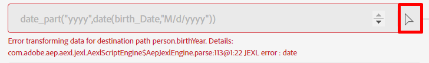

# Configurer le mappage

&#x200B;> [!NOTE]
>
>Ne suivez cette section que si vous avez terminé avec succès l’atelier d’ingestion par lots.  Sinon, suivez les étapes [Mappage de données](../batch-ingestion/mapping-data/overview.md) qui se trouvent dans le Lab d’ingestion par lots.

## Importer le jeu de mappages

Si vous avez terminé l’atelier d’ingestion par lots, vous pouvez réutiliser le jeu de mappages que vous y avez créé 😄🎉

Effectuez les étapes suivantes :

1. Cliquez sur le bouton **Importer le mappage** sur l’écran du mappage

1. Sélectionnez le flux de données que vous avez créé dans la section Ingestion par lots et sélectionnez-le.  Son nom doit être le suivant : **Lot de comptes client v2 - \&lt;vos initiales>.**.

Après l’importation, des erreurs apparaîtront.  Cela est dû au fait que le format de date utilisé pour le champ date de naissance dans le fichier d’exemple a changé.

- Fichier d’échantillon de lot utilisé -> mm/jj/aaaa
- Fichier d’exemple de flux utilisé -> aaaa-mm-jj

Les champs calculés qui utilisent les fonctions **date** devront être mis à jour pour tenir compte du changement du format de date utilisé.

## Mettre à jour les champs calculés

Mettez à jour chaque champ calculé en cliquant simplement sur l’icône de flèche en regard de chaque champ calculé, puis validez vos mappages

| Champ cible | Nouveau champ calculé |
| ----------------------- | ----------------------------------------------------------------------------------------------------------------------------------- |
| person.bornYear | date\_part(« aaaa »,date(naissance\_Date,« aaaa-M-j »)) |
| person.bornDayAndMonth | concat(date\_part(« mm », date(naissance\_Date, « aaaa-M-j »)).toString(), « - », date\_part(« jj », date(naissance\_Date, « aaaa-M-j »)).toString()) |
