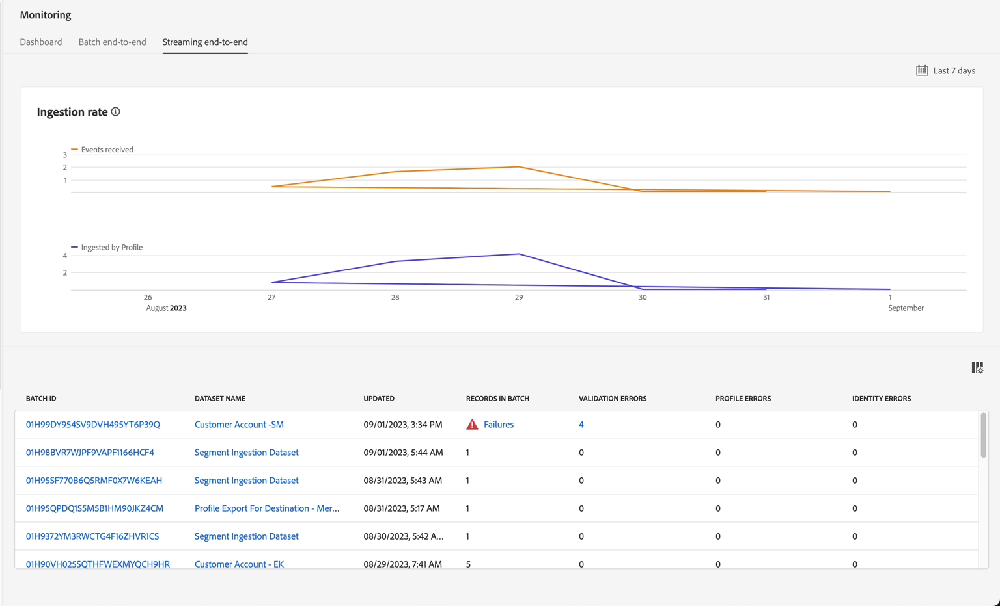

# Erreurs de surveillance et de débogage

>[!NOTE]
>
>La surveillance de l’ingestion par flux se produit au niveau du flux de données, ce qui signifie que lorsque vous la visualisez dans l’interface utilisateur, vous visualisez le lac de données.  Cela signifie que des lots s’affichent (les micro-lots qui sont traités hors du pipeline de diffusion en continu) environ toutes les 60 minutes.  Ainsi, si vous ne voyez pas vos données dans le profil client en temps réel, vous devez attendre jusqu’à 60 minutes pour diagnostiquer le problème.

## Afficher le tableau de bord de surveillance

1. Accédez à **Surveillance->Streaming de bout en bout** et localisez votre **Flux de données** :

   

1. Vous pouvez prévisualiser l’onglet **tableau de bord** pour afficher les mesures de pipeline relatives aux workflows d’ingestion par lots.

>[!NOTE]
>
>Cet écran de surveillance vous permet de voir le statut de vos différentes exécutions de flux de données.  Notez les différentes mesures disponibles dans le panneau supérieur.  Ces mesures peuvent s’avérer extrêmement utiles pour comprendre l’intégrité de votre pipeline de données dans Experience Platform

## Erreurs de débogage

1. Si votre flux de données comportait des erreurs car vous n’aviez pas suivi les instructions, les éléments suivants s’affichent.

   

1. Si vous cliquez sur les Échecs, vous obtenez l&#39;écran suivant :

   

   >[!NOTE]
   >
   >Un microlot réussi peut prendre plus de 15 minutes, car il peut s’avérer nécessaire de disposer de temps pour écrire les enregistrements dans le lac de données.

1. Analysez le message d&#39;erreur, identifiez les **champs source/cible** et recherchez le code :

   - **INGEST XXXX** - Il s’agit d’une erreur grave due à une corruption des données ou à des problèmes de formatage, c’est-à-dire qu’il ne suit pas un format RegEx.
   - **DCVS XXXX** - Cette erreur s’affiche avec les champs `required`. Si les valeurs n’existent pas ou sont mappées de manière incorrecte (et non dans la liste d’énumérations), ces lignes sont ignorées.
   - **MAPPEUR XXXX** - Avertissements et aucune ligne n’est ignorée. Cependant, les valeurs peuvent avoir été rendues « nulles ». Vous devez donc vérifier qu’elles n’ont pas d’impact sur les activités en aval.

1. Pour récupérer après les erreurs, vous devez accéder à **Sources->Flux de données->Nom du flux de données->Mettre à jour le flux de données** et corriger vos mappages.

>[!NOTE]
>
>Vous devez charger à nouveau le fichier d’exemple JSON en le supprimant d’abord et en l’ajoutant de nouveau, de sorte que le mappeur soit maintenant actualisé avec une nouvelle copie pour validation.

