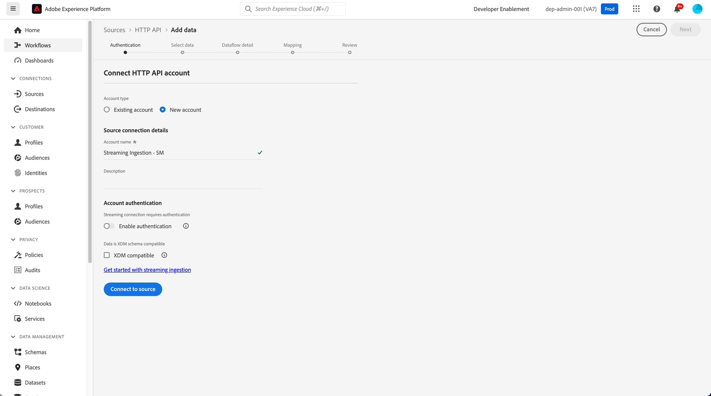
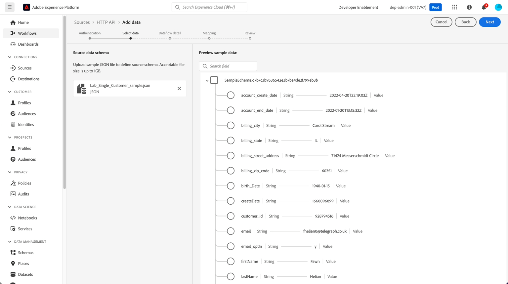
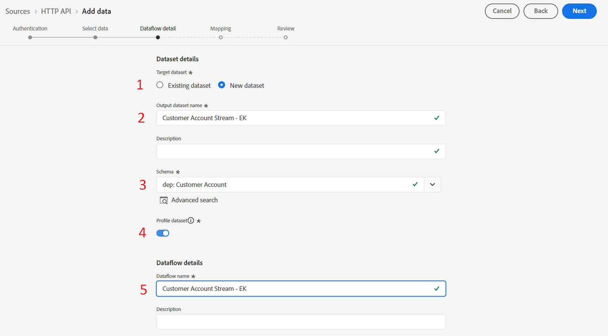

# Configurer la source

## Accéder aux sources en flux continu

1. Accédez à l’interface utilisateur de Adobe Experience Platform et à **Sources**
1. Cliquez sur **Catalogue** dans le volet de navigation supérieur
1. Sélectionnez **Streaming** dans la liste des sources (assurez-vous que le bouton radio Toutes les sources est sélectionné).
1. Cliquez sur **Configuration** / **Ajouter des données** pour l’API HTTP

## Créer un compte d’API HTTP

La première chose à faire est de créer un compte. Ce compte contient les détails sur la façon dont l’authentification est gérée et si les données diffusées en continu sont compatibles XDM (c’est-à-dire qu’elles correspondent déjà à la structure du schéma XDM sous-jacent)

Effectuez les tâches suivantes :

1. Sélectionnez **Nouveau compte** et ajoutez les détails suivants :
   - Nom du compte -> `Streaming Ingestion - <Your Initials>`
1. Laissez le bouton (bascule) de **Activer l’authentification** désactivé
1. Ne cochez pas la case **compatible XDM**
1. Cliquez sur le bouton **Se connecter à la source** pour continuer

>[!CAUTION]
>
>NE ACTIVEZ PAS l’option **Activer l’authentification** ou cochez la case **Compatible XDM**. Ça casse le labo

Votre écran doit ressembler à ceci :

Vous devriez maintenant voir une case à cocher verte avec le message « Connecté ». Cliquez sur le bouton **Suivant** en haut à droite pour continuer à configurer votre flux de données :

## Charger les exemples de données

>[!NOTE]
>
>Si ce n’est pas déjà fait, veillez à télécharger le fichier [Sample Files](../sample-files.md)

1. Dans la section Schéma de données Source de l’écran, téléchargez le fichier JSON **Lab\_Single\_Customer\_sample.json** à partir de votre système de fichiers local que vous avez téléchargé à partir de l’atelier précédent.
1. Une fois le fichier téléchargé, un aperçu s’affiche comme suit. Cliquez sur le bouton **Suivant** en haut à droite pour continuer. Notez que le champ date_naissance est dans un format AAAA-MM-JJ différent du format MM/JJ/AAAA que vous avez vu dans le laboratoire d’ingestion par lots précédemment.

>[!NOTE]
>
>Le fichier d’exemple JSON contient un seul enregistrement pour la conception et la validation du pipeline. Si vous souhaitez faire défiler l’écran, vous devez cliquer sur les nœuds XDM pour que les nœuds défilent.

## Configurer les détails du flux de données

Dans cet écran, vous créez un flux de données spécifique qui utilise le compte d’API HTTP que vous avez configuré.  Vous pouvez avoir de nombreux flux de données par compte.  Dans ce scénario, vous devez créer un flux de données pour les données de compte client en flux continu. Un flux de données nécessite une association entre un compte source, un jeu de données avec le schéma associé et les détails de configuration.

Effectuez les étapes suivantes :

1. Créez un jeu de données et nommez-le -> `Customer Account Stream - <Your Initials>`
1. Choisissez le **Schéma** comme ->`dep: Customer Account`
1. Assurez-vous que le bouton (bascule) **Jeu de données de profil** est **activé**.  Si ce n’est pas le cas **&#x200B;**&#x200B;activez-le.
1. Mettez à jour le **nom du flux de données** comme suit :
   - `Customer Account Stream - <Your Initials>`
1. Cliquez sur le bouton **Suivant** pour continuer

>[!NOTE]
>
>Si vous n’activez pas le jeu de données pour Profil, les données seront alors transmises uniquement au lac de données. Vos événements de diffusion en continu ne s’affichent pas dans le graphique de profil ou d’identité.
