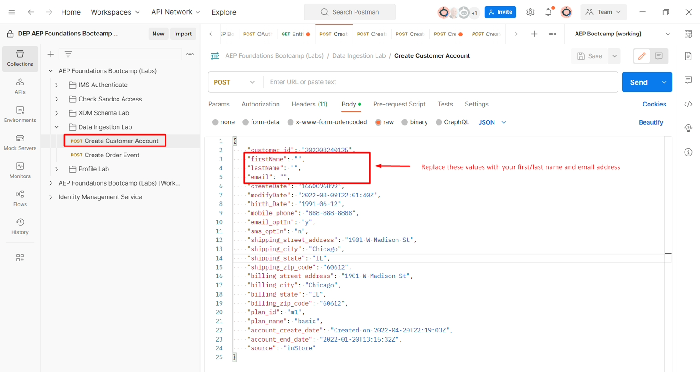

# Diffusion d’un profil en continu

## Présentation de l’API

Il est important de comprendre la structure de l’API lors de la diffusion en continu de données dans le Adobe Experience Platform sous forme brute afin de pouvoir facilement les recréer, quel que soit le flux de données que vous créez.  Voici un exemple de la structure de base de l’appel à l’aide de cURL

**Exemple de requête (données brutes)**

```curl
curl --location '' \
--header 'Content-Type: application/json' \
--header 'x-adobe-flow-id:  <dataflow-id>;' \
--header 'Authorization: Bearer XXX;' \
--data '{
    "customer_id": "202208240125",
    "firstName": "",
    "lastName": "",
    "email": "",
    "createDate": "1660096899",
    "modifyDate": "2022-08-09T22:01:40Z",
    "birth_Date": "1991-06-12",
    "mobile_phone": "888-888-8888",
    "email_optIn": "y",
    "sms_optIn": "n",
    "shipping_street_address": "1901 W Madison St",
    "shipping_city": "Chicago",
    "shipping_state": "IL",
    "shipping_zip_code": "60612",
    "billing_street_address": "1901 W Madison St",
    "billing_city": "Chicago",
    "billing_state": "IL",
    "billing_zip_code": "60612",
    "plan_id": "m1",
    "plan_name": "basic",
    "account_create_date": "Created on 2022-04-20T22:19:03Z",
    "account_end_date": "2022-01-20T13:15:32Z",
    "source": "inStore"
}'
```


Quelques éléments importants à noter dans la requête ci-dessus :

| Éléments clés | Obligatoire | Description |
| --------------------------- | -------- | ------------------------------------------------------------------------------------------------------------------------------------------------------------------------------------------- |
| URL de la requête (c’est-à-dire l’emplacement) | - | Il s’agit de l’URL du compte source d’API HTTP que vous avez créé et vers lequel les données de diffusion en continu vont pointer. **Il est toujours de type POST** |
| En-tête &#39;Content-Type&#39; | * | Toujours définie sur `application/json`, car les données que vous envoyez sont au format JSON |
| En-tête « x-adobe-flow-id » | - | Définissez sur l’identifiant du flux de données créé à partir du connecteur source |
| En-tête &#39;Authorization&#39; | * | Valeur facultative, mais fortement recommandée pour des raisons de sécurité. Il s’agit du même `access_token` que celui généré lors des ateliers de configuration de [Postman](../../postman-setup/environment-file.md) |
| Contenu du corps | - | Contient les données réelles que vous souhaitez envoyer dans Adobe Experience Platform |

>[!NOTE]
>
>Le contenu du corps doit toujours être au format JSON et correspondre à l’exemple de payload fourni lors de la conception du flux de données


## Collecter les valeurs requises

Avant de diffuser des données, collectez les valeurs requises répertoriées ci-dessus (en particulier, les valeurs d’URL de point d’entrée de diffusion en continu et les valeurs d’« en-tête » du contenu du corps).

Effectuez les étapes suivantes :

1. Copiez la valeur **Point d’entrée de diffusion en continu** et enregistrez-la sur votre ordinateur local (en supposant que vous n’ayez pas quitté l’étape de la section précédente). Si vous avez quitté cette page, vous pouvez le trouver sous Sources->Comptes.

   >[!NOTE]
   >
   >Si vous avez quitté cette page, vous pouvez accéder à cette page en procédant comme suit :
   >
   >- Cliquez sur **Sources** dans le rail de gauche
   >- Vérifiez que vous êtes sur l’onglet **Comptes** et cliquez sur le compte que vous avez créé intitulé **Ingestion par flux - \&lt;Vos initiales>**

   >[!NOTE]
   >
   >Si vous ne voyez pas cette valeur, assurez-vous de ne pas avoir sélectionné la ligne de flux de données en cliquant dessus.  NE CLIQUEZ PAS SUR LES LIENS BLEUS

   


1. Sélectionnez la ligne du flux de données en cliquant n’importe où en évitant les liens bleus. Copiez l’**ID de flux de données** et enregistrez-le en lieu sûr.


## Mettre à jour votre requête API

Passez à votre application Postman et mettez à jour la demande de création d’un compte client avec les informations que vous avez collectées.

1. Ouvrez Postman, puis accédez à la requête d’API **Data Ingestion Lab -> Créer un compte client** et ouvrez-la

   


1. Copiez et collez la valeur **Point d’entrée de diffusion en continu** vous avez enregistrée précédemment dans l’URL de la requête

   


1. Copiez et collez la valeur de l’identifiant du flux de données que vous avez enregistrée précédemment dans la valeur d’en-tête **x-adobe-flow-id**

   


1. Dans le corps de la requête, mettez à jour les attributs suivants comme suit :

   - **firstName** -> Votre prénom
   - **nom** -> Votre nom
   - **email** -> Votre adresse e-mail
   - **date_naissance** -> AAAA-MM-JJ

   **5. Enregistrer** demande

1. Cliquez sur le bouton **Envoyer** pour exécuter la requête à diffuser dans votre profil de compte client

   


1. Vous recevez une réponse `200 OK` indiquant que le Adobe Experience Platform l’a bien reçue

Exemple de réponse OK 200

```none
{
    "inletId": "57e8b639020de08147888c2ce2046f2f4d36f622ee22b7313a565ab3a4ecee54",
    "xactionId": "1688068236344:7186:152",
    "flowId": "7d1d1a20-3df2-43fb-8bd8-2856bb3ea6a4",
    "receivedTimeMs": 1688068236344
}
```

>[!NOTE]
>
>Notez l’**xactionId** dans la réponse.  Si une erreur se produit et qu’aucun enregistrement n’est ingéré, il doit toujours être fourni avec un ticket de service clientèle, car il s’agit d’une référence clé utilisée par nos équipes d’assistance pour déboguer tout problème d’environnement

>[!SUCCESS]
>
>Félicitations !  Vous avez diffusé en continu avec succès un enregistrement de profil dans le Adobe Experience Platform
