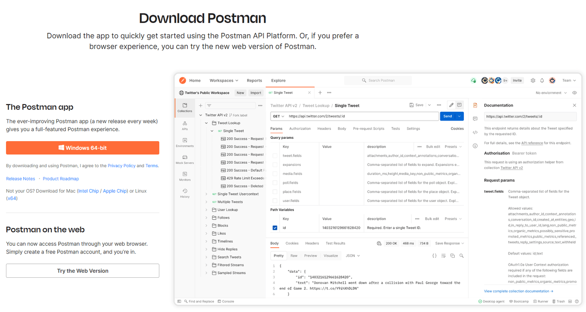

# Installation de Postman

&#x200B;> [!NOTE]
>
>Postman est nécessaire pour divers laboratoires de ce cours.  Même si Postman est déjà installé, vous devrez passer par ce Lab pour vous assurer que les fichiers d’environnement et la collecte d’API sont installés et correctement configurés.

## Installation de Postman

Accédez au site web Postman et téléchargez l’application Postman ou utilisez la version web —> [https://www.postman.com/download/](https://www.postman.com/download/)

Page de téléchargement de 

## Interface de Postman

Ouvrez Postman et familiarisez-vous rapidement avec quelques zones de l’application. Dans le cadre de notre collaboration avec Experience Platform, nous n’avons vraiment besoin de nous concentrer que sur quelques domaines clés de l’application.

## Barre latérale

La barre latérale vous permet de naviguer rapidement entre les différents éléments de Postman. Pendant les exercices, vous n&#39;utiliserez que les deux éléments suivants :

**Collections** - groupes de requêtes enregistrées qui peuvent être importées à partir d’un emplacement externe ou créées par vous-même.

**Environnements** : ensemble de variables que vous pouvez référencer dans vos requêtes Postman. Dans Experience Platform, vous pouvez considérer les environnements Postman comme synonymes d’organisations Adobe IMS. Nous utiliserons la fonctionnalité Environnements dans Postman

## En-tête

Espaces de travail : permettent d&#39;organiser votre travail en différents regroupements (c&#39;est-à-dire projets, équipes, etc.)

## Espace de travail principal

La zone de travail principale est l’endroit où vous exécuterez la majorité de votre travail lorsque vous travaillerez dans Postman. Toutes les requêtes d’API sont exposées dans un onglet spécifique de l’espace de travail principal.

**Barre latérale droite** - fournit un accès supplémentaire aux outils en fonction de l’onglet actuel sélectionné. Il s’agit par exemple de la documentation de la requête, des commentaires et des fragments de code, pour ne citer que quelques fonctionnalités.

**Sélecteur d’environnement** : permet de basculer rapidement entre différents environnements pour accéder à des variables préconfigurées lors de l’utilisation d’API. Lorsque vous utilisez Experience Platform, vous l’exploitez lorsque vous travaillez dans une organisation Adobe IMS spécifique.

## Pied de page

Tout au bas de l&#39;application Postman, vous trouverez un ensemble de fonctions qui vous permettent d&#39;afficher rapidement les logs des appels que vous avez passés, un accès rapide à la recherche et au remplacement et diverses autres fonctions.
