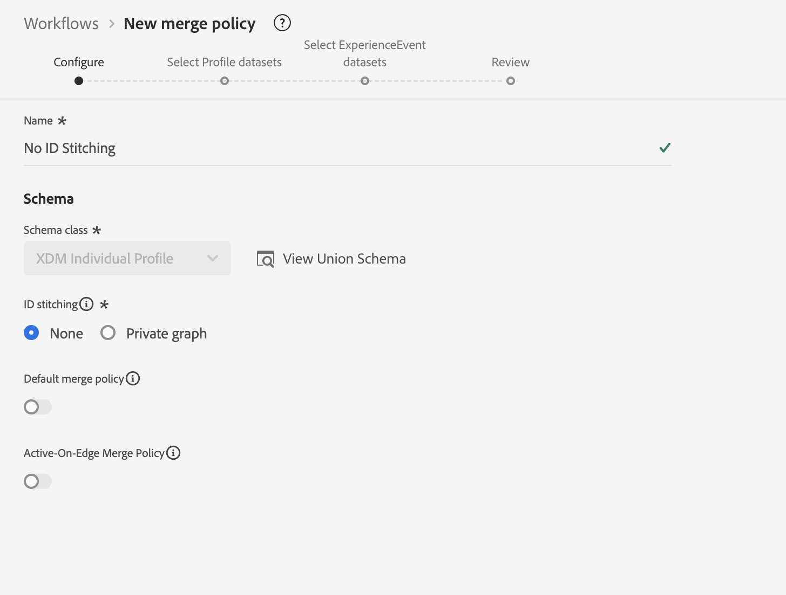
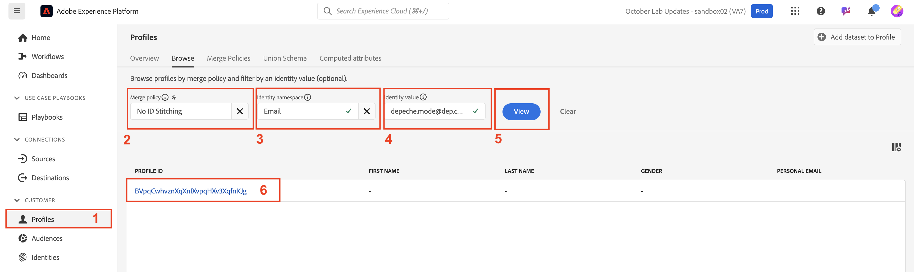

# Politiques de fusion

## Qu&#39;est-ce que c&#39;est ?

Les politiques de fusion s’affichent dans la visionneuse de profils chaque fois que vous recherchez un profil (vous n’avez probablement pas réalisé qu’il faisait quelque chose)

Une politique de fusion a deux effets :

1. Fournit les instructions pour assembler les fragments dans le magasin de profils (c’est-à-dire l’assemblage des identités). Il existe deux options :
   - Utiliser le graphique d’identités (c’est-à-dire Identity Service)
   - N’utilisez pas le graphique d’identités (en d’autres termes, utilisez uniquement l’identité fournie pour rechercher des fragments de profil stockés similaires)
1. Indique au service de profil comment résoudre les conflits de champs dans les jeux de données basés sur la classe XDM Individual Profile lorsqu’un champ peut provenir de plusieurs jeux de données (c’est-à-dire la méthode de fusion). Il existe deux options :
   - Priorité d’horodatage : utilisez l’enregistrement le plus récent de tous les jeux de données comme jeu de vérité et laissez tous les autres enregistrements combler les trous dans l’ordre du plus récent au plus ancien
   - Priorité du jeu de données : sélectionnez les jeux de données XDM Individual Profile qui peuvent être utilisés pour former le profil et dans quel ordre les assembler

> [!NOTE]
>
>Lorsque la méthode de fusion de Priorité du jeu de données est choisie, vous pouvez choisir les jeux de données Profil individuel XDM et Événement d’expérience XDM qui peuvent être utilisés dans la formation du profil.
>
>La méthode de fusion Priorité d’horodatage utilise TOUJOURS tous les jeux de données

>[!WARNING]
>
>Chaque sandbox nécessite au moins une politique de fusion marquée comme **par défaut** pour que la segmentation et le profil fonctionnent

>[!NOTE]
>
>Souvent, nous concevons de sorte à ne pas avoir besoin d’utiliser une politique de fusion personnalisée qui utilise la priorité du jeu de données.
>
>- Plutôt que d’avoir plusieurs jeux de données enregistrant le même champ, nous leur donnons des noms uniques, par exemple :
>  - Prénom - CRM
>  - Prénom - Fidélité
>  - Prénom - Formulaire Web
>- Cela permet à un professionnel du marketing de choisir la source de données + le champ à utiliser plutôt que de laisser le système en choisir automatiquement un en fonction d’un jeu de règles qu’il ne comprend pas forcément et de choisir éventuellement des champs du profil d’une source et d’autres champs d’une autre sans comprendre que cela se produit.
>- Pour notre modèle de données, nous n’avons pas besoin de résoudre de conflits de champs. Aucune politique de fusion personnalisée n’est donc nécessaire

Pour mieux comprendre le fonctionnement des politiques de fusion avec le graphique d’identités, vous devez en créer un qui n’utilise pas le graphique d’identités pour le regroupement des identifiants.

## Créer une politique de fusion sans assemblage

Créez une politique de fusion qui n’utilise pas le graphique d’identités afin de voir son comportement avec la formation de profils.

## Créer

1. Cliquez sur **Profils** dans le rail de gauche
1. Cliquez sur **Politiques de fusion** dans la barre de navigation supérieure.
1. Cliquez sur **Créer une politique de fusion** à l’extrémité droite de votre écran

## Configuration

Vous devez maintenant configurer les paramètres de la politique de fusion.  Saisissez les informations suivantes :

| Paramètre | Valeur |
| --------------------------- | --------------- |
| Nom | Aucun assemblage d’ID |
| Assemblage des identifiants | Aucun |
| Politique de fusion par défaut | Handicapé |
| Politique de fusion Active-On-Edge | Handicapé |

Lorsque vous avez terminé, cliquez sur **Suivant**

## Sélectionner des jeux de données de profil

1. Pour la méthode de fusion , sélectionnez **Horodatage ordonné**
1. Cliquez sur **Suivant**

## Sélectionner des jeux de données d’événements d’expérience

N’oubliez pas que si vous sélectionnez Horodatage ordonné pour la méthode de fusion, vous indiquez au service de profil que tous les jeux de données basés sur un profil individuel XDM et sur la classe d’événement d’expérience participent à la formation du profil.

Par conséquent, vous pouvez simplement cliquer sur **Suivant**, car il n’y a rien à faire dans cette étape.

## Révision

Dans la dernière étape, vous voyez un aperçu des paramètres que vous avez choisis et des exemples de profils qui vous montrent la politique de fusion en action.

Cliquez sur le bouton **Terminer** pour créer la politique de fusion

## Méthodes de fusion en action

Rappelez-vous que le graphique d’identité du profil, Mode Découverte, ressemblait à la capture d’écran ci-dessous. Pour comprendre comment fonctionne le service de profil, il est préférable d’ignorer l’utilisation de ce graphique d’identités pendant le processus d’assemblage.

## Comparer à l’aide de l’e-mail

Ouvrez la visionneuse de profils en procédant comme suit :

1. Cliquez sur **Profils** dans le rail de gauche, puis, dans le volet de navigation supérieur, sélectionnez **Parcourir**
1. Sélectionnez l’Espace de noms d’identité **E-mail**
1. Saisissez la valeur Identité de **depeche.mode\@dep.com**
1. Cliquez sur le bouton **Afficher** pour rechercher le profil
1. Cliquez sur le **lien** vers le profil pour afficher les détails du profil

Effectuez une autre recherche pour le profil du mode de rendu, mais cette fois-ci à l’aide de la politique de fusion **Aucun assemblage d’identifiants**.

1. Cliquez avec le bouton droit sur **Profils** dans le rail de gauche, puis sélectionnez **Ouvrir dans un nouvel onglet**
1. Dans le volet de navigation supérieur, sélectionnez **Parcourir**
1. Sélectionnez la politique de fusion **Aucun assemblage d’identifiants**
1. Sélectionnez l’Espace de noms d’identité **E-mail**
1. Saisissez la valeur Identité de **depeche.mode\@dep.com**
1. Cliquez sur le bouton **Afficher** pour rechercher le profil
1. Cliquez sur le **lien** vers le profil pour afficher les détails du profil

En comparant les deux vues du profil, vous remarquerez qu’elles sont très différentes. Certains attributs et identités sont manquants dans la version qui utilise la politique de fusion **Pas de combinaison d’identités**.

Si vous observez les événements de chaque profil, vous remarquerez que le profil utilisant la politique de fusion **Pas de combinaison d’identifiants** ne contient qu’un seul événement, tandis que l’autre version contient tous les événements.

L’événement unique sur la version du profil sans assemblage d’identifiants est dû au fait que cet événement est stocké à l’aide de l’identité principale « personalEmail.address ».

>[!NOTE]
>
>N’oubliez pas que lorsque vous utilisez une méthode de fusion qui n’utilise pas le profil de graphique d’identités, celle-ci ne repose que sur l’identité fournie pour trouver des fragments de profil stockés similaires.

## Comparer à l’aide de customerID

Vous pouvez examiner les différents fragments du profil du mode Profondeur à l’aide de certaines des autres identités du graphique.  Essayez de rechercher le même profil à nouveau avec la politique de fusion Aucun regroupement d’ID , mais cette fois-ci à l’aide de l’espace de noms customerID et de la valeur fournis ci-dessous :

| Espace de noms d’identité | Valeur |
| ------------------ | --------- |
| customerID | 266242885 |

**Questions à vous poser**

Question : Avez-vous remarqué quelque chose au sujet des attributs ? Il n&#39;y en a pas, pourquoi ?

Réponse : vous avez chargé des attributs en utilisant l’e-mail comme identité principale

Question : Remarquez quoi que ce soit à propos des événements ?

Réponse : les seuls événements qui s’affichent sont ceux dont l’identité principale est customerID

## Comparer à l’aide de GAID

Essayez de rechercher le même profil à nouveau avec la politique de fusion Aucun regroupement d’identifiants , mais cette fois, utilisez l’espace de noms et la valeur GAID fournis ci-dessous :

| Espace de noms | Valeur |
| --------- | ----------- |
| GAID | 266242-9013 |

**Question à vous poser**

Question : Aucun profil n’a été trouvé ! Que se passe-t-il ? Pourquoi aucun profil n’a été trouvé ? Réponse : aucun fragment de profil n’est stocké en utilisant cette valeur GAID comme identité principale

## Profil + Identité

Résumé rapide :

- Le magasin de profils contient des fragments de profil stockés à l’aide de l’identité principale
- Le graphique d’identités contient les relations entre deux (2) identités basées sur une personne ou plus

Lorsque le graphique d’identités est utilisé avec la banque de profils, vous pouvez l’utiliser comme une indication de la manière de trouver les fragments de profil appropriés en traitant chaque valeur d’identité du graphique d’identités comme des identités principales.

Sans graphique d’identité, la banque de profils ne peut récupérer que des fragments de profil à l’aide d’un seul identifiant (c’est-à-dire une identité principale)

> [!TIP]
>
>**Disposez d’un peu de temps supplémentaire et souhaitez expérimenter... :**
>
>- Recherchez d’autres profils dans l’interface utilisateur que vous connaissez qui ont deux identités
>- Découvrez comment certains événements sont stockés sur un fragment, mais pas sur l’autre
>- Découvrez comment certains attributs de profil sont stockés par rapport à un fragment, mais pas l’autre
>- Accédez à un profil que vous avez déjà recherché et recherchez-le à nouveau à l’aide de la politique de fusion **Aucun assemblage d’identifiants**.  Remarquez la différence
