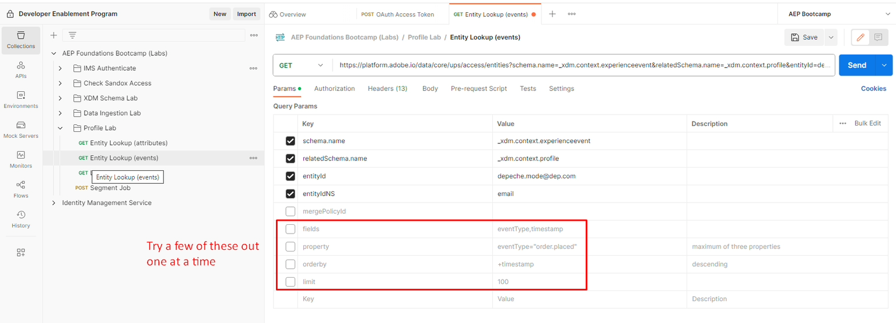
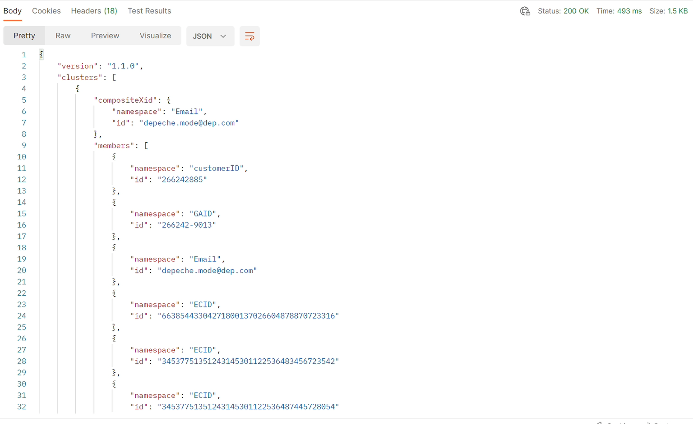

# API de profil et d’identité

## API de l’entité de profil

Savoir comment utiliser les API de profil est essentiel lorsqu’il s’agit d’utiliser le profil client en temps réel. Il permet un tri et un débogage rapides, tout en vous exposant à d’innombrables possibilités d’intégration des systèmes, des centres d’appels aux kiosques.

L’une des API les plus importantes est l’API Profile Entity.  Cette API vous permet de rechercher un profil individuel (comme vous l’avez vu dans l’interface utilisateur), mais elle utilise des paramètres pour indiquer si vous souhaitez voir les attributs ou les événements du profil.

Vous trouverez ci-dessous la spécification complète de la méthode GET pour l’API Profile Entity

## Présentation de l’API

Vous trouverez ci-dessous les informations minimales nécessaires pour appeler l’API Profile Entity.

`GET https://platform.adobe.io/data/core/ups/access/entities`

### Paramètre de requête requis

Envoyez ce paramètre avec chaque requête. Sa valeur dépend de si vous recherchez les attributs d’un profil ou ses événements :

| Paramètre | Type | Description | Exemple |
| ------------- | ------ | ---------------------------------------------------------------------------------------------------------------------------------------------- | ------------------------------ |
| `schema.name` | chaîne | Nom de la classe de schéma XDM de l’entité que vous recherchez. | `_xdm.context.profile` |
| `schema.name` | chaîne | Utilisez plutôt cette valeur pour rechercher les événements d’un profil. Associez-la à des `relatedSchema.name=_xdm.context.profile` pour définir la portée des événements pour un profil. | `_xdm.context.experienceevent` |

### Identification de l’entité à rechercher

La plupart des requêtes utilisent `entityId` et `entityIdNS` pour identifier l’entité par une valeur d’identité connue, telle qu’une adresse e-mail, un identifiant CRM ou un identifiant de fidélité, plutôt que d’avoir à connaître déjà son XID. Un XID est un identifiant codé en base64 généré et attribué en interne par Identity Service pour représenter une identité, ce qui consolide son espace de noms et sa valeur d’identifiant en un seul jeton compact (voir [XID natif](https://experienceleague.adobe.com/docs/experience-platform/identity/api/list-native-id.html?lang=fr) pour plus d’informations) :

| Paramètre | Type | Description | Exemple |
| ------------ | ------ | ---------------------------------------------------------------------------------------------------------------------------------------------- | ---------------------- |
| `entityId` | chaîne | Valeur d’identifiant à rechercher. Si vous connaissez déjà le XID de l’entité, utilisez-le uniquement ici et omettez `entityIdNS`. | `depeche.mode@dep.com` |
| `entityIdNS` | chaîne | Code d’espace de noms d’identité auquel `entityId` appartient (par exemple, `email`, `crmid`, `ECID`). Obligatoire lorsque `entityId` n’est pas déjà un XID. | `email` |

>[!NOTE]
>
>Les demandes Postman de ce Lab recherchent le profil du mode Depeche par son adresse e-mail (`entityIdNS=email`, `entityId=depeche.mode@dep.com`) plutôt que par son XID.

### En-têtes requis

Chaque requête nécessite également les en-têtes suivants :

| En-tête | Type | Description | Exemple |
| ----------------- | ------ | ---------------------------------------------- | --------------------- |
| `x-gw-ims-org-id` | chaîne | Identifiant de l’organisation IMS. | `<your IMS org>` |
| `x-api-key` | chaîne | Clé API du projet enregistré/des informations d’identification. | `<your API key>` |
| `Authorization` | chaîne | Jeton du porteur pour la requête. | `Bearer <your token>` |

>[!NOTE]
>
>Consultez la [Référence de l’API Profile Entities](https://developer.adobe.com/experience-platform-apis/references/profile#tag/Entities) pour obtenir la liste complète des paramètres de requête, y compris les options de recherche d’identité supplémentaires, le filtrage des événements (`startTime`, `endTime`, `property`, `orderby`, `limit`), la sélection de champs et les remplacements de politiques de fusion.

>[!WARNING]
>
>N’oubliez pas que toutes les requêtes d’API sont spécifiques au sandbox. Il est donc important, lorsque vous utilisez les API, de vous assurer que votre paramètre d’en-tête dans chaque requête appelée `x-sandbox-name` est correctement défini sur le sandbox approprié.
>
>Pour cet atelier, le `x-sandbox-name` est déjà défini dans votre fichier d’environnement

## Recherche d’entité (attributs)

Pour obtenir une idée de l’API Lookup d’entité, utilisez le profil de mode de profondeur de l’atelier précédent.

1. Ouvrez **&#x200B;**&#x200B;et accédez au dossier **Profile Lab**
1. Cliquez sur la requête **Recherche d’entité (attributs)** pour l’ouvrir
1. Exécutez l’appel en cliquant sur le bouton **Envoyer**

   ")

   Une requête réussie doit répondre par une `200 OK` et vous devriez voir un résultat contenant tous les attributs pour le profil de mode de vérification.

   Réponse OK  du mode de rendu")

   >[!NOTE]
   >
   >Par défaut, si aucune politique de fusion n’est spécifiée dans une demande d’entité de profil, elle utilise la politique de fusion par défaut dans le sandbox

   Avec l’API Entity, vous pouvez utiliser un certain nombre de paramètres de requête pour modifier ce qui est renvoyé en réponse.

1. Dans la requête de recherche d’entité (attributs), cliquez sur l’option **Params** de la requête
1. Cochez la case en regard de **Clé** nommée **champs**
1. Exécutez la requête en cliquant sur le bouton **Envoyer**.

>[!NOTE]
>
>Notez qu’il existe également un paramètre pour spécifier le `mergePolicyId`.  Vous pouvez trouver la valeur de cette à l’aide d’autres API ou en recherchant l’identifiant à l’aide de l’interface utilisateur.

Une requête réussie doit répondre par une `200 OK` et vous ne devriez voir que les champs spécifiés dans le filtre de paramètre que vous venez d’activer : Prénom, Nom et un tableau de produits actifs.

 avec filtre activé")

>[!TIP]
>
>Félicitations !  Vous avez réussi à rechercher les attributs d’un profil à l’aide de l’API Profile Entity

## Recherche d’entité (événements)

Pour rechercher les événements d’un profil, vous utilisez exactement la même API Profile Entity.  La seule différence est que vous devez indiquer au service de profil que vous souhaitez modifier le type de classe à utiliser dans la réponse.

1. Cliquez sur la requête **Recherche d’entité (événements)** pour l’ouvrir
1. Exécutez l’appel en cliquant sur le bouton **Envoyer**

Une requête réussie doit répondre par une `200 OK` et vous devriez voir un résultat contenant tous les événements pour le profil de mode de vérification.

Réponse OK  du mode de détection")

Tout comme lors de la recherche d’attributs de profil, l’API d’entité comporte encore plus de paramètres de requête qui peuvent être utilisés pour modifier ce qui est renvoyé en réponse.

Vous pouvez essayer quelques-unes d’entre elles en les activant dans la section Paramètres et en exécutant la requête.  Faites un essai et voyez comment cela fonctionne !

**Exemples de définitions de paramètres de requête**

| Clé | Valeur | Description |
| ------------- | ------------------------------- | --------------------------------------------------------------------------------------------------------------------------------------------------------- |
| mergePolicyId | \&lt;blank> | Si fourni, vous pouvez changer la politique de fusion utilisée pour effectuer la recherche. Pour le Lab, laisser ce champ vide signifie utiliser la politique de fusion par défaut des sandbox |
| champs | eventType,timestamp,identityMap | Affiche uniquement ces champs de chaque événement, même si le champ spécifié comporte une valeur |
| propriété | eventType=« order.put » | Filtre les événements du profil vers le bas pour qu’ils ne soient que de type « order.put ». |
| orderby | +horodatage | Trie les événements par ordre décroissant |
| limite | 5 | Affiche uniquement 5 événements dans la réponse |

>[!NOTE]
>
>Vous pouvez en savoir plus sur toutes les options des paramètres de requête ici -> [&#128279;](https://developer.adobe.com/experience-platform-apis/references/profile/#tag/Entities/operation/retrieveEntity)

## API de cluster Identity Service

À un moment donné, vous pouvez avoir une question sur les identités qui font partie du cluster d’identités d’un profil spécifique dans le graphique d’identités.  Cette API vous permet de transmettre un espace de noms d’identité/une valeur unique et, en réponse, vous recevez le cluster d’identités complet pour ce profil.

Faites un essai :

1. Cliquez sur la requête **Liste des identités liées** pour l’ouvrir
1. Exécutez l’appel en cliquant sur le bouton **Envoyer**

>[!NOTE]
>
>Notez que les paramètres de la requête sont l’espace de noms d’identité et l’identifiant (c’est-à-dire la valeur )

Une réponse réussie doit ressembler à la capture d’écran ci-dessous

>[!NOTE]
>
>Vous remarquerez que la réponse contient toutes les identités du mode d’obsolescence du profil
