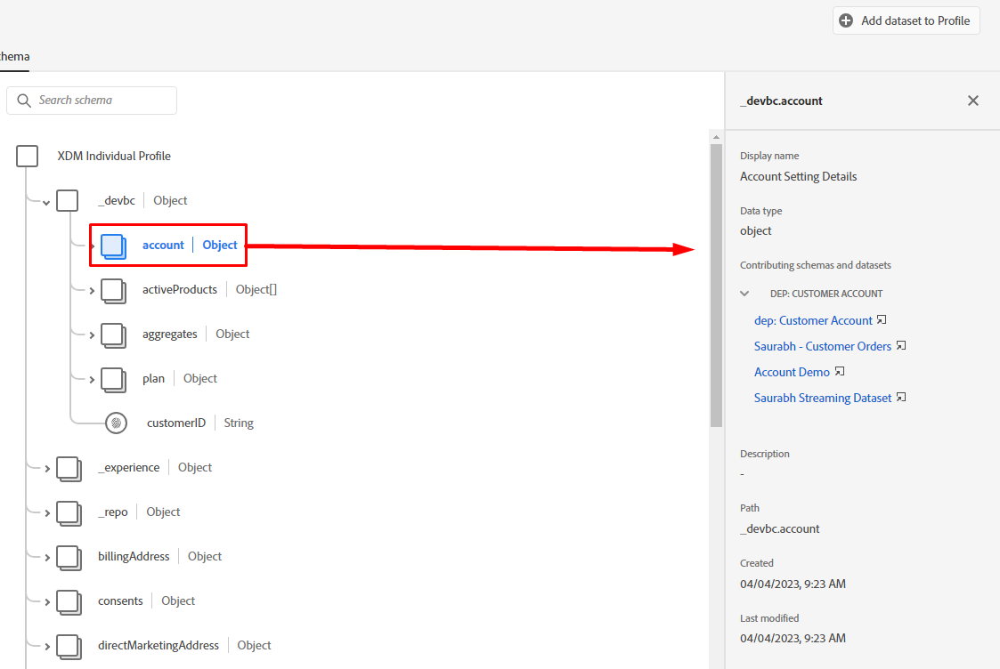

# Principes de base des profils

## Schéma d’union des profils

N’oubliez pas que la vue de tout profil client en temps réel est créée à l’aide des schémas que vous avez définis et activés pour le profil. C’est ce qu’Adobe appelle le schéma d’union du profil.

Pour afficher le schéma d’union du profil, procédez comme suit :

1. Cliquez sur **Profils** dans le rail de gauche
1. Cliquez sur **Schéma d’union** dans le volet de navigation supérieur.


>[!NOTE]
>
>N’oubliez pas que le profil crée une vue d’union pour chaque classe XDM. Vous utilisez cette vue pour voir quels schémas ont contribué à quelle classe, les identités au sein de chaque classe et les relations.

Consultez le Schéma d’union pour la classe XDM Individual Profile et développez l’espace de noms du client. Vous devriez voir ici un certain nombre d’éléments provenant de divers schémas que vous avez définis dans les **Méthodologie LID** et **laboratoires de modélisation XDM**.


Cliquez sur l’objet **account** et remarquez ce qui s’affiche dans le rail de droite de l’écran. Vous pouvez désormais voir les détails sur l’objet , le ou les schémas et le ou les jeux de données qui ont contribué à sa formation, ainsi que d’autres informations pertinentes.



>[!NOTE]
>
>Le schéma d’union est un excellent outil pour comprendre pourquoi certains éléments existent au sein d’un profil et d’où ils viennent.
>
>N’oubliez pas que le schéma d’union est observable, ce qui signifie que le profil n’affichera que les champs contenant des données lors de l’affichage d’un profil client en temps réel


## Recherche de profil

1. Cliquez sur **Profils** dans le rail de gauche, puis, dans le volet de navigation supérieur, sélectionnez **Parcourir**
1. Sélectionnez l’Espace de noms d’identité **E-mail**
1. Saisissez la valeur Identité de **depeche.mode\@dep.com**
1. Cliquez sur le bouton **Afficher** pour rechercher le profil
1. Cliquez sur le **lien** vers le profil pour afficher les détails du profil

")


Vous devriez voir ça maintenant !


Prenez une minute pour explorer le profil, Mode Découpe, en examinant chaque onglet dans le volet de navigation supérieur. Voici les onglets que vous utiliserez :

- Détail : affiche des cartes personnalisées qui présentent divers aspects du profil donné.
- Attributs : affiche tous les attributs associés au profil donné provenant du schéma d’union.
- Événements : affiche tous les événements associés au profil donné provenant du schéma d’union
- Appartenance à une audience : affiche les audiences dont le profil est actuellement membre

## Afficher les attributs

Accédez à l’onglet **Attributs** et cliquez sur **Afficher JSON**


Les champs issus des groupes de champs que vous avez ajoutés au schéma de compte client s’affichent.

- Recherchez le nœud parent appelé **entité**
- Notez l’objet enfant **billingAddress** (provenant du groupe de champs Coordonnées personnelles)

```json
"billingAddress": {
  "postalCode": "11355",
  "city": "New York City",
  "state": "NY",
  "street1": "108 Ruskin Terrace"
}
```

Comparez cela à ce que contient le schéma d’union des profils . Vous devriez voir en quoi consiste la signification de l’observable 😄

```json
"billingAddress": {
    "_repo": {
        "createDate": "datetime",
        "modifyDate": "datetime",
    },
    "_schema": {
        "description": "string",
        "elevation": "double",
        "latitude": "double",
        "longitude": "double"
    },
    "_id": "string",
    "city": "string",
    "country": "string",
    "countryCode": "string",
    "createdByBatchID": "string",
    "dmaID": "integer",
    "label": "string",
    "lastVerifiedDate": "date",
    "modifiedByBatchID": "string",
    "msaID": "string",
    "postOfficeBox": "string",
    "postalCode": "string",
    "primary": "boolean"
    "region": "string",
    "repositoryCreatedBy": "string",
    "repositoryLastModifiedBy": "string",
    "state": "string",
    "stateProvince": "string",
    "status": "string",
    "statusReason": "string"
    "street1": "string",
    "street2": "string",
    "street3": "string",
    "street4": "string"
}
```

>[!NOTE]
>
>Le schéma observable signifie littéralement afficher uniquement les champs où des données existent et masquer les champs qui ne contiennent pas de données.  Très différent de la base de données relationnelle traditionnelle !


Recherchez ensuite l’objet **consentements** (provenant du groupe de champs Détails du consentement et des préférences).

```json
"consents":{
   "marketing":{
      "sms":{
         "val":"y"
      },
      "email":{
         "val":"y"
      }
   }
}
```


Faites défiler l’écran jusqu’à l’espace de noms du client, **\_devbc**, et recherchez l’objet **plan** (provenant d’un groupe de champs personnalisé créé nommé « dep: Plan Details »)

```json
"plan": {
    "planID": "m3",
    "type": "mobile",
    "name": "pro"
}
```


Notez l’objet **aggregates** que vous avez défini pour le cas d’utilisation de vente incitative. Ces champs se trouvent également sous l’espace de noms du client \_devbc. Ils provenaient d’un schéma différent (dep : agrégats client) et d’un groupe de champs personnalisé (dep : agrégats)

```json
"aggregates":{
   "rollingSixMonthAvgMonthlyDataUsage":30,
   "rollingSixMonthTotalDataUsage":200
}
```

## Afficher la carte des identités

Vous pouvez également voir les identités associées d’un profil telles qu’elles sont stockées dans un objet basé sur une carte nommé **identityMap.** Recherchez **identityMap** près du bas du document JSON.

Il s’agit d’une représentation de toutes les identités que vous avez transmises, que vous ayez utilisé le champ identityMap ou marqué un champ à l’aide d’un descripteur d’identité.

```json
"identityMap": {
  "ecid": [{
          "id": "34537751351243145301122536487445728054"
      },
      {
          "id": "66385443304271800137026604878870723316"
      },
      {
          "id": "34537751351243145301122536483456723542"
      }
  ],
  "email": [{
          "id": "dave.gahan@dep.com"
      },
      {
          "id": "depeche.mode@dep.com"
      }
  ],
  "customerid": [{
      "id": "266242885"
  }],
  "gaid": [{
          "id": "266242-9013"
      },
      {
          "id": "266242-9012"
      }
  ]
}
```

>[!NOTE]
>
>Notez qu’il n’y a aucune référence au concept d’« identité principale » dans identityMap. La raison en est double :
>
>1. L’identityMap visible dans les attributs de profil est créée pour chaque profil à l’aide du graphique du service d’identités\*
>2. Le graphique d’identités ne concerne que les relations entre les identités. Chaque identité est traitée de la même manière. A est associé à B et peu importe s’il s’agissait d’une identité principale, d’une identité de personne, etc.
>
>*\* Si aucun graphique d’identité n’est utilisé, identityMap est composé uniquement de l’identité demandée dans la recherche*

>[!NOTE]
>
>Lorsque vous avez créé le schéma de compte client, un seul champ d’e-mail était marqué comme identité (c’est-à-dire personalEmail.address). Avez-vous remarqué que le mappage d’identité comporte deux adresses e-mail ?
>
>Que se passe-t-il ?
>
>- Le graphique d’identités enregistre en permanence les nouvelles relations et les valeurs au sein de ces relations au fur et à mesure que les données affluent dans son service
>- Le comportement de Profile consiste à remplacer les valeurs de champ existantes par de nouvelles valeurs lors de l’ingestion de données dans son service
>- Lorsque vous marquez un champ avec un descripteur d’identité, il reste un champ pour Profil


## Graphique d’identités

Revenez à l’onglet **Détail** dans le volet de navigation supérieur et cliquez sur le lien **Afficher le graphique d’identités** situé au bas de la carte **Identités liées**


Vous devriez maintenant voir cet écran.


La vue ci-dessus est le graphique d’identités du profil du mode Profond et est divisée en trois (3) zones clés :

**Visualiseur de graphique d’identités** - affiche les identités et leurs relations associées au sein du cluster d’identités des profils

**Détails du graphique d’identités** : fournit des détails spécifiques sur les espaces de noms, les valeurs et les sources de données du graphique d’identités global qui ont créé toutes les relations affichées dans le visualiseur de graphique d’identités

**Détails de l’identité sélectionnée** - affiche des informations détaillées sur l’identité sélectionnée avec les cinq (5) derniers lots pour lesquels cette identité a été traitée dans une relation

>[!NOTE]
>
>La visionneuse de graphiques d’identités affiche à la fois les relations entre toutes les identités, ainsi que des informations sur la dernière fois où la relation d’identité a été vue et à partir de quel jeu de données


Affichez le graphique d’identités du mode obsolète à l’aide de l’identité customerID à la place.  Effectuez les actions suivantes :

1. Copiez et enregistrez le **customerID** quelque part.
1. Remplacez la valeur de l’espace de noms dans la zone Espace de noms d’identité par **customerID**
1. Collez dans la valeur **customerID** enregistrée à l’étape précédente
1. Cliquez sur le bouton **Affichage** pour afficher le graphique d’identités contenant cette identité à l’aide de la nouvelle valeur d’identité


>[!NOTE]
>
>Remarquez comment vous voyez exactement le même graphique d’identité ! Toute identité utilisée à partir de ce graphique aura toujours le même résultat


## Modification des identités

Revenez à la visionneuse de profils et recherchez le mode Profondeur à l’aide de l’ID de client maintenant

1. Remplacez l’espace de noms d’identité par **customerID**
1. Mettez à jour la valeur Identité à l’aide de la valeur customerID que vous avez enregistrée dans la dernière section
1. Cliquez sur le bouton **Afficher**


Vous devriez voir le même profil que vous venez de voir précédemment !


>[!NOTE]
>
>Le graphique d’identités garantit que toute identité que vous utilisez aboutit au même profil lors de l’assemblage des différents fragments de profil
