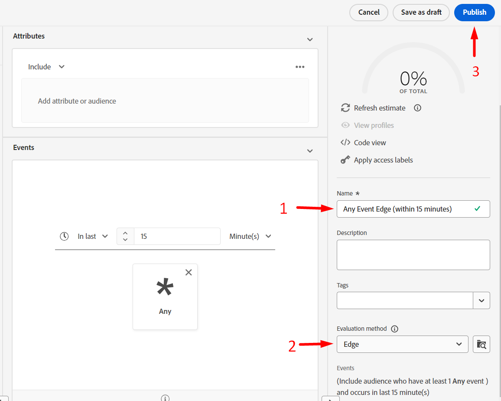

# Création d’une audience Edge

Cette audience sera utilisée pour qualifier une personne lorsqu’une payload (par exemple, page vue) vient du client (par exemple, Web SDK) vers Edge.

>[!NOTE]
>
>Nous évaluons généralement une audience sur l’Edge afin de pouvoir la retourner et l’utiliser dans Personalization. Si nous n’effectuons pas Personalization sur Edge, nous pouvons simplement demander à l’audience d’évaluer comme étant en flux continu sur le Hub.

## Créer une audience

1. Dans le rail de gauche, cliquez sur Audiences .
1. Cliquez ensuite sur Créer une audience dans le coin supérieur droit de l’écran
1. Cliquez ensuite sur Créer une règle

## Convertir l’audience en règles

1. Accédez à **Audiences** et cliquez sur le dossier **Experience Platform**
1. Faites glisser et déposez l’audience nommée **dep: Any Event Streaming (dans l’heure)** sur la zone de travail

1. Convertissez l’audience en un ensemble de règles dans la zone de travail en cliquant sur l’**icône** affichée ci-dessous, puis cliquez sur **Convertir**

## Mettre à jour les règles d’événement

Apportez les modifications suivantes aux règles d’événement (vous devrez peut-être développer l’événement pour l’afficher)

1. En dernier
1. 15
1. Minutes

## Publier le segment

1. Remplacez le nom du segment par **Any Event Edge (dans les 15 minutes)**
1. Mise à jour de la méthode d’évaluation vers Edge
1. Publication du segment

## Créer un segment évalué par lot

Répétez les mêmes étapes que celles que vous venez de suivre pour le segment Edge que vous avez créé, mais utilisez plutôt les informations suivantes :

>[!NOTE]
>
>Nous allons créer une audience par lots afin que vous puissiez constater que même si un événement est transmis dans Edge, les audiences enregistrées en tant qu’évaluation par lots ne sont pas évaluées en mode de diffusion en continu.

Règles d’événement :

- En dernier
- 1
- Jour

Détails du segment :

- Nom -> **Tout lot d’événement (dans un délai d’un jour)**
- Méthode d&#39;évaluation -> lot
