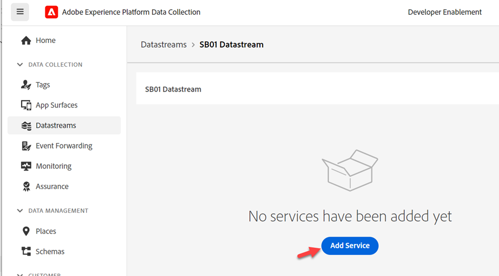

# Créer un flux de données

Un flux de données définit les services qui l’utiliseront.

- Lors de l’envoi de données à Edge, vous spécifiez le flux de données à utiliser
- Les données envoyées à ces flux de données peuvent ensuite agir en fonction du service configuré
  - Transfert d’événement
  - Adobe Experience Platform

## Créer un flux de données

1. Dans le rail de gauche, sous **Collecte de données** cliquez sur **Flux de données**
1. Cliquez ensuite sur **Nouveau flux de données** pour en créer un

## Configurer le flux de données

Configurez le flux de données avec les informations suivantes :

1. Nom -> **flux de données SB + \&lt;nom du sandbox> (c’est-à-dire flux de données SB01)**
1. Schéma d’événement -> **dep : Web**
1. Activez toutes les options **activé** sous **Géolocalisation et recherche réseau**
1. Cliquez sur le bouton **Enregistrer** lorsque vous avez terminé

>[!WARNING]
>
>Ne cliquez pas sur Enregistrer et ajouter un mappage.  Si vous le faites accidentellement, annulez simplement

Une fois le flux de données enregistré, l’écran suivant s’affiche :

## Ajouter un service de transfert d’événement

Vous pouvez ainsi utiliser le transfert d’événement pour les données reçues par ce flux de données.

1. Cliquez sur **Ajouter un service**

   

1. Configurez les éléments suivants :

   - Service -> Transfert d’événement
   - Propriété -> Sélectionnez la propriété que vous avez créée à l’étape précédente.  Son nom doit être le suivant : Propriété de transfert d’événement SB + \&lt;votre numéro de sandbox>
   - Environnement -> Développement

1. Lorsque vous avez terminé, cliquez sur **Enregistrer**

## Ajout d’un service Adobe Experience Platform

Vous pouvez ainsi envoyer des données au hub et accéder à un jeu de données pour les données reçues par ce flux de données.

1. Cliquez sur **Ajouter un service**

   

1. Configurez les éléments suivants :

   - Service -> Adobe Experience Platform
   - Jeu de données d’événement -> dep : Web
   - Jeu de données de profil -> prop : compte client
   - Sélectionnez Case à cocher -> Segmentation Edge .
   - Sélectionner la case à cocher -> Destination Personalization

   Configuration du service 

1. Lorsque vous avez terminé, cliquez sur **Enregistrer**.

1. Votre écran final devrait ressembler à ce qui suit, avec deux services présents. **Copiez** et **enregistrez** l’**identifiant de flux de données** sur votre ordinateur local (vous l’utiliserez ultérieurement dans Postman).

