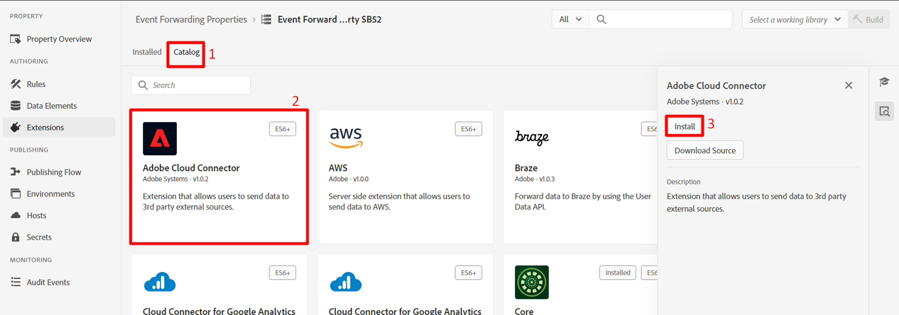
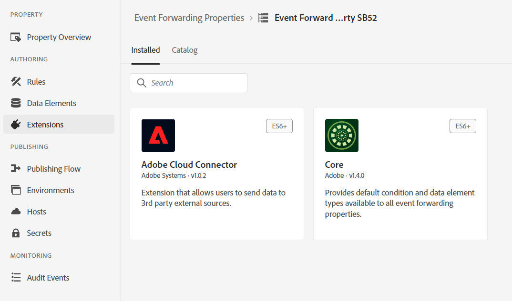
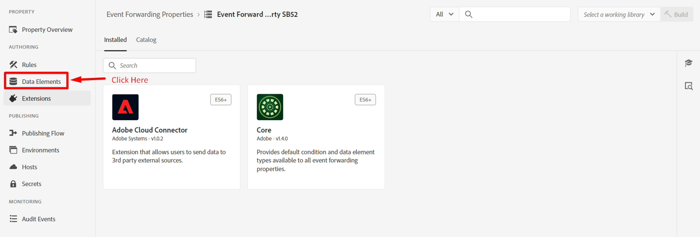
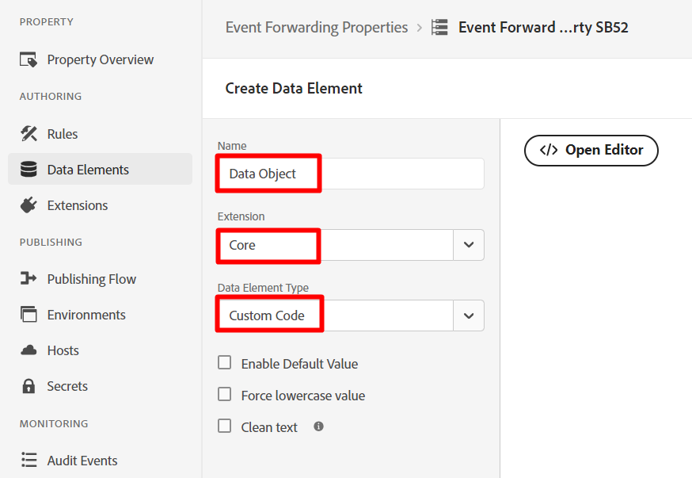

# Créer une propriété

En règle générale, nous souhaitons transférer un événement d’expérience à un tiers (ce qui n’est pas obligatoire). Cette option est généralement utilisée lorsqu&#39;une copie d&#39;un événement est nécessaire en temps réel pour informer un tiers dans des circonstances spécifiques (par exemple, en informant Google, Meta ou TikTok d&#39;un achat).

>[!NOTE]
>
>Rappel : une propriété contient toutes les extensions, les éléments de données et les règles nécessaires pour décider quoi transférer et où

1. Dans le rail de gauche, cliquez sur Transfert d’événement .
2. Cliquez ensuite sur Nouvelle propriété

   

3. Mettez à jour le nom de la propriété en utilisant la formule suivante : `Event Forward Property SB + [sandbox number]`. Votre nom final ressemblerait à ceci : **Event Forward Property SB01**

4. Cliquez sur **Enregistrer** lorsque vous avez terminé


## Installer l’extension

1. Cliquez sur la propriété Transfert d’événement que vous venez de créer

   


2. Vous devriez voir un écran comme ci-dessous.  Cliquez sur **Extensions**.

   


3. Installez l’extension Adobe Cloud Connector en procédant comme suit :

4. Cliquez sur **Catalogue** dans le volet de navigation supérieur
5. Cliquez sur la carte **Adobe Cloud Connector**
6. Dans le rail de droite, cliquez sur le bouton **Installer**




Après avoir cliqué sur installer , vous devriez voir l’affichage des extensions sous les extensions Installées pour votre propriété, comme illustré ci-dessous



## Créer un élément de données

>[!NOTE]
>
>Un élément de données référence l’événement entrant et peut l’analyser en plusieurs composants individuels si nécessaire

1. Dans le rail de gauche, cliquez sur **Éléments de données**


   


2. Cliquez sur le bouton **Créer un élément de données**

   


3. Configurez le nouvel élément de données avec les informations suivantes :

   | Type d’élément | Valeur à configurer |
   | ----------------- | ------------------ |
   | Nom | Objet de données |
   | Extension | Noyau |
   | Type d’élément de données | Code personnalisé |

   


4. Cliquez sur le bouton **Ouvrir l’éditeur** pour ajouter le code personnalisé suivant :

   


5. Ajoutez du code personnalisé à l’éditeur comme suit et enregistrez-le

   ```none
   var xdm = arc?.event || '';
   return xdm;
   ```

   

   >[!NOTE]
   >
   >Il s’agit de saisir l’objet xdm entier sans effectuer de traductions dans la payload.  Si nécessaire, nous pouvions analyser chaque élément individuel dans l’objet XDM (par exemple, le nom de page, le montant de l’achat), en un élément de données par champ.  La raison pour cela pourrait être s’il y a une transformation de la structure vers une autre structure


6. Cliquez sur le bouton **Enregistrer** pour enregistrer l’élément de données.


Lorsque vous avez terminé, l’écran suivant qui confirme que votre élément de données a été ajouté devrait s’afficher :


## Créer des règles

>[!NOTE]
>
>Une règle contient :
>
>1. Conditions sur ce qu’il faut transférer
>2. Actions pouvant transformer la payload et définir où l’envoyer


1. Dans le rail de gauche, cliquez sur **Règles**

   


2. Cliquez ensuite sur **Créer une règle**

   


3. Mettez à jour le nom de la règle en utilisant la formule suivante : `"EF Rule SB" + [your sandbox number]` (c.-à-d. la règle SB01 de l&#39;EF). Vous trouverez votre numéro de sandbox en haut à droite de la fenêtre de votre navigateur, comme illustré ci-dessous\...

   

4. Cliquez sur **Enregistrer** lorsque vous avez terminé

   >[!NOTE]
   >
   >Assurez-vous que le nom de la règle suit le modèle de formule de `"EF Rule SB" + [sandbox number]`

   


5. Ajoutez une action à votre règle en cliquant sur le signe (+) pour ajouter une nouvelle action


## Obtenir l’URL du webhook (à utiliser en action)

>[!NOTE]
>
>Cet atelier utilise un webhook ici afin que vous puissiez voir si les données sont arrivées à la destination à laquelle vous les envoyez. Dans un scénario réel, vous vous connecteriez à cette destination et utiliseriez ses outils pour voir ce qui est arrivé.


1. Ouvrez le lien suivant dans un nouvel onglet de votre navigateur -> [](https://webhook.site/)
2. Copiez l’URL unique qui s’affiche et enregistrez-la en lieu sûr.

   


3. Configurez votre action avec les informations suivantes :

| Paramètre | Valeur |
| ----------- | ------------------------------------------------------------------------------------------------------------------------------------------------------------------- |
| Extension | Adobe Cloud Connector |
| Type d’action | Effectuer l’appel de récupération |
| Méthode | Message |
| URL | Utilisez la même URL de webhook que celle utilisée lors de la configuration de la destination de diffusion en streaming. Pour le trouver, ouvrez un nouvel onglet dans le navigateur et accédez à Destinations -> Parcourir . |
| Corps | Raw |
| Données du corps | \{ « data »: \{ « event »: « \{\{Data Object\}\} » } |

>[!NOTE]
>
>L’élément \{\{Data Object\}\} référencé ici est l’élément de données que vous avez créé précédemment. Ici, le système en aval avait besoin d’encapsuler l’événement dans un objet de données avec un objet d’événement. Vous pouvez mettre n&#39;importe quelle mise en forme ici.
>
>Si nous avions divisé \{\{Objet de données\}\} en plusieurs champs (par exemple, nom de page, achat, etc.), nous pourrions transformer la structure JSON en plaçant chaque champ à l’emplacement souhaité, ce qui nous permettrait de mieux contrôler la correspondance avec la destination.


Lorsque vous avez terminé, vérifiez que votre écran ressemble à ce qui suit, puis cliquez sur **Conserver les modifications**


4. Une fois cette opération terminée, l’action doit être ajoutée à la règle. Cliquez sur **Enregistrer** pour continuer.


>[!WARNING]
>
>Lorsque vous envoyez un événement d’expérience, vous envoyez l’événement, et non le profil, ni aucun de ses attributs, y compris les qualifications d’audience (même s’il s’agit d’une audience Edge).
>
>Cela se produit à des fins de rapidité.


## Publier les modifications

1. Dans le rail de gauche, cliquez sur **Flux de publication**

   


2. Cliquez sur le bouton **Ajouter une bibliothèque**

   


3. Configurez la bibliothèque avec les informations suivantes :

   - Nom -> **Bibliothèque EF**
   - Environnement -> **Développement**
   - Cliquez sur **Ajouter toutes les ressources modifiées**


   Lorsque vous avez terminé, votre écran doit ressembler à la capture d’écran ci-dessous.  Si tout semble correct, cliquez sur le bouton **Enregistrer et créer dans le développement**

   


4. Vous devriez alors voir la version de développement passer au vert indiquant qu’elle est prête à être utilisée


