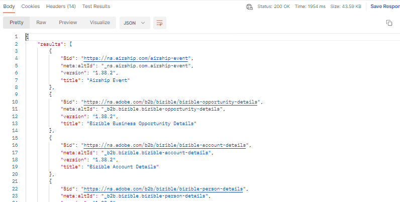

# Obtenir les groupes de champs standard

>[!NOTE]
>
>**« Groupe de champs »** était auparavant appelé **« Mixin »** ces termes peuvent donc être utilisés de manière interchangeable dans les requêtes d’API et le guide.

## Demander des groupes de champs standard XDM

1. Cliquez sur `Step 1 - Get XDM Standard Field Groups` appel API dans le dossier `XDM Schema Lab -> Create Schema`
1. Exécutez l’appel en cliquant sur le bouton `Send` .

**Requête**

>[!NOTE]
>
>Notez l’utilisation de `global` valeur dans l’URL des requêtes ci-dessous :
>
>https\://platform.adobe.io/data/foundation/schemaregistry/**global**/mixins
>
>`global` est utilisé pour demander uniquement des composants standard XDM (groupe de champs/mixin dans ce cas). Le registre XDM d’Experience Platform comporte deux types de propriétaires : Adobe et Client (c’est-à-dire personnalisé).
>
>- Les objets créés par Adobe utilisent toujours le mot `global` dans toute liste XDM ou requête de recherche
>- Les objets créés par le client (c’est-à-dire personnalisés) utilisent toujours le mot `tenant` dans toute liste XDM ou tout appel de recherche

**Réponse**

## Identifier les groupes de champs standard XDM obligatoires

Un schéma est toujours composé d’un ou de plusieurs groupes de champs et d’une classe .  Pour le schéma Profil individuel de connexion 5G, recherchez les groupes de champs XDM standard requis pour le schéma.

- Détails démographiques
- Coordonnées personnelles
- Détails relatifs au consentement et aux préférences

1. Rechercher le groupe de champs `Demographic Details` dans la réponse de l’appel
1. Copiez le `$id` du groupe de champs et enregistrez-le quelque part pour vous y référer ultérieurement
1. Répétez les étapes 1 et 2 pour les deux autres groupes de champs répertoriés ci-dessus

>[!WARNING]
>
>Ne continuez pas tant que vous n’avez pas enregistré les trois (3) `$ids` quelque part.  Ils seront nécessaires ultérieurement pour créer le schéma Compte client
