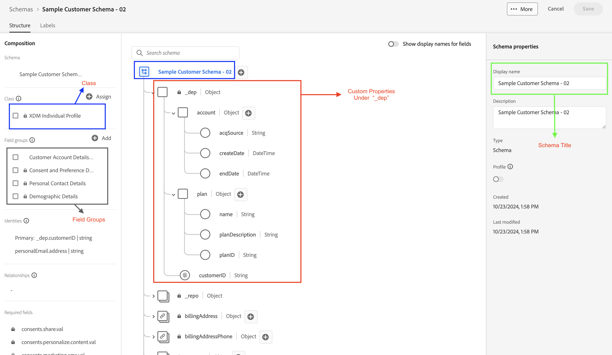

# Créer un schéma

## Assemblage de schéma

Tous les schémas faisant partie de XDM sont composés de la même manière.  Un schéma est toujours composé d’une seule classe et d’un ou plusieurs groupes de champs. En outre, la classe d’un schéma détermine la manière dont les autres systèmes d’Experience Platform interpréteront les données (en tant que série temporelle ou basée sur des enregistrements, par exemple).

## Votre objectif

Dans cet atelier, vous allez créer le schéma Compte client Connection 5G à l’aide de la feuille de mappage que vous avez remplie précédemment. Lorsque vous avez terminé cette partie du Lab, vous devriez voir un schéma similaire à celui-ci :

