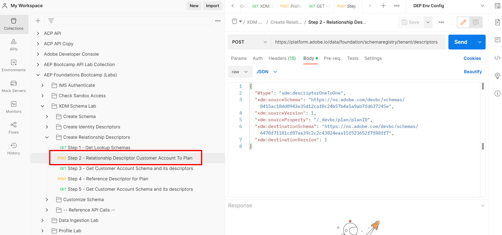

# Créer une relation de schéma

1. Cliquez sur la requête d’API `Step 2 - Relationship Descriptor Customer Account To Plan` dans le dossier `XDM Schema Lab -> Create Relationship Descriptors` .

   >[!CAUTION]
   >
   >Ne pas exécuter la requête... pour l’instant

   


2. Mettez à jour les propriétés suivantes dans le corps de l’appel API.

- Définissez la valeur de la propriété `xdm:sourceSchema` sur la `$id` du schéma de compte client que vous avez enregistré à partir de l’étape [Créer un schéma](../build-schema/create-schema.md) de l’atelier
- Définissez la valeur du `xdm:sourceProperty` sur le chemin d’accès du champ `planID` à partir du schéma de compte client.
- Définissez la valeur de la propriété `xdm:destinationSchema` sur la `$id` `dep: Lookup Plan` schéma enregistré à la première étape

>[!NOTE]
>
>Utilisez la valeur de notation par points du champ planId du schéma de compte client et remplacez le `.` par `/`
>
>
>N&#39;oubliez pas non plus le `/` principal 😄

EXEMPLE UNIQUEMENT

```json
{
  "@type": "xdm:descriptorOneToOne",
  "xdm:sourceSchema": "https://ns.adobe.com/devbc/schemas/8415ac18dd8943e35d12caf0c24b57b4a5a9ab7fd637245e",
  "xdm:sourceVersion": 1,
  "xdm:sourceProperty": "/_devbc/plan/planID",
  "xdm:destinationSchema": "https://ns.adobe.com/devbc/schemas/6470f71181cf87aa39c2c2c43824eaa15f523652f7f88ff7"
,
  "xdm:destinationVersion": 1
}
```

>[!NOTE]
>
>Pensez à mettre à jour le nom du client ci-dessus (\_devbc) avec le vôtre


&#x200B;3. Enregistrez votre demande avant de continuer à utiliser le bouton `Save`

&#x200B;4. Exécutez l’API en cliquant sur le bouton `Send` .

Vous devriez maintenant voir une réponse `201 Created` comme ci-dessous


>[!NOTE]
>
>N’oubliez pas que le profil client en temps réel (et l’ensemble d’Experience Platform) ne prend en charge que ce que nous appelons une **jointure en un (1) bond** à partir des schémas Profil individuel XDM ou Événement d’expérience XDM (c’est-à-dire que vous ne pouvez créer qu’une (1) relation de recherche de niveau)

>[!NOTE]
>
>Avez-vous remarqué que le descripteur de relation `@type` est défini sur une valeur de `OneToOne` ? La relation entre le compte client et le tableau Plan dans l’ERD XDM sur papier n’est-elle pas un 1\:N ?  Que se passe-t-il ?
>
>
>Le profil client en temps réel est conçu pour décrire les caractéristiques et les comportements d’une personne individuelle.  Par conséquent, du point de vue d’une personne individuelle, une table de choix est **uniquement** **jamais** définie comme une relation 1:1 lors de la segmentation.
>
>Ça va si ton cerveau te fait mal...
