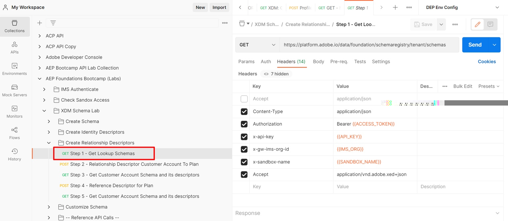
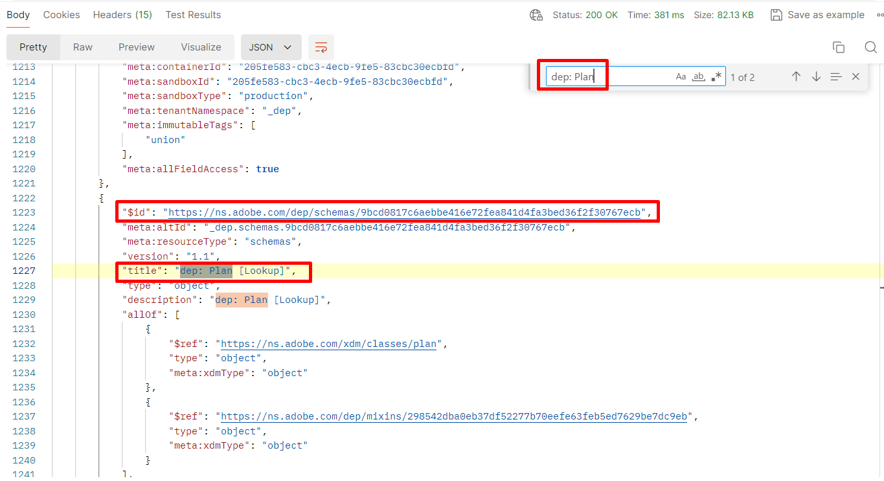

# Obtenir l’ID du schéma de plan

## Liste de tous les schémas client

1. Cliquez sur la requête d’API `Step 1 - Get Lookup Schemas` dans le dossier `XDM Schema Lab -> Create Relationship Descriptors` .
1. Exécutez l’API en cliquant sur le bouton `Send` .

>[!NOTE]
>
>Cet appel GET récupère tous les schémas qui existent dans la partie « tenant » du registre des schémas (c’est-à-dire les schémas créés sur mesure). Il suffit de rechercher le schéma **Plan** pour pouvoir l’associer au schéma Compte client.

## Identification du schéma du plan

1. Recherche du schéma `dep: Plan [Lookup] ` dans la réponse des appels
1. Copiez le `$id` du schéma et enregistrez-le quelque part pour référence ultérieure

>[!NOTE]
>
>Ce schéma doit déjà être prédéployé dans votre sandbox

>[!WARNING]
>
>Ne continuez pas tant que vous n’avez pas enregistré `$id` du schéma quelque part.  Il sera nécessaire ultérieurement pour créer le descripteur de relation
