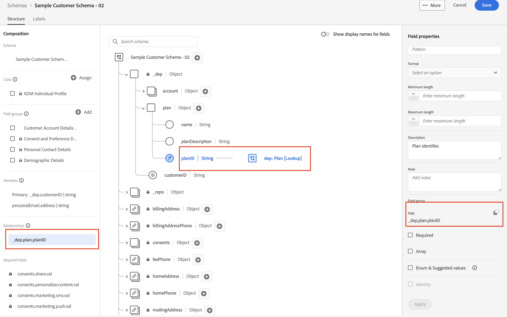

# Afficher le schéma

## Affichage via l’interface utilisateur

1. Ouvrez votre navigateur et revenez à la section `Schema -> Browse` .
1. Rechercher le `Sample Customer Schema - <your sandbox number>` de schéma
1. Notez que la relation avec la `dep: Plan [Lookup]` est définie

## Affichage via l’API

1. Sélectionnez l’API `Step 4 - Get Customer Account Schema and its descriptors` en cliquant dessus.

2. Dans l’URL de la requête, remplacez la `<replace me>` par la `$meta:altId` que vous avez enregistrée dans la section précédente [Créer un schéma](../build-schema/create-schema.md) comme illustré ci-dessous

3. Enregistrez la demande à l’aide du bouton `Save` .

4. Exécutez la requête en cliquant sur le bouton `Send` .

Vous devriez maintenant voir une réponse `200 OK` et vous devriez être en mesure de naviguer jusqu’à la fin du schéma que vous avez créé pour voir l’identité à travers le prisme de la structure JSON XDM

