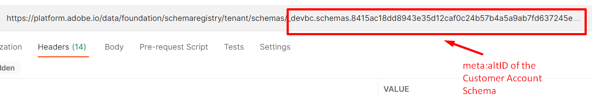

# Afficher le schéma

## Affichage via l’interface utilisateur

1. Ouvrez votre navigateur et revenez à la section `Schema -> Browse` .
1. Recherchez le schéma **Compte client**
1. Notez que les identités sont ajoutées au schéma

## Affichage via l’API

1. Sélectionnez l’API `Step 3 - Get Customer Account Schema and its descriptors` en cliquant dessus.

   

1. Dans l’URL de la requête, remplacez la `<replace me>` par la `$meta:altId` que vous avez enregistrée de la section précédente (Créer votre schéma) à la fin de l’appel, comme illustré ci-dessous

   

1. Enregistrez les modifications apportées à la demande

1. Exécutez la requête en cliquant sur le bouton `Send` .

Vous devriez maintenant voir une réponse `200 OK` et vous devriez être en mesure de parcourir le schéma que vous avez créé à travers le prisme de la structure XDM JSON

Parcourez plus bas la réponse de l’API pour voir les descripteurs d’identité que vous avez créés

## Accepter les en-têtes

Notez l’en-tête **Accept** utilisé dans la requête. Cet en-tête indique au registre des schémas XDM de renvoyer le `$refs` non résolu du schéma (c’est-à-dire d’afficher la quantité minimale d’informations) ainsi que ses descripteurs associés dans la réponse de l’API.  Adobe fournit d’autres en-têtes **Accept** que vous pouvez utiliser pour obtenir différents degrés de détail sur le schéma.

>[!NOTE]
>
>Vous pouvez en savoir plus sur les différents en-têtes Accept ici -> [Point d’entrée de l’API de schéma ](https://experienceleague.adobe.com/docs/experience-platform/xdm/api/schemas.html?lang=en#lookup)

Pour voir cela en action, modifiez l’en-tête **Accepter** afin d’indiquer au registre des schémas de répondre avec tous les `$ref` et `allOf` entièrement résolus (c’est-à-dire éclatés) et tous les descripteurs associés

1. Remplacez la valeur de l’en-tête `Accept` par la suivante :
   `application/vnd.adobe.xed-full-desc+json; version=1`
1. Enregistrez votre demande à l’aide du bouton `Save` .
1. Exécutez votre demande à l’aide du bouton `Send` .

Vous devriez voir maintenant une réponse qui ressemble à ceci :

>[!NOTE]
>
>Notez que toutes les propriétés du schéma sont désormais entièrement affichées dans la réponse, alors que dans l’appel précédent, seules les valeurs `$ref` du schéma (c’est-à-dire les groupes de champs qu’il référençait) vous étaient présentées et rien n’a été entièrement résolu sur chaque champ/propriété individuel.

>[!NOTE]
>
>Il est important de comprendre cela, car lorsque vous utilisez des API, vous n’avez pas toujours besoin de la réponse entièrement résolue si vous vous contentez d’obtenir le `$id` du schéma ou de simplement vérifier sa composition
