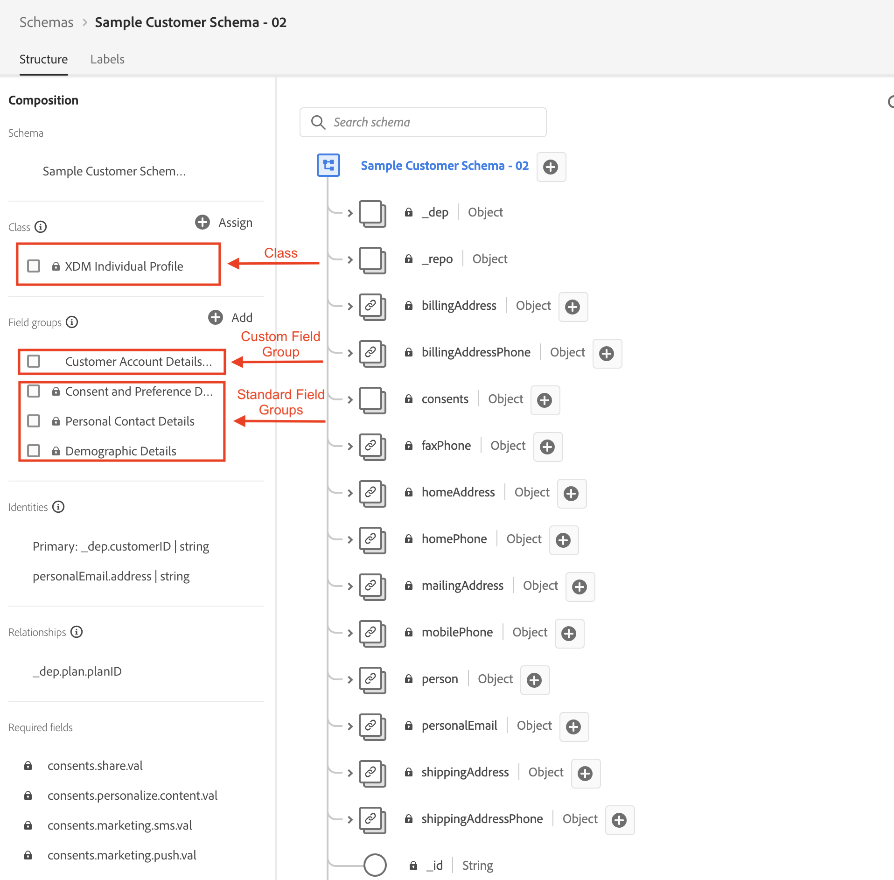

# Récapituler

La vidéo ci-dessous montre comment vous avez créé le schéma, les identités et les descripteurs de relation par le biais d’appels API et comment le correctif JSON est utilisé pour modifier un schéma.

>[!VIDEO](https://video.tv.adobe.com/v/3459564/?quality=12&learn=on)

>[!SUCCESS]
>
>Félicitations ! Comprendre comment cela fonctionne vous aide à comprendre le système dans son ensemble.

## Création du schéma de compte client

Vous avez créé le schéma en `$ref` les deux groupes de champs créés par Adobe et votre propre groupe de champs personnalisé (c’est-à-dire le client ou la cliente). Vous `$ref` également la classe que le schéma est censé représenter (c’est-à-dire XDM Individual Profile)

## Correctif JSON du schéma de compte client

Vous avez utilisé la méthode Correctif JSON pour modifier le schéma de compte client afin d’ajouter un nouveau champ à l’objet de plan. Pour ce faire, appliquez le correctif au groupe de champs personnalisés `$ref` appelé `Customer Account Details` vous avez défini dans [Créer des groupes de champs personnalisés](build-schema/create-custom-field-groups.md) plutôt que d’appliquer le correctif au schéma lui-même.

## Champs d’identité marqués

Pour créer des `Identity Descriptors` pour les champs `_devbc.customerID` et `personalEmail.address` du schéma Compte client, vous avez effectué deux des mêmes appels `POST`.

1. Le champ `_devbc.customerID` a été défini comme identité **principale**
1. Le champ `personalEmail.address` n’a **pas été défini** comme principal

## Relation de recherche créée

La dernière étape consistait à créer la relation entre le compte client et les schémas de plan du laboratoire XDM ERD on Paper. Cela vous a obligé à créer à la fois un descripteur de relation (c’est-à-dire comment lier le schéma `Customer Account` au schéma `dep: Plan [Lookup]`) et un descripteur d’identité de référence sur le schéma Compte client.

>[!NOTE]
>
>Le descripteur `referenceIdentity` indique au profil client en temps réel le champ du schéma `Customer Account` qui correspond à l’espace de noms d’identité. N’oubliez pas que lorsque vous définissez un schéma de recherche, vous devez marquer un champ en tant qu’identité principale et lui attribuer un espace de noms avec un type de `non-person`.
