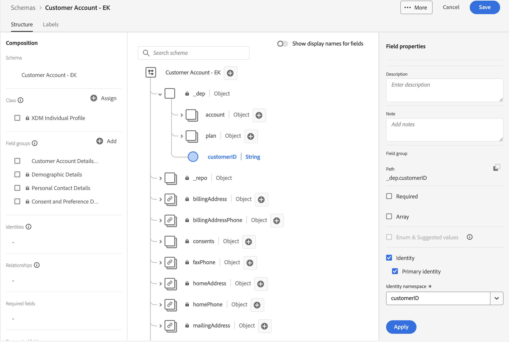
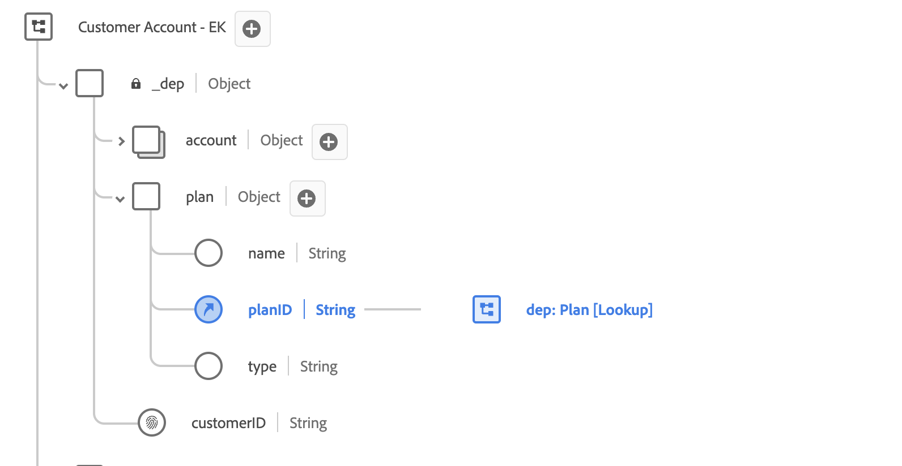
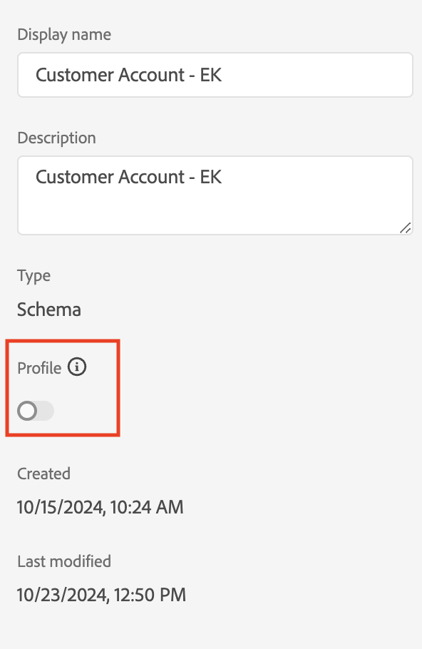
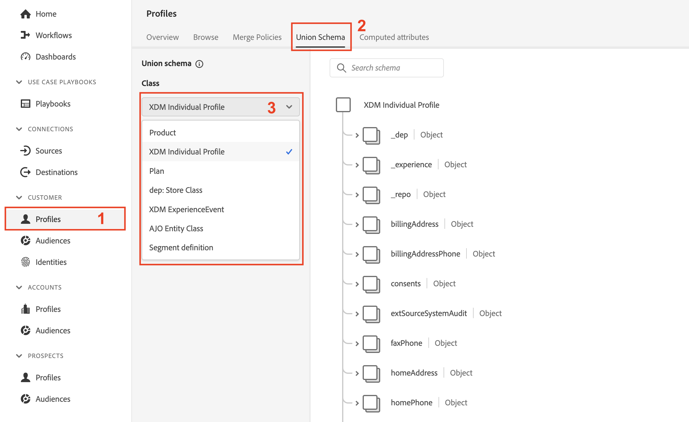

# Configuration d’pour le profil

## Présentation

Pour utiliser un schéma pour le profil client en temps réel, vous devez d’abord vous assurer qu’il est correctement configuré. Cela signifie prendre ce que vous avez identifié pendant le Lab LID comme étant des identités principales/de personne, des identités de relation, etc. et vous assurer que ces configurations sont effectuées sur chaque schéma. Lorsque tout est terminé, vous pouvez « retourner l’interrupteur » et activer un schéma à utiliser avec le profil.

En examinant le modèle XDM sur papier Connection 5G ERD, vous voyez les informations suivantes sur le schéma Compte client .  Il reste donc à effectuer pour utiliser le schéma dans le profil client en temps réel.

## Marquer le champ Identité principale

Chaque schéma nécessite un champ d’identité principal s’il doit être utilisé avec le profil client en temps réel. Pour marquer un champ en tant qu’identité principale, procédez comme suit.

1. Ouvrez le schéma **Compte client** que vous avez créé
1. Sélectionnez le champ **\_\&lt;nom-client>.customerID** en cliquant sur le champ du schéma
1. Dans le rail de droite, cochez les cases **Identité** et **Identité du Principal**
1. Sélectionnez l’espace de noms **customerID** dans la liste déroulante
1. Lorsque vous avez terminé, cliquez sur le bouton **Appliquer** dans le rail de droite, puis sur **Enregistrer** vos modifications.

>[!NOTE]
>
>Vérifiez qu’une empreinte s’affiche sur votre champ après avoir cliqué sur Appliquer comme ci-dessous
>
>
>
>

>[!NOTE]
>
>Notez également que les éléments suivants doivent maintenant s’afficher dans le rail de gauche. Les identités (principales ou non) apparaissent ici. Les identités **principales** sont également marquées comme champs obligatoires.
>
>
>
>

## Marquer le(s) champ(s) d’identité de la personne

N’oubliez pas que chaque schéma à utiliser avec le profil client en temps réel **peut éventuellement contenir** des champs d’identité d’autres personnes. Pour marquer un champ en tant qu’identité de personne, effectuez les actions suivantes sur le schéma de compte client que vous avez créé précédemment.

1. Sélectionnez le champ **personalEmail.address**
1. Cochez la case **Identité** située dans le rail de droite
1. Sélectionnez l’espace de noms d’identité **E-mail** dans la liste déroulante
1. **Appliquer et enregistrer** vos modifications

>[!NOTE]
>
>Vérifiez qu’une empreinte s’affiche dans votre champ après avoir cliqué sur Appliquer

## Création de la relation de schéma

Pour mettre en relation le schéma de plan avec le schéma de compte client comme indiqué dans l’ERD, vous devez définir une relation. Suivez les étapes ci-dessous pour créer une relation de schéma entre les schémas Compte client et Plan (recherche) .

### Ajouter une relation

1. Sélectionnez le champ **planID** dans l’objet Plan comme illustré ci-dessous
1. Dans le rail de droite, cliquez sur l’icône **Ajouter une relation**

### Définir la relation

1. Dans la zone de sélection Type, sélectionnez l’option **Un-à-un**
1. Dans la zone Schéma de référence , sélectionnez le schéma nommé **dep: Plan \[Lookup]** (il a été précréé pour vous)
1. Cliquez sur **Appliquer** et **Enregistrer**

![Définition d’une relation un-à-un avec le schéma Dep : Plan [Recherche]](assets/configure-for-profile-define-one-to-one-relationship.png)

### Confirmer la relation

Lorsque vous avez terminé, la relation que vous avez créée doit s’afficher comme illustré dans la capture d’écran ci-dessous.

## Configuration du schéma pour le profil

Le profil client en temps réel fusionne des données provenant de sources disparates afin de créer une vue complète de chaque client individuel. Si vous souhaitez que les données capturées par un schéma participent à ce processus, vous devez configurer le schéma à utiliser dans Profile. Pour ce faire, vous devez effectuer les étapes suivantes :

1. Ouvrez votre nouveau schéma **Compte client - \[vos initiales]**
1. Cliquez sur le titre de votre schéma dans le rail de gauche
1. Configurez votre schéma pour le profil en activant le bouton Profile **ON** dans le rail de droite
1. Dans la boîte de dialogue modale qui s’affiche, cliquez sur le bouton **Activer**
1. N’oubliez pas de **Enregistrer** votre schéma lorsque vous avez terminé !

>[!TIP]
>
>Félicitations !  Vous venez de créer un schéma à utiliser avec le profil client en temps réel.

## Vérifier le schéma d’union des profils

Comme mentionné précédemment, la puissance de XDM + le profil client en temps réel est la possibilité d’assembler divers fragments d’un individu et de leurs comportements.  On parle alors de « vue de l’union » du client.  Dans les étapes ci-dessous, vous prévisualisez à quoi ressemble cette union pour chaque classe XDM configurée pour le profil client en temps réel

1. Accédez à **Profils** dans le rail de gauche
1. Sélectionnez l’onglet **Schéma d’union** dans le menu supérieur
1. Sélectionnez la classe **XDM Individual Profile** dans la liste déroulante

Parcourez la classe XDM Individual Profile, puis prenez quelques instants pour passer en revue d’autres classes telles que XDM ExperienceEvent ou les classes de plan.

>[!NOTE]
>
>Notez que le schéma présenté est une vue agrégée fusionnée de tous les schémas activés pour le profil dans votre sandbox. Les champs similaires dans la structure XDM hiérarchique fusionnent, tandis que les champs portant des noms et/ou des hiérarchies différents sont ajoutés à l’affichage global.

>[!NOTE]
>
>Seule la classe basée sur XDM Individual Profile effectue des fusions entre les champs aux noms similaires.
