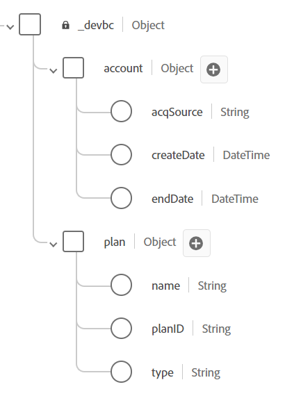

# Modèles d’objets personnalisés

## Ajout de champs personnalisés

Comme nous l’avons vu dans la lecture, il n’existe pas de groupes de champs ou de types de données standard prêts à l’emploi qui modélisent les champs personnalisés du compte client.  Les champs ci-dessous sont actuellement considérés comme personnalisés et doivent être modélisés dans le schéma XDM.

- \_\&lt;nom-client>.account.createDate
- \_\&lt;nom-client>.account.endDate
- \_\&lt;nom-client>.account.acqSource
- \_\&lt;nom-client>.plan.planID
- \_\&lt;nom-client>.plan.name
- \_\&lt;nom-client>.customerID

>[!NOTE]
>
>Notez que l’attribut \&lt;nom-client> est spécifique à l’environnement dans lequel vous travaillez

## Création de l’objet de compte

1. Ajoutez un nouveau champ en cliquant sur le bouton **+ (ajouter)** en haut de votre schéma

   

   >[!NOTE]
   >
   >Notez que le rail de droite s’ouvre avec quelques champs à remplir

1. Créez l’objet compte en utilisant les détails ci-dessous. Lorsque vous avez terminé, cliquez sur le bouton **Appliquer** dans le rail de droite pour afficher la modification dans l’espace de travail des schémas

| Nom du champ | Nom d’affichage | Type | Affecter à un nouveau groupe de champs |
| ---------- | ------------ | -------- | ----------------------------------------------------------------------------------------------------------------------------- |
| *account* | *Compte* | *Objet* | *Détails du compte client - \[Vos initiales]* *(saisissez ceci et sélectionnez la liste déroulante ou appuyez sur Entrée)* |

>[!WARNING]
>
>Vos noms de champ doivent respecter une casse spécifique. En effet, nous avons déjà précréé le même schéma que celui que vous êtes en train de créer. Si votre casse est désactivée, cela provoquera un conflit avec les chemins d’accès aux champs du schéma préexistant dans votre sandbox

>[!NOTE]
>
>Notez que le champ personnalisé que vous avez créé automatiquement est placé sous un espace de noms client, signalé par `_devbc` dans la capture d’écran. Votre espace de noms client peut être différent. Les espaces de noms de client sont utilisés pour différencier les objets personnalisés des objets standard d’Adobe et s’assurer que les futurs ajouts/mises à jour des normes d’Adobe n’entrent pas en conflit avec les objets créés personnalisés.

>[!NOTE]
>
>Notez que votre nouveau groupe de champs personnalisés s’affiche dans le rail de gauche sous le `Field groups` sans icône de verrouillage.  Cela indique qu’il s’agit d’un groupe de champs créé personnalisé.

>[!WARNING]
>
>Vous ne pouvez pas enregistrer votre schéma à ce stade. Si vous le faites, une erreur se produit, car vous ne pouvez pas créer d’objet vide dans le schéma JSON, car il ne décrit pas son contenu

1. Ajoutez les champs suivants affichés ci-dessous sous l’objet Compte que vous venez de créer.

   | Nom du champ | Nom d’affichage | Type |
   | ------------ | ------------- | ---------- |
   | *createDate* | *Date de création* | *DateHeure* |
   | *endDate* | *Date de fin* | *DateHeure* |

   >[!NOTE]
   >
   >Lorsque vous ajoutez de nouveaux champs, l’option **Affecter à** est déjà renseignée et fait référence au groupe de champs que vous avez utilisé pour l’objet de compte.

1. Une fois cette opération terminée, l’objet de compte des schémas doit ressembler à ce qui suit. **Enregistrez** votre schéma !

   

1. Ajoutez un autre champ personnalisé à l’objet de compte. Cliquez sur le bouton **+ (ajouter)** en regard de l’objet de compte.  Créez le champ suivant :

   | Nom du champ | Nom d’affichage | Type | Énumérations |
   | ----------- | ----------------- | -------- | --------------------------------------- |
   | *acqSource* | Source acquis ** | *String* | *web :: Web * *inStore :: In Store* |

   Ce champ nécessite des valeurs normalisées. Utilisez donc l’option **Énumération et valeurs suggérées** dans les propriétés des champs. Sélectionnez le bouton radio **Énumération** pour ajouter une validation pour ce champ lors de l’ingestion, ainsi que des libellés conviviaux. Ajoutez les valeurs d’énumération comme illustré ci-dessous :

   - *web :: Web*
   - *inStore :: en magasin*

   

   >[!NOTE]
   >
   >L’objectif des valeurs Énumération et Suggestions est de faciliter la segmentation pour l’utilisateur final. Les énumérations appliquent la validation au moment de l’ingestion des données, contrairement aux valeurs suggérées. Pour en savoir plus sur cette fonctionnalité, vous pouvez consulter la documentation ici -> [&#128279;](https://experienceleague.adobe.com/docs/experience-platform/xdm/ui/fields/enum.html?lang=fr#enums-and-suggested-values)

1. Lorsque vous avez terminé, cliquez sur le bouton **Appliquer** pour ajouter le nouveau champ au schéma.

1. **Enregistrer** votre schéma

>[!TIP]
>
>Vous avez créé votre premier objet et champ personnalisés dans le registre des schémas XDM.

## Planifier la création d’objet

Répétez les étapes ci-dessus et ajoutez l’objet **Plan** et les champs associés. Tous les nouveaux champs doivent être ajoutés sous le groupe de champs Détails du compte client - \[vos initiales] .

Utilisez les métadonnées du tableau ci-dessous pour créer l’objet de plan et ses champs associés.

| Nom du champ | Nom d’affichage | Type | Énumération et valeurs suggérées |
| ---------- | -------------- | -------- | ------------------------------------------------------------------------------------- |
| *plan* | *Détails du plan* | *Objet* | - |
| *planID* | *ID du plan* | *String* | - |
| *name* | *Nom du plan* | *String* | Énumération  *de base :: De base * *ultime :: Ultimate * *pro :: Pro* |
| *type* | *Type* | *String* | - |

>[!WARNING]
>
>Veillez à ajouter les nouveaux champs que vous créez au groupe de champs Détails du compte client - \[vos initiales] .  Pour vous assurer qu’ils sont ajoutés automatiquement à ce groupe de champs, sélectionnez le groupe de champs dans le rail de gauche avant d’ajouter un champ personnalisé.
>
>
>
>
>
>

Une fois cette opération terminée, validez la correspondance de votre schéma avec la capture d’écran ci-dessous. S’il a l’air correct **Enregistrer** votre schéma

>[!TIP]
>
>Joli !  Vous avez ajouté votre propre objet et vos propres champs personnalisés sans aide !

## Création de champ d’ID client

L’ajout du champ **customerID** en tant que ce champ est essentiel, car il servira d’identité principale pour le schéma, ainsi que de champ général pour contenir des données.

Effectuez les mêmes étapes que précédemment et utilisez le tableau ci-dessous pour référencer les métadonnées du champ.

| Nom du champ | Nom d’affichage | Type | Groupe de champs |
| ------------ | ------------- | -------- | --------------------------------------------- |
| *customerID* | *ID de client* | *String* | *Détails du compte client - \[Vos initiales]* |

>[!NOTE]
>
>Le `customerID` peut être placé n’importe où dans le schéma d’un point de vue hiérarchique. Dans cet atelier, nous avons choisi de le conserver à la racine et de ne pas l’imbriquer dans l’un des objets personnalisés que vous avez précédemment créés.  C’est là que l’architecture des données émet des opinions
>
>😄

Le résultat final doit ressembler à la capture d’écran ci-dessous lorsque vous avez terminé

## Résultat final du schéma

>[!TIP]
>
>Vous avez créé votre premier schéma XDM. Dans la section suivante, vous allez configurer le schéma à utiliser avec le profil client en temps réel.
