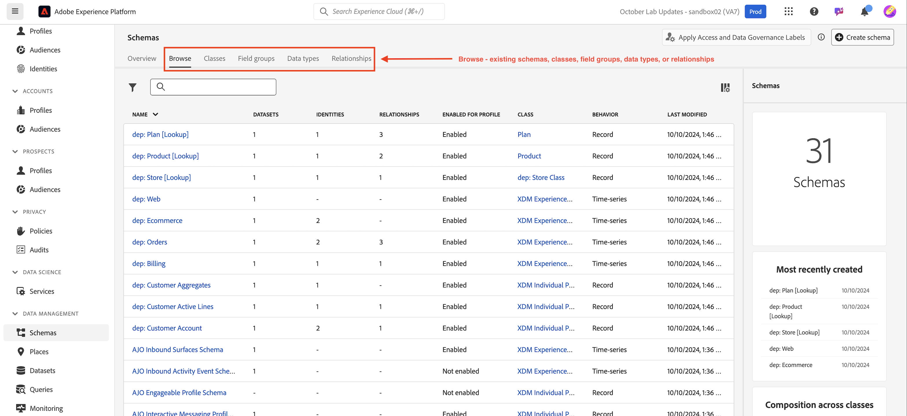
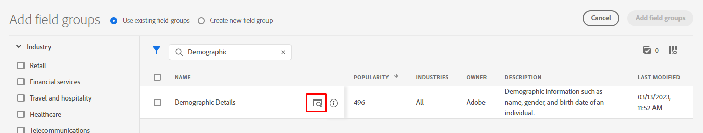
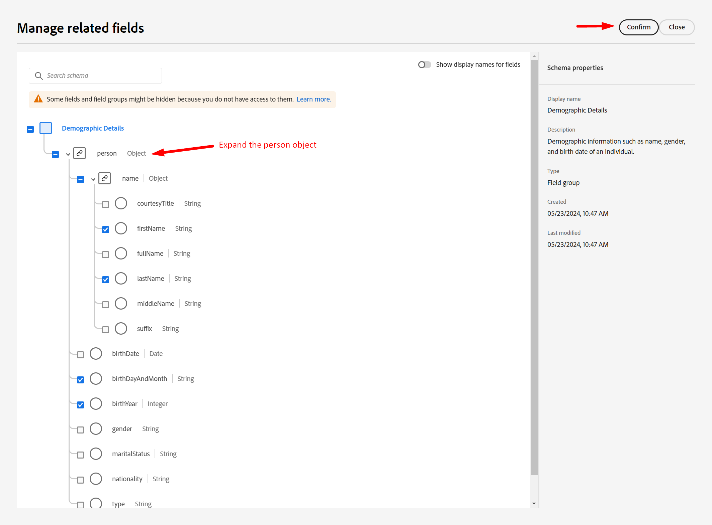
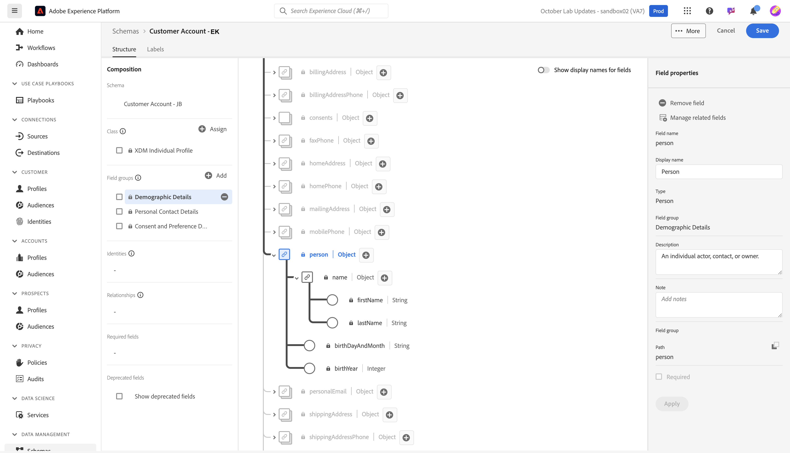

# Objets standard du modèle

## Accès aux schémas

1. Cliquez sur l’onglet **Schémas** dans le rail de gauche

1. Dans le volet de navigation supérieur, vous pouvez parcourir les schémas existants et afficher les groupes de champs et les types de données qui se trouvent actuellement dans le registre XDM.

>[!NOTE]
>
>Vous remarquerez qu’il existe déjà des schémas précréés dans votre sandbox. Il s’agit notamment des schémas qui ont été précréés dans le cadre de ce bootcamp (ils sont précédés du préfixe `dep`), ainsi que des schémas générés par le système pour Adobe Real-Time CDP et Adobe Journey Optimizer.

## Créer un schéma de profil individuel

1. Commencez par cliquer sur **Créer un schéma**

1. Sélectionnez **Manuel**

1. Sélectionnez **Profil individuel**

## Nommer le schéma

Les schémas basés sur la classe XDM Individual Profile vous permettent de collecter des attributs sur un individu qui seront assemblés au profil. La classe elle-même contient des champs qui ne sont pas modifiables, tels que *modifiedByBatchID*, *PersonID*, etc.

1. Donnez un nom et une description à votre schéma.
   - **Nom D’Affichage Du Schéma** —> *Compte Client - \[Vos Initiales]*
   - **Description** —> Ce schéma collecte les identités, les informations de plan, les détails démographiques et les coordonnées d’une personne.
1. Enregistrez votre schéma à l’aide du bouton **Terminer** en haut à droite.

## Ajouter un groupe de champs Détails démographiques

Il existe de nombreux groupes de champs qui existent en tant que XDM standard dans Adobe Experience Platform et que vous pouvez les ajouter à votre schéma et personnaliser.

1. Cliquez sur le **+ (ajouter)** sur le rail de gauche dans la section groupe de champs .

1. Recherchez **Détails démographiques** ou trouvez-les en parcourant la liste.

- Lorsque vous trouvez le groupe de champs, cliquez sur la loupe située à droite du groupe de champs pour en afficher la structure.  Il s’agit d’une méthode utile pour prévisualiser ce que vous êtes sur le point d’ajouter à votre schéma sans réellement l’ajouter.
- Fermer l’aperçu une fois la révision terminée

&#x200B;3. **Cochez** case en regard du groupe de champs, puis cliquez sur le bouton **Ajouter des groupes de champs**

## Ajouter d’autres groupes de champs standard

Vous devez ajouter des groupes de champs standard supplémentaires à votre schéma. Répétez les étapes précédentes pour ajouter les deux groupes de champs supplémentaires à votre schéma :

- Coordonnées personnelles
- Détails relatifs au consentement et aux préférences

Lorsque vous avez terminé, votre schéma doit ressembler à l’image ci-dessous. Veillez à cliquer sur le bouton **Enregistrer** et à enregistrer votre travail !

>[!NOTE]
>
>Notez que les groupes de champs que vous avez sélectionnés et ajoutés apparaissent maintenant dans votre schéma et s’affichent dans le rail de gauche. Notez que tous les champs de chaque groupe de champs que vous avez ajouté ne sont pas nécessairement nécessaires.  L’étape suivante supprime les champs superflus.

>[!WARNING]
>
>Veillez à enregistrer votre schéma avant de continuer.

## Personnaliser les groupes de champs standard

### Groupe de champs Détails démographiques

Le groupe de champs Détails démographiques a importé de nombreux champs, mais en fonction de la conception de votre schéma à partir de la méthodologie LID, vous n’avez besoin que des champs suivants :

- person.name.firstName
- person.name.lastName
- person.bornDayAndMonth
- person.bornYear

Pour supprimer des champs de n’importe quel groupe de champs standard d’Adobe, vous pouvez utiliser l’option **Gérer les champs associés**. La gestion des champs associés vous permet de supprimer des champs standard de votre schéma, de sorte que vous ne disposiez que des champs dont vous avez besoin.

1. Sélectionnez l’objet **personne** dans le schéma
1. Cliquez sur le **Gérer les champs associés** dans le rail de droite

1. Développez l’objet personne en cliquant sur le chevron à gauche de personne et développez l’objet nom complet en cliquant sur le chevron à gauche de l’objet nom. Conserver uniquement les champs suivants :

- person.name.firstName
- person.name.lastName
- person.bornDayAndMonth
- person.bornYear

Lorsque vous avez terminé, cliquez sur le bouton **Confirmer** dans le coin supérieur droit.

>[!NOTE]
>
>Vous pouvez cocher la case située en haut de l’écran pour **Détails démographiques** afin de désélectionner automatiquement tous les objets enfants, puis de ne sélectionner à nouveau que ceux dont vous avez besoin.

1. Lorsque vous avez terminé, vous devriez voir l’objet personne dans votre schéma comme illustré ci-dessous. Si tout semble correct, cliquez sur le bouton **Enregistrer** pour enregistrer votre schéma.

### Groupe de champs Consentement et Préférences

Effectuez le même ensemble d’étapes que précédemment, mais cette fois pour le groupe de champs Consentement et préférences .

1. Cliquez sur le nom du groupe de champs **Consentement et préférences** dans le rail de gauche pour mettre en surbrillance ses champs dans votre schéma.
1. Sélectionnez l’objet **consentements**, puis utilisez le processus **Gérer les champs associés** pour supprimer les champs non nécessaires de l’objet de consentement. Conserver uniquement les champs suivants :

- consentements.marketing.email.val
- consentements.marketing.sms.val

>[!NOTE]
>
>Assurez-vous que le bouton (bascule) est désactivé pour **Afficher les noms d’affichage des champs** dans le coin supérieur droit de l’espace de travail des schémas
>
>

Lorsque vous avez terminé, votre schéma final doit maintenant ressembler à ceci.  Veillez à cliquer sur **Enregistrer** avant de continuer.

>[!TIP]
>
>Vous avez à présent terminé d’ajouter des composants standard à votre schéma. Très bon travail ! Passez à la création d’attributs personnalisés pour votre schéma.
