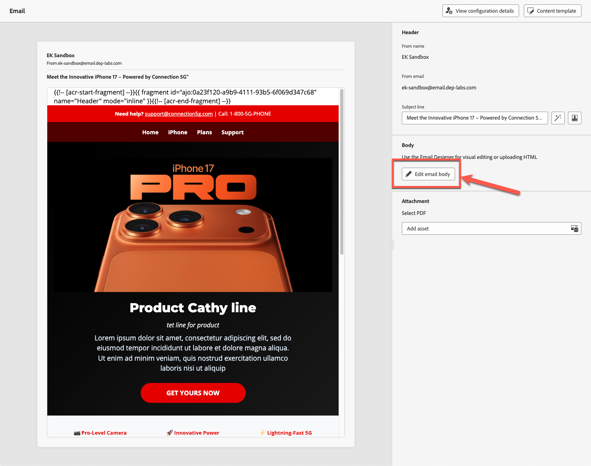
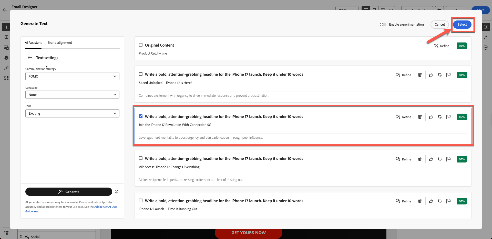
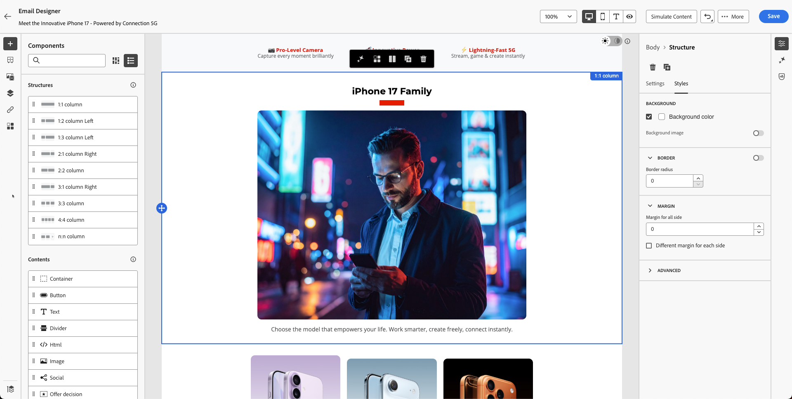

# Assistant d’IA et personnalisation de contenu

**Objectif :** découvrez comment utiliser l’assistant d’IA de Adobe Journey Optimizer pour générer des lignes d’objet, affiner le texte des e-mails, ajuster le ton et créer des images Firefly sur la marque directement dans le concepteur d’e-mail.

## Objectifs d’apprentissage

À la fin de ce module, vous serez en mesure de :

1. Utilisez l’assistant d’IA pour générer des objets et des pré-en-têtes.
1. Affinez le texte, les descriptions, le ton et les messages des héros.
1. Appliquez une reformulation, une synthèse et des ajustements de tonalité pilotés par l’IA.
1. Générez des images à l’aide d’Adobe Firefly avec le style de référence et les paramètres de marque.
1. Remplacez les espaces réservés par les images générées dans votre conception d’e-mail.

## Introduction

L’assistant d’IA d’AJO vous permet de créer du contenu plus intelligent sur la marque.
Il peut :

- Générer les lignes d&#39;objet
- Améliorer le texte existant
- Ajuster le ton et la clarté
- Création d’images de marque à l’aide de Firefly
- Assurez-vous que tout est conforme aux directives de la connexion 5G

Pour cet exercice, vous allez améliorer l’e-mail que vous avez créé à l’aide de l’assistant AI.

>[!NOTE]
>
>L’assistant d’IA est **non déterministe**, ce qui signifie qu’il peut générer un contenu légèrement différent chaque fois qu’il est utilisé. Ce que vous voyez au cours de votre entraînement peut ne pas correspondre exactement aux captures d&#39;écran ou aux exemples de ce guide. C’est correct : concentrez-vous sur l’apprentissage du processus et des concepts plutôt que sur l’attente de résultats identiques.

## Créer l’objet de l’e-mail à l’aide de l’assistant AI

1. Revenez à la campagne en cliquant sur le bouton Précédent ou modifiez l’e-mail que vous avez créé dans le module précédent. À l’étape précédente, vous pouvez cliquer sur l’onglet **Paramètres** sur le côté droit.
2. Cliquez sur Conteneur d’e-mail > Cliquez sur le bouton Modifier l’e-mail .
3. Cliquez sur l’onglet Contenu , puis sur Corps de l’e-mail .
4. Sélectionnez le champ **Objet**.
5. Cliquez sur l’icône **Assistant IA**. (voir ci-dessous)

   

6. Notez que Brand Guideline est sélectionné par défaut.
7. Saisissez l’invite :

   >Nous lançons iPhone 17 et souhaitons que l’objet soit accrocheur

8. Appuyez sur **Générer**.
9. Examinez les quatre variantes générées.
10. Sélectionnez la variante présentant le meilleur score d’alignement et cliquez sur **Sélectionner**.

>[!NOTE]
>
>Vos résultats peuvent être complètement différents de ceux du guide de laboratoire, vous n&#39;avez donc pas à vous inquiéter. Sélectionnez ce que vous pensez être un titre correct et poursuivez avec le Lab.

## Améliorer le titre et la description des héros

1. Ouvrez l’e-mail en cliquant sur le bouton « Modifier le corps de l’e-mail ».

   

2. Cliquez sur l’en-tête **Product Catchy line**.
3. Ouvrez l’assistant AI en cliquant sur **Générer et sélectionner un texte**

   

4. Sélectionnez **Guide de la marque Connection 5G** dans la liste déroulante.

   

5. Invite :

   >*Faites un gros titre audacieux et captivant pour le lancement d’iPhone 17. Gardez moins de 10 mots*

6. Cliquez sur Paramètres de texte pour modifier le ton et la stratégie de communication. Modifiez la stratégie de communication en **FOMO (Peur de manquer)**, la langue en **Anglais** et le ton en **Passionnant**. Utilisez une version plus courte en réduisant le cadran.

   

7. Cliquez sur le bouton **Générer**
8. Examinez et sélectionnez la meilleure version,
9. Si votre texte est long, utilisez le curseur pour **« texte plus court »** puis régénérez le texte.

   

10. Une fois que vous êtes satisfait du texte, cliquez sur **Sélectionner**

## Invite de description

Cette fois, vous testez la manière dont l’IA peut vous aider à résoudre les problèmes.

1. Sélectionnez le texte sous lequel se trouve le texte modélisé et qui n’a aucune signification.

   

2. Cliquez sur le bouton d’évaluation comme illustré ci-dessous.

   

3. Votre contenu d’origine est automatiquement sélectionné avec votre marque, comme indiqué dans les étapes 1 et 2 ci-dessous. Cliquez sur le bouton **Évaluer** pour continuer.

   

4. Comme prévu, vous remarquez de nombreuses erreurs qui enfreignent les directives de la marque. Bien que ces problèmes puissent être corrigés à l’aide de l’IA, dans ce cas, vous ne révisez pas les documents existants. Au lieu de cela, vous pouvez les laisser tels quels et créer du contenu entièrement aligné sur les normes de la marque.

   

5. Utilisez le nouveau paragraphe généré pour vous à l’aide de l’IA avec l’invite ci-dessous. Vous pouvez utiliser la même approche pour le texte de description à l’aide de l’invite ci-dessous.

Invite :

>*Rédigez une description de produit attrayante pour le nouvel iPhone 17. Mettez en avant ses fonctionnalités les plus impressionnantes, telles que l&#39;appareil photo avancé, l&#39;autonomie de la batterie et les performances. Le ton doit être premium, passionnant et facile à comprendre pour un large public. Gardez-le sous 3 phrases.*

Pour gagner du temps, le texte a déjà été créé pour vous. Copiez et collez ci-dessous pour obtenir votre texte.

>Découvrez iPhone 17™, doté d&#39;un appareil photo de pointe pour des photos époustouflantes, d&#39;une autonomie de batterie toute la journée pour vous maintenir en vie et de performances ultra-rapides qui vous maintiennent en tête. Ne manquez pas cette expérience innovante.

Votre e-mail ressemble à l’exemple illustré ci-dessous.

## Ajout d’une image générée par Firefly

Jusqu’à présent, nous avons testé l’assistant AI sur la ligne d’objet et le texte. Qu&#39;en est-il des images ?

Avant de passer à la génération d’images par l’IA, examinez les types d’expériences que vous pouvez créer.

Nous comprenons que nous avons l&#39;année de naissance du profil. L’une des expériences que nous pouvons faire est de créer un bloc avec différentes variantes. Avec Adobe Journey Optimizer, c’est possible et l’un des plus grands avantages d’avoir Adobe Experience Platform comme base. Nous aborderons l’expérimentation dans notre prochain module, mais préparez d’abord le bloc ci-dessous.

1. Faites glisser un composant **Image** vers la colonne de gauche sous le bloc Famille Iphone 17.

   

2. Cliquez à l’extérieur, puis sélectionnez l’espace réservé pour l’image. (Veillez à cliquer sur l’image, sinon vous ne verrez pas l’option Firefly.)

   

3. Sous **&#x200B;**, cliquez sur **Générer et sélectionnez l’image**.

## Charger l’image de référence

1. Activez **Style de référence**.
2. Sélectionnez **Connection 5G Brand Guideline** lors de la sélection de la marque.

   

3. Cliquez sur Charger l’image .

   

4. Sélectionnez reference.jpg dans le dossier toolkit

   

5. Ajouter une invite d’image
   `Portrait-oriented image of a confident man in his early to mid-40s, standing alone at night in a neon-lit urban street, focused on his smartphone. Cinematic cyberpunk-inspired city atmosphere with colorful LED signs, cool blue and warm orange lighting, shallow depth of field, soft bokeh lights in the background. Modern lifestyle, tech-savvy mood, realistic skin tones, high contrast, photorealistic, professional lighting, ultra-detailed`.

Champ d’invite d’image Firefly 

## Choisir les paramètres d’image

Choisissez votre **paramètres d’image** :

1. Choisissez les paramètres suivants :
   - **Ratio:** Paysage (4:3)
   - **Type de contenu :** Photo
   - **Couleur et ton :** Tonalité froide
   - **Éclairage :** Éclairage Dramatique
1. Appuyez sur le bouton **Générer**

## Sélectionner et insérer l’image générée

1. Vérifiez les résultats de Firefly en vérifiant toutes les images générées.

   

2. Cliquez sur **Sélectionner** pour sélectionner l’image souhaitée.

   

3. Si une boîte de dialogue modale de chargement vous y invite, cliquez sur **Suivant**.

   

4. Cliquez ensuite sur **Importer**.

## Finalisation de la conception du bloc

Appliquez un rayon de bordure arrondi de 10 juste pour le rendre moderne, si vous avez le temps.

Après quelques itérations et variations, vous obtenez la conception finale. Votre disposition finale ressemble à l’exemple.

À ce stade, vous devriez vous sentir en confiance en utilisant l’IA pour accélérer et élever la création de contenu.

## Récapituler

Vous avez correctement utilisé l’assistant AI pour :

- Générer les lignes d&#39;objet
- Affiner le texte de référence
- Reformuler les paragraphes
- Modifier le ton des messages
- Créer des images Firefly de marque à l’aide du style de référence
- Insertion des images générées dans votre e-mail

Vous êtes maintenant prêt pour le module suivant : **Personalization et expérimentation de contenu**, où vous allez créer des variantes et des tests pilotés par les profils.
