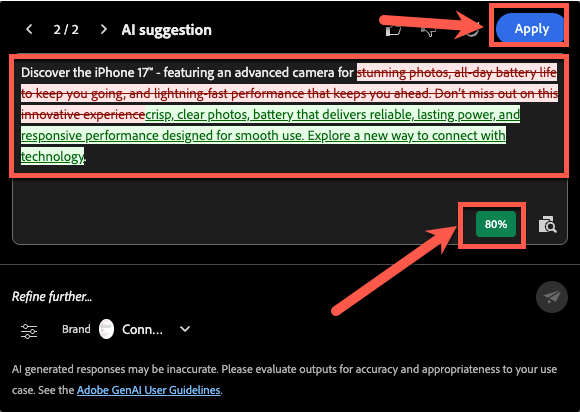

# Alignement sur la marque

**Objectif :** découvrez comment utiliser la fonctionnalité d’alignement des marques de Adobe Journey Optimizer pour évaluer le contenu des e-mails, identifier les violations des directives et appliquer des recommandations optimisées par l’IA pour améliorer la conformité de la marque.

## Objectifs d’apprentissage

À la fin de ce module, vous serez en mesure de :

1. Accédez au panneau Alignement des marques et interprétez-le.
1. Évaluez le contenu des e-mails par rapport aux directives de la marque.
1. Identifier les problèmes signalés par l’IA.
1. Appliquez des suggestions pour améliorer l’alignement de la marque.
1. Réévaluez les scores pour suivre les améliorations.

## Introduction

Adobe Journey Optimizer comprend un score d’alignement des marques piloté par l’IA **** qui vérifie votre contenu par rapport aux directives de marque publiées pour **Connexion 5G**.

Cela permet d’assurer les éléments suivants :

- Le ton, le style et les messages correspondent à votre marque
- Les exigences légales sont respectées
- Les images suivent les règles visuelles
- Les créateurs de contenu restent cohérents à grande échelle

Ce module vous apprend à exécuter l’évaluation, interpréter les résultats et améliorer votre contenu à l’aide de l’IA.

## Ouvrir le panneau d’alignement des marques

1. Ouvrez l’e-mail que vous avez créé dans les modules précédents.
2. Recherchez l’onglet **Alignement des marques** dans le rail de droite ou l’icône **%** dans la barre latérale.
3. Cliquez pour ouvrir le panneau.

4. Assurez-vous que la marque appropriée est appliquée :
   - **Connexion 5G** (par défaut).
5. Cliquez sur **Évaluer le score**.

**Interpréter le score de la marque et les commentaires :** au bout d’un moment, le score de conformité de la marque pour votre contenu s’affiche. Ce score peut être présenté sous la forme d’une note (par exemple, Élevée, Medium ou Faible) ou d’un pourcentage, avec un indicateur de couleur (vert, jaune, rouge) et le moment de l’évaluation. Un score élevé signifie que votre contenu s’aligne fortement sur les directives de la marque, tandis qu’un score moyen ou faible indique un alignement modéré ou faible.

Examinez les commentaires détaillés fournis dans le panneau pour chaque catégorie de directives.

Les commentaires sont généralement organisés par catégories de consignes (telles que le ton, le style, les images, etc.), indiquant les règles adoptées et celles qui peuvent nécessiter une attention particulière.

Notez les messages ou les points forts spécifiques. Par exemple, le panneau peut indiquer que certains mots ou expressions ne correspondent pas au ton prescrit ou qu’une image ne répond pas à une norme visuelle. C&#39;est votre indice sur ce qu&#39;il faut améliorer.

>[!NOTE]
>
>Notez que votre score est différent de celui de l’écran ci-dessous. Votre objectif est d’améliorer le score à l’aide des directives de la marque et de l’IA.

## Vérifier le score d’alignement

Après évaluation, AJO affiche :

- Score d’alignement des marques
- Évaluation (Élevée / Medium / Faible)
- Indicateur de couleur (vert / jaune / rouge)
- Date et heure
- Catégories de recommandations (Ton, Style, Imagerie, etc.)

Interprétez les résultats pour comprendre à quel point votre e-mail correspond aux directives de connexion 5G.

## Examiner les commentaires détaillés

1. Faites défiler les catégories de consignes.
1. Recherchez des avertissements ou des indicateurs rouges.
1. Cliquez sur chaque directive marquée pour ouvrir les commentaires détaillés de l’IA.
1. Consultez les suggestions, telles que :
   - Erreur de correspondance de tonalité
   - Phrase incorrecte
   - Mots interdits
   - Utilisation de marque manquante
   - Violations de style d’image

## Appliquer les recommandations de l’IA

1. Cliquez dans les blocs de texte ou les images marqués de l’e-mail.
2. Utilisez le paragraphe que vous avez collé dans l’exercice précédent, comme illustré ci-dessous.

3. Utilisez les modifications suggérées fournies par l’IA. Cliquez sur l’icône comme illustré ci-dessous.

4. Cliquez sur le bouton **Corriger avec l’IA** comme illustré ci-dessous.

5. Les modifications suggérées sont surlignées en vert et le texte supprimé est barré en rouge, comme illustré ci-dessous. Vous remarquerez également que le score a été mis à jour (dans ce cas, il est de 80 %). Cliquez sur le bouton **Appliquer** pour que les modifications soient prises en compte.

6. Les modifications sont appliquées avec le nouveau texte.
7. Passez en revue toutes les zones surlignées et effectuez les mises à jour nécessaires pour corriger le contenu, à l’aide de l’IA ou en le modifiant manuellement. Assurez-vous que toutes les modifications requises sont effectuées avant de continuer.
8. Enregistrez les modifications.

## Réévaluer le score de la marque

1. Apportez des modifications à tous les emplacements pour corriger le contenu à l’aide de l’IA ou manuellement.
2. Revenez au panneau Alignement des marques .
3. Cliquez sur **Réévaluer le score**.
4. Comparez le nouveau score au précédent.

Par exemple :

- Score d&#39;origine : **56%**
- Score mis à jour : **90%**

Cela indique que vos mises à jour ont correctement aligné l’e-mail sur les normes de la marque.

5. Cliquez sur **Enregistrer** pour finaliser l’e-mail.

## Récapituler

Dans ce module, vous avez appris à :

- Évaluation d’un e-mail à l’aide du score d’alignement des marques
- Interprétation des commentaires au niveau de la catégorie
- Identifier les problèmes d’écriture, de tonalité et de mise en page
- Appliquer les corrections recommandées par l’IA
- Améliorer la cohérence de la marque dans l’ensemble de votre communication

Votre contenu est maintenant validé et prêt à être testé dans le module suivant : **Tester l’e-mail**.
