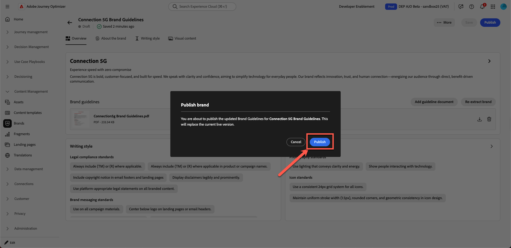
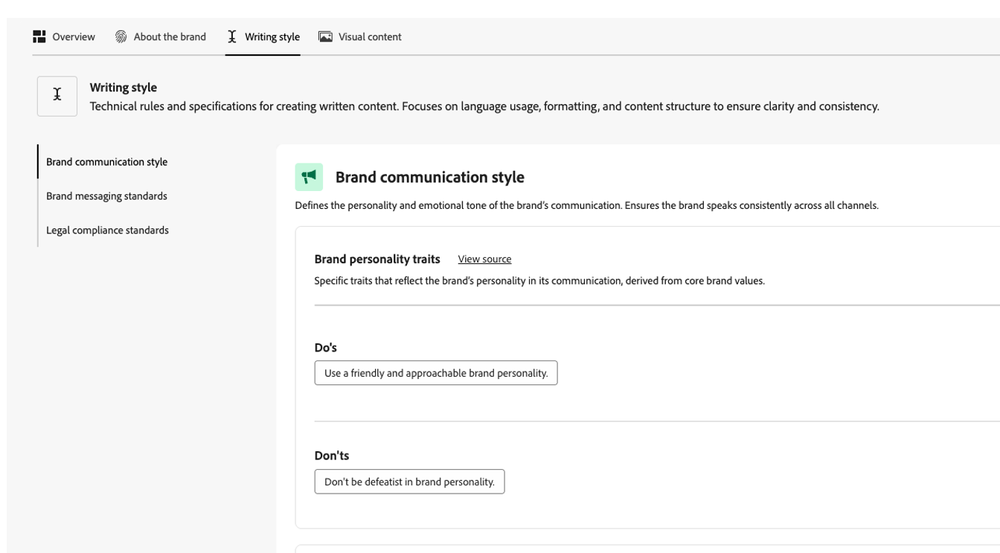
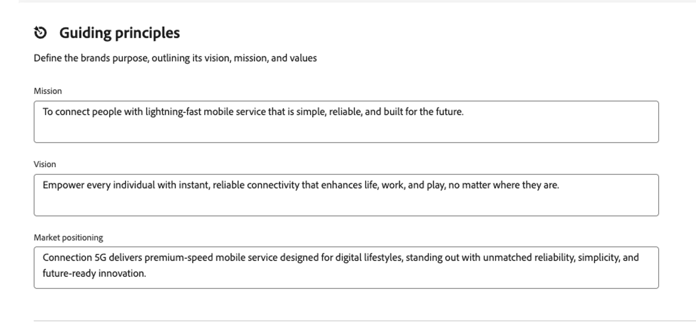
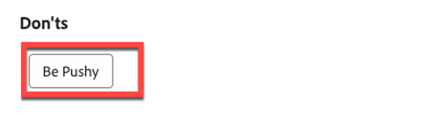

# Gestion des marques

**Objectif :** Configurez, affinez et publiez les directives de la marque Connection 5G dans Adobe Journey Optimizer (AJO), de sorte que toutes les fonctionnalités de contenu et d’IA restent alignées sur la marque.

## Objectifs d’apprentissage

À la fin de ce module, vous serez en mesure de :

- Créez une nouvelle marque dans Adobe Journey Optimizer.
- Chargez et extrayez des informations relatives aux directives de marque à partir d’un PDF.
- Passez en revue et affinez les détails de la marque dans les onglets À propos de la marque, Style d’écriture et Contenu visuel .
- Ajoutez une règle d’exclusion pour éviter la copie de boutons push.
- Publiez la marque afin qu’elle soit disponible pour les modèles, les fragments, l’assistant d’IA et l’alignement des marques.

Télécharger le fichier — [toolkit.zip](assets/toolkit.zip)

>[!NOTE]
>
>Avant de commencer les ateliers pratiques, veillez à télécharger le fichier toolkit (voir ci-dessous toolkit.zip). Décompressez le fichier pour accéder aux images et aux fichiers annexes requis pour les exercices. Conservez ces ressources dans un endroit facile d’accès, car vous les référencerez tout au long du Lab.

## Introduction

Dans ce module, vous allez créer la marque **Connection 5G** dans AJO à l’aide d’un guide de marque PDF préparé.

La fonctionnalité **Marques** de Adobe Journey Optimizer vous permet de définir et de maintenir une identité cohérente dans tous les efforts marketing. Des logos et couleurs au ton de la voix et au style de messagerie, la création d&#39;une marque garantit que chaque e-mail, campagne et contenu reflète une personnalité unifiée.

Nous utiliserons le modèle 1 de la conférence (AJO uniquement) pour ce Lab. Notez que les ressources sont stockées à l’aide d’**Assets Essentials**.

Vous commencerez avec le document Guide de la marque Connection 5G, vous le téléchargerez, vous laisserez AJO extraire des informations essentielles, puis vous affinerez et publierez le résultat.

## Préparer les directives de marque

1. Ouvrez le PDF **Connection 5G Brand Guideline** à partir du dossier toolkit (veillez d’abord à le décompresser).

2. Consultez le document pour comprendre le contenu utilisé pour la connexion 5G :
   - Ton de la voix
   - Couleurs et style visuel
   - Exemples de style d’écriture et de message
   - Guide d’imagerie
   - Notes juridiques et de conformité

## Création d’une marque dans AJO

1. Dans Adobe Journey Optimizer, accédez au volet de navigation de gauche, puis cliquez sur **Marques**.
2. Cliquez sur **Créer une marque**.

3. Dans le champ **Nom**, saisissez `Connection 5G Brand Guidelines`
4. Dans la zone de chargement, effectuez un glisser-déposer du fichier **Connection5g Brand Guidelines.pdf** (ou cliquez sur **Sélectionner des fichiers** et sélectionnez-le sur votre ordinateur).

5. Cliquez sur **Créer une marque** pour commencer l’extraction.

Un écran de progression s’affiche pendant que AJO analyse votre fichier. Cette opération peut prendre plusieurs minutes en fonction de la taille du document.

6. Une fois l’extraction terminée :
   - Une barre de confirmation verte s’affiche en haut.
   - Vous êtes automatiquement redirigé vers l’écran de configuration de la marque .
   - Les normes de création visuelle et de contenu sont désormais automatiquement renseignées en fonction du fichier Brand Guidelines chargé.

7. Cliquez sur le bouton **Publier** pour publier les directives de la marque.

8. Confirmez en appuyant sur le bouton « Publier » pour confirmer.

Une barre de confirmation verte s’affiche au bas de la page pour indiquer que votre marque a été publiée.

9. Cliquez à nouveau sur la page principale de la marque pour voir que votre marque est maintenant en ligne (cela doit être indiqué par un point vert avec le libellé **« En ligne »**).

## Consulter les onglets des marques

Vous allez maintenant examiner et comprendre les trois onglets clés qui ont été renseignés pour Connexion 5G.

### À propos de la marque

Cet onglet définit l’identité de la marque à un niveau élevé. Il comprend généralement :

- Nom de marque
- Valeurs principales
- Principes directeurs
- Objectif et promesses de la marque
- Le sentiment que la marque veut créer

Tout le reste du système s’appuie sur cette base. Il est donc important que cet onglet reflète le véritable ADN de Connection 5G.

Passez un moment à parcourir les champs extraits et à vérifier qu’ils correspondent au PDF d’origine.

### Règle de style

L’onglet **Style d’écriture** définit la manière dont la marque communique. Il comprend :

- Directives de tonalité
- À faire et à ne pas faire
- Exemples de phrases et de messages clés
- Slogans et slogans
- Règles juridiques telles que le moment d’inclure des marques

Vous pouvez ajouter et affiner des règles en langage naturel et même les appliquer uniquement à des canaux spécifiques, tels que les e-mails ou les SMS. Vous pouvez ainsi contrôler de manière flexible mais précise la manière dont l’assistant IA et les auteurs de contenu doivent écrire.

### Contenu visuel

L’onglet **Contenu visuel** décrit l’apparence que doit avoir la marque. Il couvre :

- Normes de photographie
- Style d’illustration
- Règles d’iconographie
- Fonctions visuelles et non

Cela permet de s’assurer que tout, des images aux icônes, est cohérent et conforme aux valeurs fondamentales de Connection 5G.

## Ajouter une vision manquante et un positionnement sur le marché

Dans le contenu extrait, certains principes directeurs peuvent être incomplets. Maintenant, complétez-les en utilisant la formulation officielle du PDF.

1. Cliquez sur la marque que vous venez de créer

2. Cliquez sur **Modifier la marque**. Un onglet de confirmation s’affiche ; cliquez de nouveau sur **Modifier la marque** pour confirmer.

3. Accédez à l’onglet **À propos de la marque**.

4. Recherchez la section **Principes directeurs**, **Vision** ou une description générale similaire dans cette section.

5. Ajoutez le texte suivant :

**Vision:**

>Donnez à chaque individu une connectivité instantanée et fiable qui améliore sa vie, son travail et ses loisirs, où qu&#39;il se trouve.

**Positionnement sur le marché :**

>La connexion 5G offre un service mobile haut débit conçu pour les modes de vie numériques, se démarquant par une fiabilité, une simplicité et une innovation sans précédent.

6. Cliquez sur **Enregistrer**. (Si vous ne voyez pas le bouton **Enregistrer**, cliquez d’abord sur l’onglet **Aperçu**, puis sur **Enregistrer**.)

>[!TIP]
>
>Vous vous êtes maintenant assuré que l’objectif, la vision et le positionnement commercial de la marque sont clairement représentés dans AJO.

## Ajouter une règle d’exclusion de bouton d’e-mail

Ensuite, améliorez la marque en ajoutant une règle qui garantit que les boutons d’e-mail ne sont jamais écrits de manière push.

1. Accédez à l’onglet **Style d’écriture**.

2. Vérifiez que vous vous trouvez dans la section **Style de communication de la marque**.

3. Sous la zone **Ne pas**, cliquez sur l’icône **plus** pour ajouter une nouvelle règle.

Icône 

4. Configurez la règle comme suit :
   - **Exclusion:** `Be pushy`

>[!NOTE]
>
>Elle est ajoutée en tant que règle « Ne pas utiliser », ce qui signifie que la marque ne souhaite pas d’appels à l’action poussés

**Canal:** E-mail

**Element:** Button

5. Cliquez sur **Ajouter**.

6. Vérifiez que la nouvelle règle Ne pas afficher apparaît comme `Be pushy` dans la liste.

7. Cliquez sur **Enregistrer**.

Cette règle s’applique partout où l’assistant AI ou les auteurs travaillent sur la copie des boutons d’e-mail, en alignant les CTA sur le ton de la connexion 5G.

>[!NOTE]
>
>D’autres règles « ne pas » répertoriées peuvent ne pas correspondre exactement à la capture d’écran. Ignorer cet élément, car c’est un comportement attendu.

## Publier les directives de la marque

Une fois que vous êtes satisfait(e) de la configuration :

1. Revenez à l’onglet **Aperçu**. Cliquez sur **Enregistrer**.
2. Dans le coin supérieur droit, cliquez sur **Publier**.

3. Une boîte de dialogue de confirmation s’affiche pour vous informer que vous êtes sur le point de publier les directives de marque mises à jour pour la connexion 5G. Cliquez de nouveau sur **Publier** pour confirmer.

4. Attendez que la barre de confirmation verte apparaisse.
5. Cliquez sur **Précédent** pour revenir à la liste Marques.
6. Vérifiez qu’une nouvelle carte s’affiche pour les directives de la marque **Connection 5G** avec un statut indiquant qu’elle est en ligne et disponible.

Votre marque est maintenant en ligne et prête à être utilisée dans Adobe Journey Optimizer.

## Récapituler

Dans ce module, vous :

- Nous avons examiné le PDF de la directive sur les marques de connexion 5G.
- Création d’une nouvelle marque pour Connection 5G dans Adobe Journey Optimizer.
- a téléchargé le fichier de recommandations sur les marques et a permis à AJO d’extraire des informations essentielles ;
- Nous avons examiné et affiné les onglets À propos de la marque, Style d’écriture et Contenu visuel .
- Ajout d’une règle d’exclusion spécifique pour que les boutons d’e-mail ne soient jamais poussés.
- Publié la marque afin qu’elle puisse alimenter l’assistant IA, l’alignement des marques, les modèles et les fragments.

Vous disposez désormais d’un profil de marque **Connection 5G** entièrement configuré et publié qui sera utilisé dans le reste du Lab pour conserver tout le contenu sous marque.
