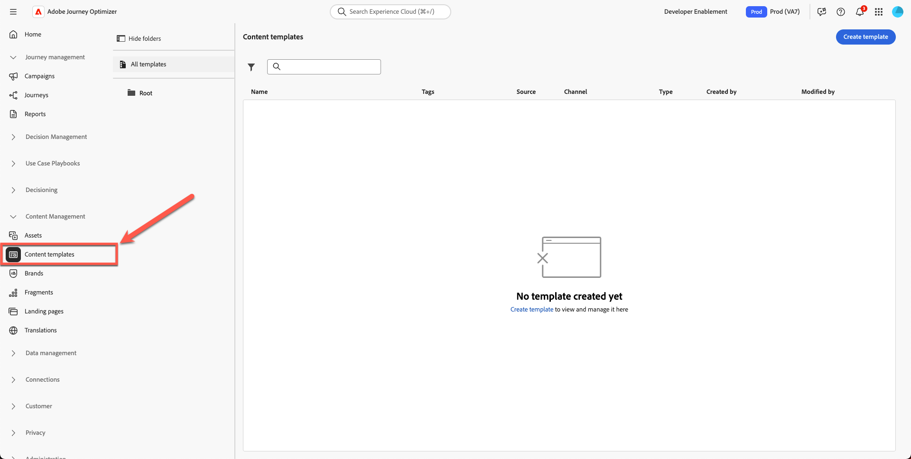

# Créer un modèle de contenu

## Création de contenu avec des modèles et des fragments

**Objectif :** Découvrir comment créer des modèles réutilisables dans Adobe Journey Optimizer

## Objectifs d’apprentissage

À la fin de ce module, vous serez en mesure de :

1. Créez un modèle d’e-mail complet à l’aide d’HTML et de fragments importés.

## Importance des modèles

Les modèles vous permettent de créer du contenu cohérent et aligné sur la marque, qui peut être réutilisé dans les e-mails, les campagnes et les parcours.

### Modèles

Plans directeurs de cette structure :

- Emplacement de l’en-tête
- Zone de contenu du corps
- Zone du pied de page
- Style de disposition standard

Les modèles garantissent la cohérence de la marque entre les équipes et permettent de gagner du temps lors de la création.

## Créer un modèle à l’aide de fragments

Les modèles aident les utilisateurs à réutiliser des mises en page complètes dans les campagnes. Les modèles de contenu dans Adobe Journey Optimizer sont des outils puissants conçus pour simplifier et rationaliser la création de contenu réutilisable pour les campagnes et les parcours. Que vous créiez un e-mail, un SMS ou une notification push, les modèles vous permettent de gagner du temps en fournissant des structures préconçues qui peuvent être facilement personnalisées et partagées entre les projets.

Pour accélérer et améliorer le processus de conception, créez des modèles autonomes pour réutiliser facilement du contenu personnalisé dans les campagnes et parcours Journey Optimizer.

Cette fonctionnalité permet aux utilisateurs et utilisatrices orientés sur le contenu de travailler sur des modèles en dehors des campagnes ou des parcours. Les utilisateurs et utilisatrices marketing peuvent ensuite réutiliser et adapter ces modèles de contenu autonomes dans leurs propres parcours ou campagnes.

## Créer un modèle

1. Accédez à **Gestion de contenu → Modèles de contenu**.

   

2. Cliquez sur **Créer un modèle** puis renseignez les champs suivants :
   - **Name:** `Promotional Template`
   - **Description :** `Promotional Template for phone products`
   - **Canal:** `Email`

   

3. Cliquez sur **Créer**.

## Ajouter un objet et ouvrir le concepteur d’e-mail

1. Ajoutez la ligne d’objet : `Promotional Template` et cliquez **sur le corps de l’e-mail** pour l’ouvrir et le modifier

   

2. Trois options s’affichent :
   1. Créer en partant de zéro
   2. Coder le vôtre
   3. Importer HTML

Sélectionnez la troisième option. Cliquez sur **Importer HTML**

## Importer le modèle HTML fourni

1. Chargez le fichier html du modèle à partir du dossier toolkit `promotional-template-final.html`

   

2. Cliquez sur le bouton Importer pour **importer** le modèle.

   

3. Attendez que la mise en page s’affiche. Vous constatez des problèmes tels que des liens d’image rompus ou une image de marque manquante. (Comportement attendu, car nous disposons de ressources d’espace réservé)

## Explorer la structure du modèle

### Panneau de gauche

Les composants « **Structures** » et « **Contents** » de Adobe Journey Optimizer (AJO) sont des éléments essentiels utilisés lors de la conception d’e-mails, de pages de destination et de fragments de contenu. Les structures définissent le framework de disposition, tandis que les contenus fournissent les blocs de création réels placés à l’intérieur de ces dispositions.

La section corps de Adobe Journey Optimizer est le conteneur principal du contenu de votre e-mail ou de votre page. Il sert de racine à l’espace de conception visuelle, où tous les composants de structure (colonnes, mises en page) et de contenu (texte, images, boutons, etc.) sont imbriquées.

### Panneau de droite

Les options « **Paramètres** » et « **Style** » sous la section du corps de Adobe Journey Optimizer vous permettent de définir l’aspect et la disposition de base de votre e-mail ou de votre page. Ces commandes affectent l&#39;ensemble de la conception puisque le corps est le parent de tous les composants.

Sur la barre du rail de gauche, vous trouverez des sections pour :

- Fragments
- Fichiers
- Structure du corps
- URL suivies

Le fragment d’en-tête que vous avez créé dans l’exercice précédent apparaît ici comme illustré ci-dessous. Assurez-vous que votre fragment d’en-tête s’affiche en direct avec un point bleu et non en mode brouillon. Passez du temps à vérifier le reste des sections.

>[!NOTE]
>
>Si vous ne voyez pas votre fragment ici, cela signifie que vous ne l’avez pas enregistré correctement et que vous devez le charger à nouveau.

## Insérer des fragments d’en-tête

Maintenant, améliorez le modèle. Vous avez déjà créé l’en-tête et le pied de page.

1. Faites glisser une colonne **1:1** au-dessus du contenu existant.

   

   Vous voyez quelque chose comme ça.

   

2. Votre arrière-plan utilise la couleur d’arrière-plan du modèle, qui est actuellement noire. Définissez sa couleur d’arrière-plan **sur blanche. Cliquez sur** dans l’onglet Style du rail de droite et utilisez la couleur blanche du sélecteur de couleurs.

   

3. Ouvrez **Fragments** et faites glisser votre fragment **En-tête**.

   

4. Notez que le fragment d’en-tête est soigneusement aligné sur votre modèle, comme illustré ci-dessous.

   

5. Cliquez sur le bouton **Enregistrer** pour enregistrer votre modèle, puis sur **Précédent**.

>[!NOTE]
>
>Il se peut que certaines images soient endommagées. Nous corrigerons cela plus tard.

## Récapituler

Dans ce module, vous avez réussi à :

- HTML importé pour créer un modèle promotionnel complet

Vous êtes maintenant prêt à passer au module suivant : **Création de l’e-mail**
