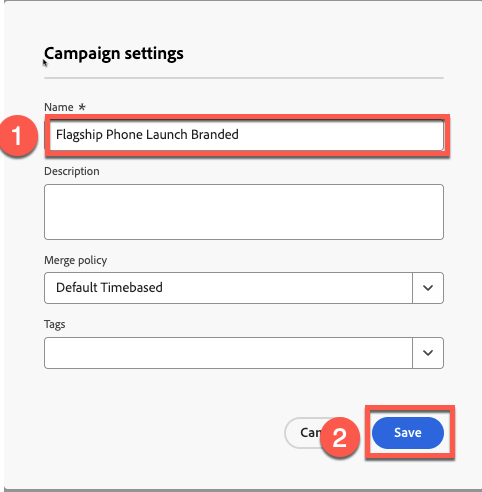
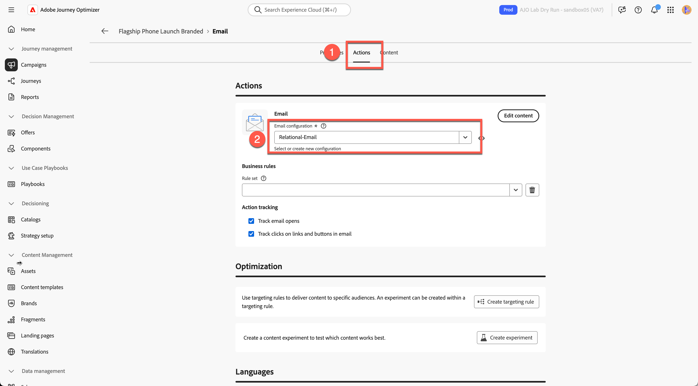
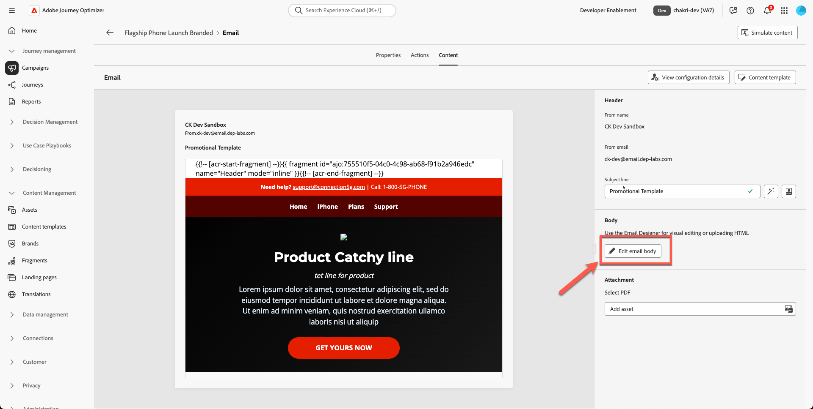
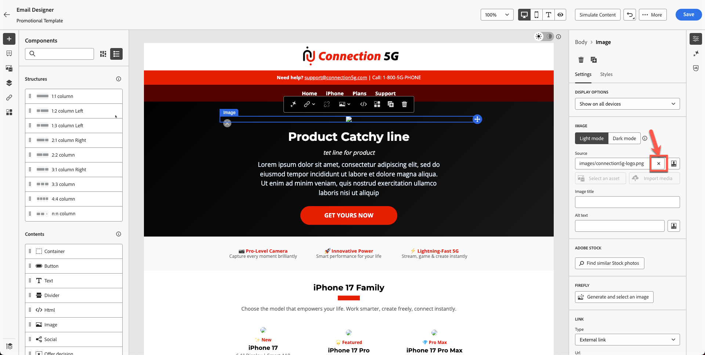
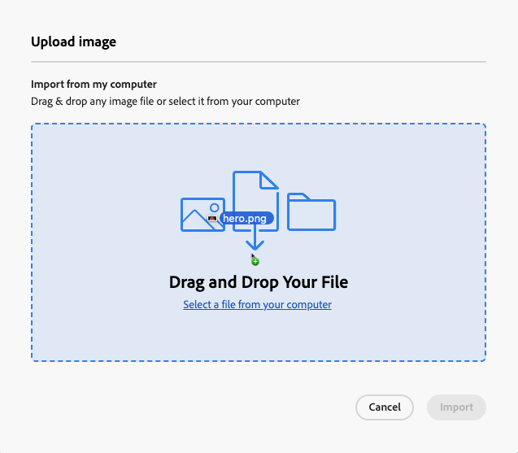

# Créer l’email

## Création de contenu avec des modèles

**Objectif :** découvrez comment créer des modèles réutilisables dans Adobe Journey Optimizer, puis les appliquer dans un e-mail réel au sein d’une campagne.

## Objectifs d’apprentissage

À la fin de ce module, vous serez en mesure de :

1. Créez une campagne et utilisez votre nouveau modèle de marque.
1. Mettez à jour les images principales, les images de produit, les boutons et le style de disposition.

## Créer et mettre à jour l’e-mail dans une campagne

### Objectif

Dans cet exercice, nous allons apprendre à appliquer le modèle que vous avez créé à un e-mail dans un parcours. Dans un scénario idéal, vous pouvez utiliser n’importe quel parcours ou campagne existant et remplacer son contenu d’e-mail par un modèle normalisé afin d’assurer la cohérence de la marque et une exécution plus rapide.

Cette étape montre comment les modèles peuvent être réutilisés sur plusieurs parcours, ce qui permet aux équipes de mettre à jour les conceptions sans devoir reconstruire les e-mails à partir de zéro.

## Créer une campagne par e-mail

1. Revenez à l’écran principal et cliquez sur **Parcours Management → Campagnes**.
2. Cliquez sur **Créer une campagne**

   

3. Sélectionnez « **Orchestration - Marketing** », puis cliquez sur **confirmer**

   

4. Nommez votre campagne `Flagship Phone Launch Branded`. Appuyez sur le bouton **Enregistrer**.

   

5. Cliquez sur le signe **+** puis sélectionnez l’activité **Lecture d’audience**

   

6. L’étape suivante consiste à sélectionner **zone « Lecture d’audience »** puis à cliquer sur **icône du dossier Audience**

   

7. Sélectionnez l’audience **dep: Intéressé par iPhone 17** et cliquez sur le bouton « **Ajouter une audience** »

   

8. Sélectionnez Entité - **dep-rel : Compte client - customer\_id** (ou tout autre, car cela n’a pas d’importance pour cette partie).
9. Ajoutez l’**activité E-mail** en cliquant sur le signe **+** puis sélectionnez **E-mail** dans les activités Canal.

   

10. Cliquez sur **Modifier l’e-mail**.

&#x200B;11. Cliquez sur l’onglet **Action** et sélectionnez **votre** configuration d’e-mail. Votre sandbox peut l’afficher comme E-mail relationnel. (Sélectionnez-en un)

&#x200B;12. Cliquez sur **onglet Contenu**

&#x200B;13. Cliquez sur **Appliquer le modèle de contenu**

&#x200B;14. Sélectionnez le modèle **« Modèle promotionnel »** que vous avez créé, puis cliquez sur **Confirmer**

&#x200B;15. Cliquez sur **Modifier le corps de l’e-mail**

&#x200B;16. Vérifiez que les nouveaux blocs d’en-tête, de héros, de pied de page et de contenu s’affichent correctement.

## Remplacer les images principales et les images de produits

Modifiez les images du héros et du téléphone. Vous devez charger du contenu vers les ressources à partir du dossier de la boîte à outils. Actuellement, votre image de bannière principale de produit est un espace réservé.

1. Cliquez sur l’image de bannière principale rompue.

   

2. Supprimez l’URL source temporaire.

   

3. Cliquez sur **Importer un média**

   

4. Chargez des `hero.png` à partir de votre boîte à outils. (Vous pouvez faire glisser le fichier)

   

5. Cliquez sur **Suivant** Sélectionnez **votre dossier pour les ressources** puis appuyez sur **importer**

   

6. Votre modèle d’e-mail s’affiche correctement. Cela ressemble à ce qui suit. Cliquez sur **« Enregistrer »** pour enregistrer votre travail.

## Exercice facultatif

### Remplacer les images du produit

Continuez et mettez à jour toutes les images du produit (images fournies dans le dossier toolkit) et ajoutez également une bordure arrondie à votre convenance. Votre e-mail s’affiche mieux sans aucun lien rompu, comme illustré ci-dessous. Répétez le processus pour toutes les cartes de produits.

## Récapituler

Dans ce module, vous avez réussi à :

- Création d’une campagne avec un e-mail à l’aide de votre modèle de marque
- Mise à jour des images de héros et de produits
- Style amélioré

Vous êtes maintenant prêt à passer au module suivant : **Assistant IA et personnalisation de contenu**, où vous utiliserez l’IA pour affiner le texte et générer automatiquement des images.
