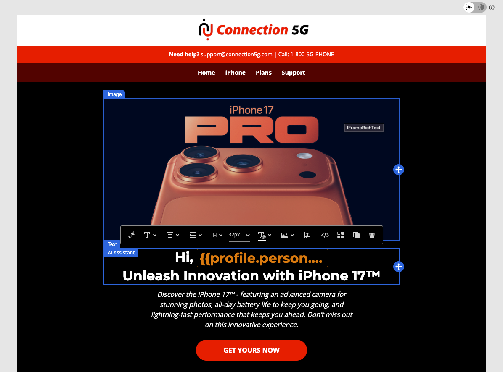
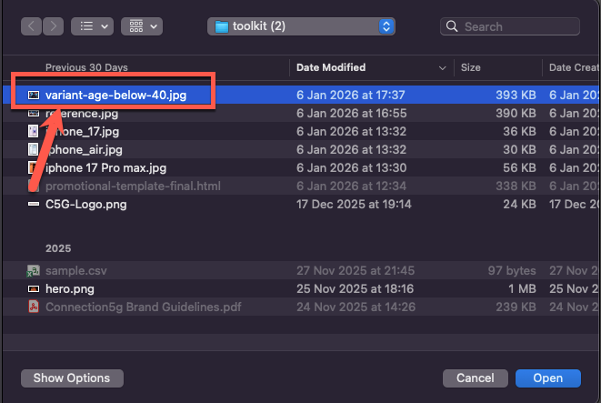
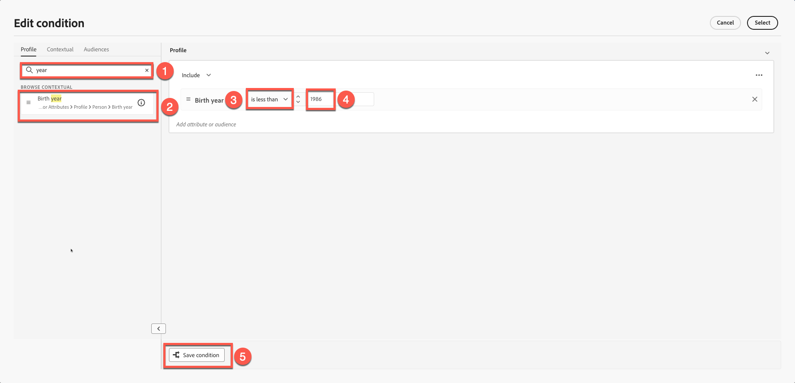
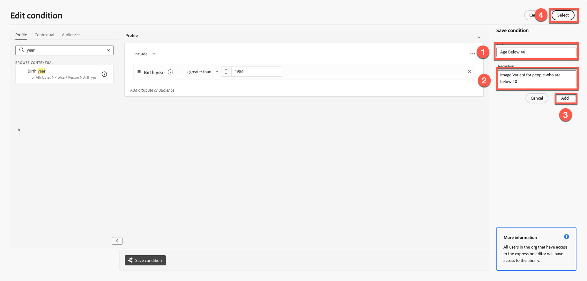

# Personalization et expérimentation de contenu

**Objectif :** découvrez comment personnaliser le contenu des e-mails à l’aide des attributs de profil, créer des variantes de contenu dynamique et appliquer une logique conditionnelle dans Adobe Journey Optimizer.

## Objectifs d’apprentissage

À la fin de ce module, vous serez en mesure de :

1. Ajoutez des champs de personnalisation à l’aide des attributs de profil.
1. Utilisez l’éditeur de personnalisation et la syntaxe Handlebars.
1. Créer des variantes de contenu dynamique en fonction de la logique de profil.
1. Créez des règles conditionnelles pour les blocs de contenu personnalisés.
1. Testez le changement de variante en fonction d’attributs tels que l’année de naissance.

## Introduction

La personnalisation dans Adobe Journey Optimizer permet d’offrir des expériences individuelles à grande échelle.
Dans ce module, vous allez :

- Insérer du texte personnalisé (prénom et nom)
- Créer des variantes de contenu basées sur l’âge
- Application d’une logique conditionnelle à l’aide d’attributs de profil
- Préparation du contenu pour la simulation dans le module 7

Personalization dans Adobe Journey Optimizer vous permet de créer des expériences client percutantes et personnalisées en personnalisant dynamiquement le contenu en fonction des profils individuels, des comportements et des données contextuelles. Que vous créiez des e-mails personnalisés, des notifications ou des offres, les outils et les techniques fournis permettent de connecter facilement le bon message à la bonne personne au bon moment. Découvrez comment l’éditeur Personalization, la syntaxe Handlebars et les données Adobe Experience Platform fonctionnent ensemble pour donner vie à vos idées, explorer des blocs de contenu réutilisables avec des fragments d’expression et explorer des fonctions d’assistance avancées pour déverrouiller des possibilités plus profondes. Chaque sujet développe vos compétences étape par étape, ce qui vous permet d’être prêt à concevoir des parcours personnalisés en toute confiance.

## Ajouter une personnalisation de base

Cette partie de l’exercice permet de garder la personnalisation simple. Ajoutez le prénom et le nom de famille à l’e-mail en fonction du profil. Personalization repose sur les données de profil gérées par le schéma Profil individuel XDM que vous avez défini. Le schéma Profil individuel XDM est le seul que vous pouvez utiliser pour personnaliser le contenu dans Journey Optimizer.

1. Ouvrez l’e-mail créé dans les modules précédents.
2. Ajoutez un bloc de texte au-dessus du titre de héros avec le contenu : **Bonjour,**
3. Cliquez sur l’icône **Personnalisation**.

   

4. Recherchez **F**&#x200B;**prénom**.

   

5. Cliquez sur **+** pour l’ajouter à la zone d’expression.
6. Ajoutez un **espace** après le champ **Prénom**.

   

7. Répétez le processus ci-dessus, mais cette fois, recherchez et ajoutez **Nom**.

   La syntaxe finale affiche des variables de prénom et de nom clairement séparées.

   

8. Validez le fragment. Notez qu’il existe une option pour enregistrer le contenu en tant que fragment. Il s’agit d’une excellente occasion de le faire si vous utilisez Nom complet pour la création d’autres contenus d’e-mail. Ignorez cette étape et passez à l’étape suivante.
9. Cliquez sur **Enregistrer**

Votre vue ressemble à ceci. Les accolades se composent de variables, et chaque individu reçoit un e-mail avec son nom.

À ce stade, vous savez comment ajouter une personnalisation pour les profils individuels.

## Présentation du contenu dynamique

Le contenu dynamique dans Adobe Journey Optimizer vous permet de créer des messages personnalisés qui s’adaptent facilement à votre audience. En utilisant des règles conditionnelles, vous pouvez personnaliser les e-mails, les SMS et les notifications push en fonction des attributs de profil, de l’appartenance à une audience ou des événements en temps réel. Que vous élaboriez un message de secours en cas de non-respect de critères spécifiques ou que vous enregistriez des règles réutilisables par souci de cohérence, l’éditeur de personnalisation et le Designer d’e-mail offrent des outils intuitifs pour donner vie à vos idées.

Il s’agit d’un cas d’utilisation parfait pour ajouter du contenu conditionnel à l’e-mail et le personnaliser en fonction de l’âge de l’utilisateur.

Pour en revenir à votre schéma, vous avez **« person.bornYear »** comme année de naissance. Cet attribut peut s’avérer utile. Ciblez et configurez une campagne basée sur l’âge.

Pour cet exercice, vous allez créer deux variantes basées sur l’âge. Une variante cible les utilisateurs de plus de 40 ans, et l’autre cible les utilisateurs de moins de 40 ans (peut-être au milieu de la vingtaine et de la trentaine). Toute personne née avant 1986 est considérée comme ayant plus de 40 ans, tandis que toute personne née en 1986 ou après est considérée comme ayant moins de 40 ans.

**Logique d’âge**

Vous utiliserez l’attribut de profil `person.birthYear`.

| Groupe Cible | Condition |
| ------------ | ----------------- |
| Plus De 40 | naissanceAnnée \&lt; 1986 |
| Inférieur À 40 | bornYear >= 1986 |

## Créer deux variantes d’image

Vous vous souvenez de ce bloc que nous avons créé dans notre module précédent ? Votre image est différente de la mienne.

Créez une autre image pour les personnes de moins de 40 ans (souvenez-vous que vous avez créé une image Firefly d’une personne dans la quarantaine) et utilisez-la pour cet exercice.

1. Sélectionnez le bloc d’image existant. (Cliquez sur l’image), puis sur **Bloc conditionnel**.
2. Cliquez sur **Ajouter une variante**.

   

3. Renommez la première variante en **Âge supérieur à 40**.

   

4. Créez une variante en cliquant sur **bouton « Ajouter une variante »** et renommez-la en **Âge inférieur à 40,**

   

5. Vous pouvez éventuellement créer une image à l’aide de Firefly en utilisant une invite telle que « mid-20-year-old ». Cependant, pour gagner du temps, nous disposons déjà d’une image dans la boîte à outils appelée « **variant-age-under-40.jpg**.
6. Cliquez sur l’image, puis sur Importer un média.

   

7. Sélectionnez l’image **variant-age-under-40.jpg**. Importez-le en cliquant sur **Suivant** et appuyez enfin sur **Importer** dans votre dossier (vous devriez déjà être dans votre dossier par défaut).

   

8. Essayez de basculer entre les variantes et une autre image s’affiche.

Jusqu’à présent, vous avez créé la conception mais n’avez pas encore appliqué la logique. L’étape suivante applique la logique.

## Appliquer une logique conditionnelle aux variantes

Les deux variantes sont prêtes, mais vous n&#39;avez pas encore appliqué de logique conditionnelle.

## Logique de « 40 ans et plus »

1. Sélectionnez et passez la souris sur la variante **Âge supérieur à 40**.
2. Cliquez sur l’icône **Logique conditionnelle**.

   

3. Créez une condition.

   

4. Recherchez **year** dans la liste des attributs.
5. Faites glisser **Année de naissance** dans la zone de travail.
6. Définissez la condition sur :
   - **bornYear \&lt; 1986**

   

7. Nommez la condition : **Âge supérieur à 40 ans**
8. Ajoutez une description : « **Variante d’image pour les personnes de plus de 40** ».
9. Cliquez sur **Ajouter → sélectionner**.

## Logique de « 40 ans et moins »

1. Sélectionnez et passez la souris sur la section **Âge inférieur à 40**.
2. Répétez les étapes, mais modifiez la logique en :
   - **bornYear >= 1986**

   

3. Nommez la condition : **Âge inférieur à 40 ans**
4. Ajoutez une description. « **Variante d’image pour les personnes de moins de 40** »
5. Cliquez sur **Ajouter → sélectionner**.

## Valider le changement de variante

Basculez entre les deux variantes pour vous assurer que :

- Les images correctes s’affichent
- La logique est correctement appliquée.
- Aucune variante n’indique « Aucune condition appliquée ».

Variante : **âge supérieur à 40**

Variante : **âge inférieur à 40**

Cliquez sur le bouton « **Enregistrer** pour enregistrer l’e-mail.

## Récapituler

Dans ce module, vous avez appris à :

- Ajouter des champs de personnalisation pour la messagerie individuelle
- Créer des variantes d’images dynamiques
- Application de règles conditionnelles en fonction de l’âge

Vous êtes maintenant prêt pour le module suivant - **Simulation de contenu**, pour tester les deux variantes.
