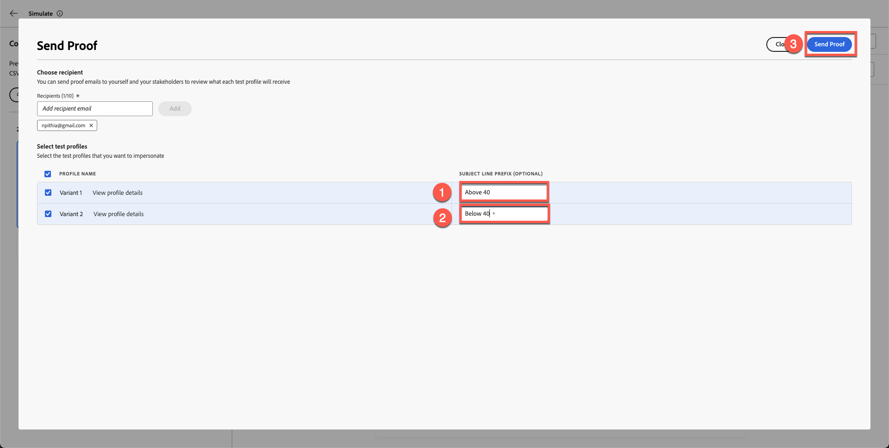

# Tester l’e-mail

## Objectifs d’apprentissage

À la fin de ce module, vous serez en mesure de :

- Envoyez des e-mails de BAT à partir de l’éditeur d’e-mail de Adobe Journey Optimizer.
- Validez le contenu personnalisé et les variantes conditionnelles à l’aide des e-mails de BAT.
- Vérifiez la diffusion des BAT dans votre boîte de réception, y compris la gestion des spams et des messages tronqués.
- Examinez les logs de diffusion, les horodatages et les variantes du BAT dans Adobe Journey Optimizer.
- Vérifiez que le contenu de l’e-mail est précis, personnalisé et prêt pour l’activation.

## Envoyer des e-mails de BAT (facultatif, mais recommandé)

À ce stade, vous avez appris que nous pouvons non seulement personnaliser les attributs de profil, mais également les utiliser pour créer une logique conditionnelle qui déterminerait le contenu que vous souhaitez afficher. Adobe Journey Optimizer est extrêmement puissant et offre aux marketeurs une grande flexibilité.

1. Cliquez sur **Simuler du contenu**.
2. Sélectionnez **Simuler une variation de contenu**.

Un panneau de simulation s’ouvre.

&#x200B;3. Cliquez sur **Envoyer un BAT**.

&#x200B;4. Ajoutez votre adresse e-mail personnelle.

>[!NOTE]
>
>Notez que parfois l’e-mail de votre entreprise bloque les e-mails de la sandbox. Je vous recommande d&#39;utiliser votre adresse e-mail personnelle.

&#x200B;5. Sélectionnez les deux variantes.
&#x200B;6. Ajouter un préfixe de ligne d&#39;objet
   1. Variante 1 : supérieure à 40
   2. Variante 2 : Inférieure À 40
&#x200B;7. Cliquez sur **Envoyer un BAT**. Un message de confirmation vert « **BAT envoyés avec succès »** s’affiche

Vérifiez que les deux e-mails ont bien atterri dans votre boîte de réception.

>[!NOTE]
>
>Selon les filtres, les e-mails relatifs aux épreuves peuvent apparaître dans **Spam**.

Il se peut que vous receviez un message tronqué, mais cela reste correct, car certains liens du pied de page ne sont pas réels. Si vous cliquez sur le lien, vous verrez que les deux e-mails avec des variantes ont été envoyés.

### Vérifier la diffusion du BAT dans AJO

Enfin, vous pouvez également voir la diffusion du BAT dans Adobe Journey Optimizer.

1. Revenez à l’éditeur d’e-mail.
2. Revenez à l’écran de création d’e-mail et cliquez sur **Afficher le BAT**.
3. Examinez les logs de diffusion, les horodatages et les variantes envoyées.

Vous remarquerez les détails de l’e-mail relatif à votre BAT.

## Récapituler

Dans ce module, vous avez réussi à :

- Emails de BAT envoyés et vérifiés dans AJO

Vous avez maintenant terminé le Parcours complet Connection 5G AJO Lab et validé que votre e-mail est précis, personnalisé et prêt à être activé.
